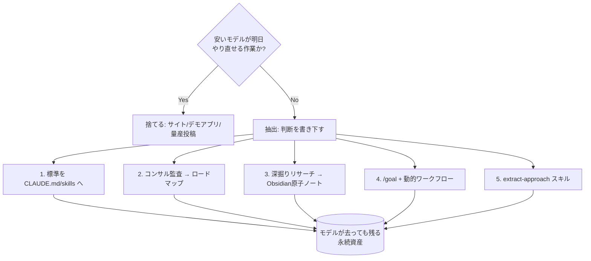

# フロンティアモデルの抽出（去る前に判断を永続資産へ）

> **TL;DR**: 去りゆくフロンティアモデルには「会話」でなく「抽出」で向き合う。「安いモデルが明日やり直せる作業か?」の**不可逆性フィルタ**で選別し、5つの型で判断を永続資産（標準・ロードマップ・知識庫・スキル）に落とす（@EXM7777）。

@EXM7777 は、[[models/claude-fable-5|Fable 5]] がサブスクから外れ従量課金へ移る「最終日」の過ごし方の大半は間違っていると述べる。出回るリストは「サイトを作れ・デモアプリを出せ・1ヶ月分のコンテンツを生成しろ」だが、これらは唯一意味のあるテストに落第する。テストは一問——**「安いモデルが明日これをやり直せるか?」**。サイトもデモも投稿も、プランに残る日常モデル（Opus）が来週タダで作り直せる。フロンティアモデルの最後の時間をそこに使うのは「外科医を雇って血圧を測らせるようなもの」だ、と @EXM7777 は言う。

抽出すべきは、**作るのにfableレベルの判断が要るが、使うのは普通の知能で足りるもの**——書き下された標準／推論済みのロードマップ／蒸留された知識庫／自走するスキル。これらはモデルが手の届かない所に行っても価値を保つ。@EXM7777 は歴史的パターンを引く。llama時代に最も複製された訓練データは、フロンティアモデルから52,000の回答を引き出して小型オープンモデルを訓練したもので、生成コストは$500未満だった。教師モデルは引退したが、それで訓練したものは今も動く。「教師は死んだが、抽出したものは残る」。だから今日の戦略は会話でなく**抽出**だ、というのが全体の論旨。

## 5つの型

**1. workspace に fable の判断を植える** — 最高価値の成果物は「標準」。1つの答えは一度助けるだけだが、標準は以後の全ての答えを底上げする。[[concepts/claude-md-rules|CLAUDE.md]]・[[concepts/claude-skills|skills]]・learningsファイル・メモリ設定は、将来のどのモデルも作業前に読む層。今日 fable が、opusには追随できるが決して書けない水準でその層を書く。**「基準の行（criteria line）」が肝**——安いモデルは品質バーを発明できないが、書かれた品質バーは問題なく適用できる。

**2. コンサル監査（the consultant audit）** — fableの検証された強みは、難しく雑然とした問題での判断（最難関コーディングtierで次点モデルの2倍超のスコア、難度が上がるほど差が開く）。ならば自分が持つ最も難しく雑然とした問題＝**自分のビジネス**を渡す。プロジェクト・数字・文脈にアクセスできるセッションで監査させる。成果物ルールが価値を運ぶ——**推論を今日書き下す**（それを生めるモデルがflat-rateの間に）。明日のopusは天才である必要はなく、天才的な文書に従えばよい。

**3. second brain run** — リサーチが最も深く抽出できる（長い多段の統合がfableの最大の測定リード）。ニッチ・競合・顧客の問題・学びたかった手法をdeep researchで大量に走らせ、各runを [[concepts/obsidian-claude-second-brain|Obsidian vault]] にマイニングする。**要約して1本の長いレポートにするな、原子化せよ**——100本のリンクされた1インサイト・ノートは検索・再利用されるが、40ページのレポートは保存され忘れられる、と @EXM7777 は言う。この原子ノート観は [[concepts/llm-wiki]] の設計思想と一致する。

**4. fire the goals** — fableの署名的能力は「何時間も一つの仕事を筋を見失わず保持する」持久力で、これが明日flat-rateでなくなるもの。[[tools/claude-code|Claude Code]] の2コマンドを使う。[[tools/claude-code-goal|/goal]] はプロンプトでなく**完了条件**を置き、2つ目の小型モデルが毎ターン条件を判定し、満たすまで止めない。[[concepts/claude-code-dynamic-workflows|dynamic workflows]] はスケール層で、モデルがオーケストレーションスクリプトを書き、数十のサブエージェントを背後で並列に走らせ互いの発見を照合する。2つの安全ルール:

- **完了条件に「貼られた証拠」を要求**する。審判モデルは会話しか読めずテストを実行できないので、緑のrunを**貼らせる・約束させない**。
- **全runに上限**（ターンか実時間）を条件に書き込む。上限なしの1ループは朝までに$6,000請求されうる。

加えてメーター注意——fableは週次上限をopusの約2倍速で消費し、そもそも週次上限の半分しか適用されない。10個でなく最も価値の詰まった2〜3ゴールに絞る。

**5. how fable thinks を記録するスキル** — fableが難問を解くたび、その approach はセッション終了で蒸発する。`.claude/skills/extract-approach/SKILL.md` を作り、CLAUDE.mdに配線して**指示なしで発火**させる。以後、実際のバックログ（厄介なバグ・回り続けていたアーキ判断）でfableを酷使すると、解くたびにノートが残る。ノートこそ蒸留物——fableの推論がリポに座り、後続のどのモデルも読める。@EXM7777 はこれを**複利の型**と呼び、1時間しかないなら最初に入れるべきものだと言う（残りのfable時間を自動で永続資産に変換するため）。この自己記録は [[concepts/skill-self-improving-loop]] と同系。

**時間がないときの順序**: 5 →（単独で走る）4 → 1 → 2 → 3。

## 繰り返す状況

@EXM7777 は「この状況はまた繰り返す」と述べる。過去1年のパターン——フロンティアモデルが現れ、値付けし直され、引かれ、時に戻り、いずれ引退する。ある主要モデルは予告なく削除され、反発で復活し、それでも6ヶ月後に引退した（[[models/claude-fable-5]] の輸出規制による一時停止と復帰の経緯を指すと思われる）。アクセスがある間に保存しないアウトプットは、去った後には再構築できない。「あらゆる教師は去る。抽出したものが手元に残る」。

## 観察ログ（未検証）

- 2026-07-06: fableは最難関コーディングtierで次点モデルの2倍超のスコア、長い多段統合が全モデル中最大の測定リード、という @EXM7777 の主張（単一ソース）。[[models/claude-fable-5]] の「Cognition FrontierCodeでフロンティア最高」等の検証済み事実と整合するか要確認。
- 上限なしの自律ループが朝までに$6,000請求されうる、との警句（単一ソース・後で相場感を確かめたい数字）。

## 問い

- 「安いモデルが明日やり直せるか?」の不可逆性フィルタは、自分のバックログの棚卸しにそのまま使えるか
- 型5の `extract-approach` スキルを自分のvault／CLAUDE.mdにどう実装・配線するか
- [[concepts/ai-strategist-prompt]]（参謀プロンプトでの棚卸し）と本抽出術を「棚卸し → 抽出 → 永続資産」の一連の運用に束ねられるか

## 関連

- [[models/claude-fable-5]] — 抽出対象のフロンティアモデル。サブスク枠→従量課金の移行が本ページの前提
- [[concepts/ai-strategist-prompt]] — 同じ「Fable最終日」テーマの姉妹編。参謀プロンプトで人生・事業を棚卸しする型（@akira_papa_IT）
- [[concepts/agi-knowledge-moat]] — AGI時代の競争優位の源泉の変容。抽出した判断＝私有資産という本ページの論旨と同系
- [[tools/claude-code-goal]] — 型4の `/goal`（完了条件で自律ターン反復）
- [[concepts/claude-code-dynamic-workflows]] — 型4のスケール層（オーケストレーションスクリプト＋大規模並列サブエージェント）
- [[concepts/obsidian-claude-second-brain]] — 型3のリサーチ・マイニング先（Obsidian原子ノート）
- [[concepts/skill-self-improving-loop]] — 型5と同系の会話→ノート→スキルの自己改善ループ
- [[concepts/llm-model-selection-strategy]] — 「fableで推論・opusで実行」の工程分解型モデル選択
