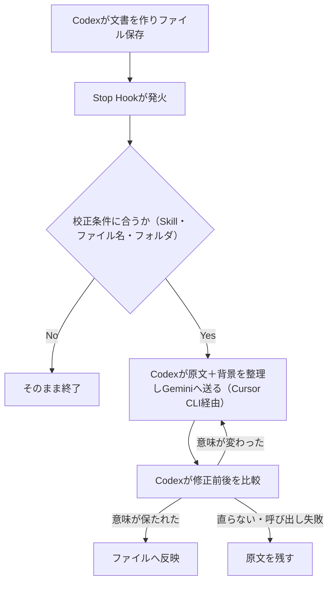

# Gemini日本語リライトのStop Hook自動化（内容は別モデル・日本語はGeminiの分業）

> **TL;DR**: FableやAstraに内容を考えさせ、できた文書の日本語だけをGeminiで整える分業を、CodexのStop Hookから自動で呼ぶ仕組みにしたと@yugen_matuniが紹介する。原文と一緒に「誰が読むか・何に使うか」の背景を送り、修正前後をCodexに比較させて意味が変わったら原文を残す。

出発点は、同著者が[[concepts/reasoning-vs-japanese-fluency]]で示した「推論力と日本語の自然さは別能力」という判断である。@yugen_matuniは内容を考えたり調べたりする作業は普段使いのモデル（Fable・Astra）に任せ続け、できあがったMarkdownをGeminiに貼って「意図や内容を変えずに極めて自然かつ平易なビジネスユースの日本語へ修正」と頼む運用をXで紹介した。校正済みの文章をもう一度Geminiに通して複数回繰り返してもよく、指示文は用途に合わせて変える（記事なら「話し言葉の感じを残して」、社内連絡なら「簡潔で堅すぎない文章に」）と著者は書く。

## 背景を原文と一緒に送る

提案書とnote記事では読みやすい言葉遣いが違うため、著者は原文と一緒に「誰が読むのか」「何に使うのか」「どんな話し方を残したいか」も伝えている。自動化するとこの背景の受け渡しがより重要になる、と著者は述べる。文書を作ったCodexは会話から執筆の経緯を知っているが、校正を頼まれたGeminiは同じ会話を読んでいないためである。そこで背景をCodex自身に短く整理させ、原文に添えて送らせる。

校正用Skillには「普段の日本語では使わない言い回しや単語を避け、極めて自然で平易な日本語に直してください」という方針も入れている。難しい言葉を別の難しい言葉に置き換えるだけでは読みやすくならないから、という理由である。

## Stop Hookでの自動化

手動運用ではコピー→Geminiに貼り付け→結果を読んで元ファイルに反映、という往復が文書ごとに発生していた。著者はこれを、エージェントが回答を終えようとするタイミングで動くCodexの **Stop Hook** に載せた。流れは次の4段である。

1. Codexが文書を作り、ファイルに保存する
2. 終了時にHookが動き、今回の文書を校正するようCodexへ指示する
3. Codexが校正する文書を選び、原文と背景をGeminiに送る
4. Codexが修正前後を比較し、内容を保っていることを確認してから反映する

Hookが指示を出したあともCodexが作業を続ける構成にしたことで、校正からファイル保存までが一続きになった、と著者は書く。Geminiの呼び出しはCursor CLI経由で、モデルはGemini 3.8 Flash Highを指定している。Antigravityを使う場合はGeminiを選び、Antigravity自体のStop Hookで同じ運用ができるとも述べる。Stop Hookで「終了させずに次の作業を差し込む」という形は、[[tools/claude-code-goal]]がStop hookのラッパーとして完了判定を回す構造と同じ使い方だと考えられる。

## 呼び出し条件を絞る

毎ターンGeminiを呼ぶと待ち時間と利用量が増えるため、著者は校正が必要な場面だけに条件を付けることを勧める。例として挙げるのは次のとおり。

- 記事執筆用に指定したSkillを使ったときだけ
- 「記事本文.md」など指定した名前のファイルを作成・更新したときだけ
- 「公開用」など決めたフォルダへ保存したときだけ
- これらの組み合わせ（「記事作成用Skillを使い、記事本文.mdを更新したとき」）

対象ジャンルも「エージェントでなく人が読む文書」に絞り、チャット返信・コード・作業ログは除外し、校正済みの内容は再度呼ばないようにしている。

## 意味が変わっていないかの確認

著者が最も警戒するのは文章の意味まで変わることで、例として「対応できる可能性があります」が「対応できます」になると相手への約束が変わってしまう点を挙げる。対策は2つある。Geminiへの指示に「数値・条件・否定・依頼や約束の強度を保つ」と書くこと、そしてCodexに修正前後を比較させ、意味が変わっていれば理由を添えてGeminiに直させることである。直らないときやGeminiの呼び出しに失敗したときは原文を残す仕様にしている。

この仕組みは、同著者の[[concepts/llm-japanese-style-hooks]]（書き込み直後のNGワード機械検査）と並行して動いている。機械検査でよく直す表現を拾いつつ、Geminiにも文章を読ませる二重構えである。それでも第三者に読ませる文章、特に約束や金額を含む文書は最後に自分で確認する、と著者は締めている。機械検査Hook（検出）と本ページのリライトHook（生成側の置き換え）は、[[concepts/ai-japanese-writing-stack]]が説く「執筆と検査の分離」の検査層に、さらに整形専用モデルを足した構成と読める。

## 問い

- このvaultのweekly・note原稿の生成に、Stop Hookで「公開用フォルダに保存したときだけGeminiで整える」条件付き校正を入れると、手直し時間はどれだけ減るか
- 「約束の強度を保つ」という比較チェックを、Codexの自己比較でなく[[tools/suiko]]のような決定論的な差分検査で補えるか。比較するモデル自身が意味の変化を見落とすケースはどこか

## 関連

- [[concepts/reasoning-vs-japanese-fluency]] — 本ページの分業の根拠。同著者が「推論力と日本語の自然さは別能力」とし、日本語の最終成果物はGemini 3.8 Flashで作ると判断した実測
- [[concepts/llm-japanese-style-hooks]] — 同著者が並行して動かしているNGワード機械検査Hook（書き込み直後のPostToolUse）。本ページはその隣に置く生成側のリライトHook
- [[concepts/ai-japanese-writing-stack]] — 執筆と機械検査を分離する日本語執筆の統合論（@kgsi）。本ページはその構成に整形専用モデルの層を足す実装例
- [[tools/claude-code-goal]] — Stop hookのラッパーで完了条件まで自律ターンを回すClaude Codeの機能。Stop Hookで終了前に次の作業を差し込む同じ使い方
- [[companies/google]] — Geminiの提供元
- [[concepts/exclusion-first-prompting]] — 「意味が変わる直しは出さなくていい。その上で、言い回しだけ」という除外先行の指示文型。本ページの「約束の強度を保つ」制約を1文で書いた形
