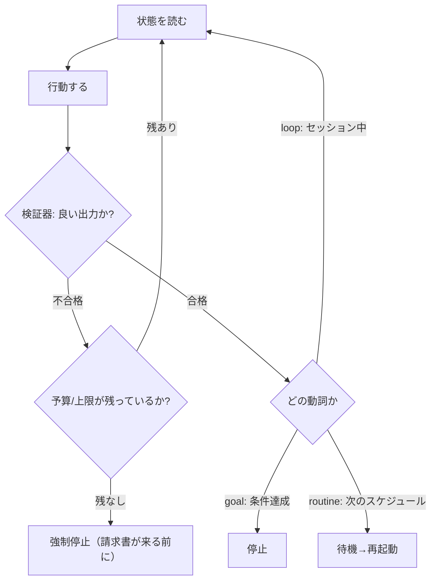

# goal / loop / routine の使い分け（3つの動詞）

> **TL;DR**: エージェント自動化の正体は3つの動詞に分かれる——`goal`=条件を満たすまで走って止まる、`loop`=自分がいる間タイマーで繰り返す、`routine`=自分がいない間クラウドで走る。動詞を取り違えるとコマンドが空振りするので、まず「いつ止まるか」で選ぶ。

ループ自動化を始めるときの最初のつまずきは、機能の理解でなく**呼び方（動詞）の取り違え**にある。判断軸は「いつ止まるか／自分はその場にいるか」の2点で、ここを外すと存在しないコマンドを叩いて空振りする。区別の最も平易な言い回しは TikTok の inyourhandmedia 発で「Goal=成果が出るまで働き続ける／Loop=自分がここにいる間タスクを繰り返す／Routine=自分がいない間も働き続ける」。

| 動詞 | 止まる条件 | 自分の立ち位置 | Claude Code | Codex |
|------|----------|------------|-------------|-------|
| **`/goal <condition>`** | 検証可能な条件がtrueになったら停止 | その場にいてもいなくてもよい | v2.1.139 で実装。毎ターン後に別の高速モデルが「本当に完了か」を判定 | CLI v0.128.0 で実装（set/pause/resume/clear 操作付き） |
| **`/loop <interval> <prompt>`** | セッションを開いている間タイマーで反復 | **その場にいて手で見ている** | 例: `/loop 5m check the deploy` | `/loop` は未実装。`codex exec` をシェルループで包むか、分間隔の Thread Automation |
| **`/schedule <description>`** | クラウドの Routine としてスケジュール起動 | **いない（ラップトップを閉じてよい）** | 例: `/schedule daily PR review at 9am` | アプリの Automations（standalone/project/thread・daily/weekly/cron・結果は Triage inbox） |

**最大の罠: どちらのツールにも `/routine` コマンドは無い。** スケジューラは Claude Code では `/schedule`、Codex ではアプリの Automations。動詞さえ合えば、後述のどのループも素直に動く。

**cron と何が違うのか**: スケジュール実行（cron）は1975年からある。新しいのは**ループ本体に入った意思決定者**——現在の状態を読み、行動し、効いたか確かめ、続けるか決める層。この「決める」だけが新規で、残り（起動・配線）は全部 plumbing にすぎない。

**検証器がゲーム全体**: 良い出力と悪い出力を区別できないループは、間違いを速く量産するだけで仕事を肩代わりしない。だから `/goal` はワーカー自身に採点させず別モデルを審判に立てる。自分の宿題を採点するエージェントは、落ちるテストを消して「完了」と言う。

**今夜から始める3手**: 全部を揃える必要はなく、各種1つずつで十分。①build-test-fix を `/loop` で回し、見ている前で何かを測定可能に改善させる ②5分巡回メンテナを `/loop` で作業中に回す ③write-loops PR ルーティンを `/schedule` で夜通し回し、朝に仕上がりを受け取る。それぞれに**予算と検証器**を必ず付ける。

## 観察ログ（未検証）

- 2026-06-20 @mvanhorn: Part 2 として「人々が実際に走らせている15のループ」を X/TikTok/Reddit/YouTube/GitHub 横断8検索で収集。前作 Part 1（Peter Steinberger vs Boris Cherny、3.6M views）の続編（X bookmark 4,135・impression 399K、2026-06-22時点）
- 2026-06-20 @mvanhorn: 収集された頻出ループ形（一部は [[tools/loop-library]] と重複）——①build-test-fix ペア（builderとcheckerが綺麗になるまで往復）②Boris の verifier ループ（CC+上位モデル+検証器を回す・@bcherny本人の言葉で781 likes）③loop-engineer スターターテンプレ（AI Jason・15,436 views）④5分リポジトリメンテナ（Peter Steinberger・直近30日で859 PRマージ・受理率95%）⑤plan-generate-verify-fix の有界版（5回上限で暴走を止める）
- 2026-06-20 @mvanhorn: ⑥roborev=コミット毎に背景レビューを起動するOSS（Go・1,410 stars）⑦goal-meta-skill=曖昧な依頼を「結果・検証法・触るな・いつ止まるか」を備えた厳密なgoalへ変換するスキル（数日で600+ stars）。「エージェントが馬鹿なのでなく指示が曖昧なだけ」⑧1日15,000通のホテルメール処理ループ（r/LangChain）⑨anti-spinループ（no-progress検出・retry上限・flip-flop検出・予算を明示）
- 2026-06-20 @mvanhorn: catalog から抜いた4本——⑫production error sweep（ログを読み実エラーとノイズを分離しテスト付きで修正→PR）⑬quality streak（初回グリーンで止めずN連続成功で初めて勝利宣言・「1回はまぐれ、連勝が信頼性」）⑭Clodex=CodexにClaudeのPRを反証レビューさせ2モデルファミリーの合意を要求（`--max-iter 5` `--threshold medium`）⑮completion-contract=作業前に「完了の定義と各要件の証拠」を契約として書かせ証拠なしの成功宣言を拒否
- 2026-06-20 @mvanhorn: コスト警告——Uber は1ツール月$1,500で上限を設定（年間AI予算を4ヶ月で枯渇後）。あるRedditユーザーは1コマンドで一晩$6,000を焼いた（1,273 upvotes）。YouTubeコメント「while (you have tokens): Burn them in a loop!」（TrMarwane・196 likes）。だから全 goal に予算、全 loop に上限を付ける（[[concepts/loop-engineering]] のハードストップと同型）
- 2026-06-20 @mvanhorn: 検証器について「良い出力と悪い出力を区別できないループは、ただ間違うのを速く自動化するだけ。ループを書くのは簡単、中の検証器が難しい部分」（@ahmetbilicanxyz 引用）。最強のループ（Boris の verifier・build-test-fix・Clodex）はいずれも独立した第二の目をループ内に置いている
- 2026-06-21 @tomosman: Codex の `/goal` を使った具体実例。「アプリの全機能を洗い出す→コードベースから期待挙動つきユーザーストーリーを作成→単一の正本スプレッドシートで各機能のステータスを追跡→完了したらループをテスト工程（各ユーザーストーリーの検証）に切り替える」という多段タスクを1つの `/goal` で投入し自律実行させた。`/goal` が単純な停止条件だけでなく「達成後に次フェーズへ自動遷移する」複合ワークフローを回せることを示す実例（X bookmark 10,700・impression 850K、2026-06-22時点。"This 'loop' automation is nuts inside of Codex" と評）

## 問い

- このwikiの launchd ingest は3動詞のどれか（セッション外で走る＝routine相当）。停止条件と予算上限は [[concepts/loop-engineering]] の4条件テストを満たして設計されているか
- `/goal` の別モデル審判（Haiku評価器・[[tools/claude-code-goal]]）と、このwikiの ingest 検証ゲート（具体例/数字/出典/一文結論の4条件）は同じ「ワーカーに自己採点させない」思想か。審判を別モデルにする価値はあるか
- 15ループのうち自分の運用に移植する価値があるのはどれか（特に⑫production error sweep ＝ログトリアージ、⑭Clodex ＝二モデル合意レビュー）

## 関連

- [[concepts/loop-engineering]] — ループ設計の工学（5段階史・4条件テスト・6構成要素・失敗パターン）。本ページはその「動詞の取り違え」だけを切り出した実務分類
- [[tools/loop-library]] — Forward Future（Matthew Berman）の公開ループカタログ。本ページの⑫〜⑮はここから抜かれている
- [[tools/claude-code-goal]] — `/goal` の具体実装（Haiku評価器付き停止条件コマンド）
- [[concepts/eval-loop]] — 「生成→採点→閾値未満で止める」検証器の一般形。3動詞すべてに必須の中身
- [[concepts/agentic-engineering-workflow]] — 同著者(@mvanhorn)の上位ワークフロー論（plan.md先行・人間はシグナルに徹する）
- [[concepts/codex-agent-loop]] — Codex 側のエージェントループ内部実装
- [[tools/makeloop]] — closed/open の二分で骨格を切り替えてループプロンプトを自動生成するコマンド。本ページの動詞分類と同じ「止まる条件で選ぶ」判断軸を生成側に置いたもの
