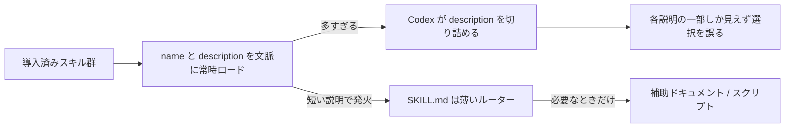

# GPT-6 Astra 向けにスキルと指示を見直す（Codex チームの指針）

> **TL;DR**: OpenAI の Codex DX（開発者体験）担当 Eric Provencher（@pvncher）は、[[models/gpt-6-astra]] 世代では過去に積み上げた足場（スキル・AGENTS.md・タスクプロンプト）が逆に効くとして、スキルは「入れすぎない・説明文は最短・根本文書は薄いルーター・手順書化しない」、AGENTS.md は「各行をまだ要るかで再審査する」へ書き直せと述べる。Codex 同梱の $skill-creator スキルの指針もこの方向へ更新済み。

エージェントを1年使ってきた人ほど、モデルを良い結果へ導くために書き足した指示が肥大しており、リリースごとにその前提を見直す価値はあったが、GPT-6 Astra ではそれがこれまで以上に重要になる、と Provencher は書く。かつて多くの手取り足取り（handholding）と足場（scaffolding）を要した作業が、もう要らなくなっているためである。指示は Skills・AGENTS.md・タスクプロンプトの3つの形を取り、いずれもモデルの仕事の進め方を形づくる。記事はこの3つを順に扱うが、本 vault のキャッシュは AGENTS.md の節で途切れており、タスクプロンプトの節は未捕捉。

## スキル: 入れすぎが最大の失敗

Provencher の定義では、スキルファイルは Markdown として保存されたプロンプトで、スクリプトを同梱することもある。特定のタスクでだけ必要になるワークフローの指針や、プラグインの使い方を教えるのに最も向く。

多くの人がプロジェクトに大量のスキルをダウンロードするが、それは誤りだと Provencher は述べる。各スキルは name と description をモデルの文脈に載せて「いつ使うか」を判断させる。説明文の多くは長すぎ、スキルを増やしすぎると Codex は収まるよう説明文を切り詰め始める。モデルは各説明の一部しか見られなくなり、どのスキルを選ぶかの判断が難しくなる。さらに悪いことに、説明文同士が矛盾したり「自分を選べ（pick me）」と主張しすぎたりして、タスクに役立たない指示を読み込む結果になる。

Codex にスキルを作らせると使われる $skill-creator スキルの指針を、実運用で見えた失敗モードを抑えるために最近3点で更新した、と Provencher は述べる（一人称複数「we」で書かれており、Codex チームとしての更新）。

1. **説明文は最短にする**。いつ使うべきかが伝わる範囲で、できるだけ短く書く。記事に添えられた例では、悪い説明文はデータベースに触れるあらゆる場面でスキルを発火させてしまうのに対し、良い説明文はマイグレーションを扱うときだけに絞る（例の説明文の原文は本 vault では未捕捉）。
2. **progressive disclosure（段階的開示）**。スキルを読むこと自体が文脈を消費し、compaction（文脈圧縮）を早め、タスクに無関係な指針まで持ち込む。複数のワークフローを持つスキルは、根本文書を最小のルーターにして補助ドキュメントとスクリプトを指し示し、どこを見ればよいかは分かるが今関係ないものは読まずに済むようにする。
3. **手順書（itinerary／recipe）にしない**。多くのスキルは細かな旅程や料理のレシピのように書かれてきたが、モデルはニュアンスと曖昧さの理解が大きく進み、以前は効いた過度に具体的な指針が今は結果を損ないうる。

リポジトリに置いたスキルは他の貢献者のエージェントも導き、それらは別のモデルを使うかもしれない。Sol や Luna（[[models/gpt-5-6]] の能力ティア）に効く指針が GPT-6 Astra を縛りすぎることがあるので、残す指示をどのモデルが使うのかを考えよ、と Provencher は付け加える。

## AGENTS.md: 各行に「まだ要るか」を問う

AGENTS.md はモデルがそのリポジトリで作業するたびに適用されるので、各指示を見直し、そのタスクにまだ必要かを問え、と Provencher は述べる。編集のたびにドキュメントの山や全リポジトリの地図を要求するのは、タイポ修正には過剰である。GPT-6 Astra は変更のたびにプロジェクト全体を見直すよう押されなくても、何を読む必要があるか自分で見つけられる。

## Anthropic 側の指針との対応（本 wiki の対応づけ）

同じ問題を別ベンダーが独立に語っている点が読み取れる。[[concepts/context-engineering]] で Anthropic Claude Code チームの Thariq が「ルールを与える→判断に委ねる」「全部前もって→progressive disclosure」と述べ、[[concepts/fable-5-prompting]] が Fable 5 向けに「指示を足すより減らす」を掲げ、[[concepts/instruction-patch-lifecycle]] が Boris Cherny の「モデル世代が変わったら全部外す」を伝える。Provencher の3点（最短の説明文・薄いルーター・手順書化しない）は [[concepts/skill-building-best-practices]] の「description はトリガー定義」「ファイルシステムで progressive disclosure」「railroading 回避」とほぼ一対一で重なる。両社の Codex／Claude Code 担当者が同じ時期に同じ方向へ動いているのは、モデルの判断力が上がったときに指示の在庫が負債へ転じる現象が特定製品に固有でないことを示唆する（本 wiki の推論）。

Codex 固有の点として、スキルが多すぎると説明文が黙って切り詰められる挙動は、Claude Code 側で @kimuai08 が報告した「説明文の合計上限を超えるとスキルが一覧から落ちる」（[[concepts/instruction-patch-lifecycle]]）と症状が近い。[[tools/skill-cleaner]] はこの予算超過を検出する側の道具である。

## 問い

- この vault の wiki-ingest SKILL.md は「複数ワークフローを持つスキル」に当たる。根本文書を薄いルーターにして Tier 判定・長文構造・図解判定を補助ドキュメントへ分ける progressive disclosure を適用すべきか。[[concepts/context-engineering]] の問いと同じだが、Codex 側からも同じ指針が出た
- 「説明文の切り詰め」は Codex のどの閾値で起きるか。[[tools/skill-cleaner]] が仮定する「文脈の2%」と一致するかは記事に記載がない
- 記事後半のタスクプロンプトの節は未捕捉。X の記事本体（x.com/i/article/2095989703967125509）を取り込む

## 関連

- [[models/gpt-6-astra]] — 本記事が前提とする OpenAI の新モデル
- [[tools/openai-codex]] — 本記事の対象製品。$skill-creator は Codex の同梱スキル
- [[concepts/skill-building-best-practices]] — Anthropic 側のスキル設計原則。description＝トリガー定義・progressive disclosure・railroading 回避が本記事の3点と対応
- [[concepts/context-engineering]] — Anthropic Claude Code チームの「ルール→判断」「前もって全部→progressive disclosure」。本記事は Codex 側の同じ転換
- [[concepts/fable-5-prompting]] — Fable 5 向け「指示を足すより減らす」公式指針。ベンダー違いの同型
- [[concepts/instruction-patch-lifecycle]] — モデル世代交代で指示を全部外して戻す運用。本記事の「リリースごとに前提を見直す」の手順版
- [[concepts/agents-md-canonical]] — AGENTS.md を正本にする設定設計。本記事は正本に置いた各行の再審査を求める
- [[tools/skill-cleaner]] — Codex スキルの予算超過・重複・未使用を検出する CLI。「入れすぎ」を検出する道具側
- [[concepts/skills-over-memory]] — 指示ファイルを短く保ち決定を変える行だけ残す同じ問題意識
