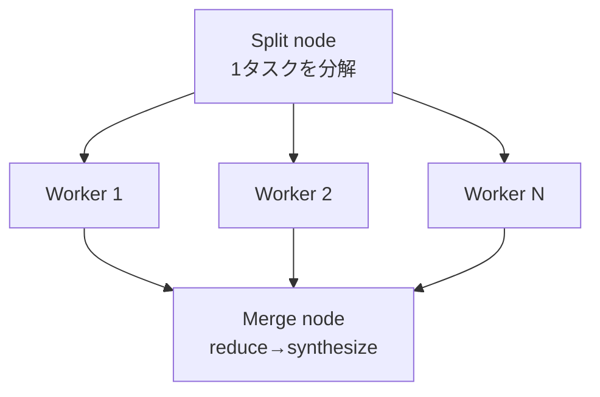

# グラフエンジニアリング（Graph Engineering with Claude）

> **TL;DR**: エージェント間のオーケストレーションを「ノード（仕事）」と「エッジ（実際に流れるデータ）」という語彙で捉え直し、"これは本当にエッジか" "バリアは要るか" を機械的に判定できるようにする設計規律。

線形の「Aして、Bして、Cして」という指示は、実は退化したグラフ——各ノードが入力エッジ1本・出力エッジ1本しか持たない一本鎖にすぎない。@0xCodez（movez.substack.com）は、Claude Code の [[concepts/claude-code-dynamic-workflows|Dynamic Workflows]] を使いこなす分かれ目を、この鎖をどう幅のあるグラフへ描き直すかに置く。

**エッジは「そして」ではない**。「ファイルを要約して、天気を教えて」の2つは要約結果を天気の応答が消費しないため、エッジで繋がっていない独立した2ノードにすぎない。@0xCodezは、あらゆる「そして」に対し「次のステップは前のステップの出力を読むか？」を問えとする。読まないなら待たせるだけ無駄で、線形スクリプトが不要な直列化をしているサインだと述べる。

**ノードには契約（contract）を持たせる**。境界のある入力・境界のある出力・単一の仕事、この3つが揃わないノードは並列化できない。Dynamic Workflowsでは `agent()` 呼び出しにJSON schemaを渡すことでこれを強制でき、次のノードは自由テキストをパースして祈る代わりに検証済み構造化データを受け取れる。

**バリアの要否を判定するスメルテスト**。`parallel()` は全結果が揃うまで待つバリア、`pipeline()` は各アイテムが独立に各ステージを流れるストリーミングで、遅い1件が他の全件を足止めしない。@0xCodezは「`parallel → 変換 → parallel` と書いていて、その変換にアイテム間の依存が無いなら、そこはコード（エッジ）で済ませるべきでバリアを重ねる理由にならない」という具体的な判定基準を示す。fan-in（統合）だけがバリアの正当な置き場所——重複排除・ランキング・空集合での早期終了など、全件が揃わないと成立しない処理に限る。

**サイクルは収束条件とセットでなければ暴走する**。未知サイズの発見タスク（バグ探索など）にはループバックのエッジが要るが、@0xCodezはここでの典型的な失敗を名指しする——重複排除の対象を「確認済みの結果」ではなく「これまでに見た全て」にしないと、一度却下された発見が毎ラウンド再浮上し、ループが同じ行き止まりを永遠に再発見し続ける課金マシンになる。停止条件は「K回連続で新規なし」（loop-until-dry）。

**モデルはノードごとに階層化する**。図の全ノードが同じ知能を要るわけではない。境界が明確で反復的なノード（抽出・分類）は安いモデルへ、判断が要る統合ノードだけ高いモデルへ回す。Dynamic Workflowsでは各サブエージェントがデフォルトでセッションモデルを継承するため、何も指定しなければ大規模runは全ノードがセッション階層の料金で課金される——`agent()` の `model` オプションで個別ノードだけ安いモデルへ逃がすのがこのレバーの使い方になる。

**グラフの形そのものがコストとレイテンシの最大のレバー**。`parallel()` か `pipeline()` かの選択がここに当たる。「コードが綺麗になる」「ステージが概念的に別」はバリアを選ぶ理由にならない——バリアの待ち時間は実測できる無駄であり、別であることと同期している必要があることは別だと@0xCodezは強調する。

**手で描けない仕事は自己ルーティングに任せる**。事前にグラフの形を計画できないタスクでは、プロンプトに「workflow」という語を含める、または `ultracode` を有効にすると、Claudeがオーケストレーションスクリプト自体を書く。うまくいった実行は `s` キーで `.claude/workflows/` に保存でき、以降は名前で再実行できるバージョン管理された資産になる。

## エンジニアリングスタック：各層が前の層を包む

2026年7月18日、Peter Steinberger（[[tools/openclaw]] 開発者）が「まだループの話してる？それとももうグラフに移った？」と9語で問いかけた数時間後、Hamel Husainが「Loop Engineering Is Dead. Enter Graph Engineering」という記事を公開した。@akshay_pachaarはこの応酬を「半分は冗談だが、核心を突いている」と評する——複数のループが協調する必要が生じた瞬間、それは調整問題であり、エンジニアはずっとグラフで調整を記述してきたからだ、と述べる。

@akshay_pachaarは、AI開発の重心がモデルそのものから離れ続けるたびに新しい名前が付いてきたと整理する。各層は1つ前の層を包み込む入れ子構造で、下の層を飛ばすとグラフはより複雑な形で失敗するだけだと述べる。用語は増え続け新しい用語が出るたびに前の用語の置き換えとして扱われがちだが、実際には置き換えでなく包含であり、各層を見分けるいちばんクリーンな方法は「1つの作業単位（unit of work）がどこまでを指すか」を問うことだと@akshay_pachaarは述べる。

| 層 | 対象 |
|----|------|
| プロンプトエンジニアリング | モデルへ送る言葉そのもの |
| コンテキストエンジニアリング | モデルが見る全て（指示だけでなく）。[[concepts/context-engineering]] 参照 |
| ハーネスエンジニアリング | ツール実行・状態追跡・エラー処理を行うモデル周囲のコード |
| ループエンジニアリング | 1エージェントをゴールへ向けて回す自律サイクル |
| グラフエンジニアリング | 複数ループを束ねる調整層——何が・いつ・どの順で走り、誰が誰を検証するか |

@akshay_pachaarは、この技術自体に新しさはないと釘を刺す。LangGraphは2024年1月時点で既に「状態を共有するノードとエッジ」という同じモデルを実装しており、MicrosoftのAutoGenにもGraphFlow、GoogleのADK 2.0もワークフロー実行系を同じ発想で構築している。Hamel Husainの投稿への反応の一つが単に「おかえり、langchain」だったと@akshay_pachaarは紹介する。

## 4つの難所（@akshay_pachaarによる整理）

グラフを腐らせずに使いこなすための4つの難所。

**難所1: ノードを置く価値があるかの判定** — 最も多い失敗は「PDFを要約して」のような単純作業を、fetcher・chunker・summarizer・reviewer・formatterの5ノードに分解してしまうことだ。ノードが存在資格を得るのは、別のモデル・別のツールセット・読み取り専用レビュアーのような明確に独立した役割を担うときだけで、既存ループへインライン化できる手順はノードではない。@akshay_pachaarは実務者の基準として「紙ナプキンに描けないなら複雑すぎる」というフィルターを紹介し、2ノードを1つに統合しても何も失われないなら、それらは最初から2ノードではなかったとする。

**難所2: 共有状態を汚さない** — ループのコンテキスト腐敗に相当する病がグラフでは共有状態に移る。全ノードが状態オブジェクトへ書き込むため、2番目のノードの雑な書き込みが5番目のノードにとって「確信を持った入力」になってしまい、出力が誤るまで誰も気づかない。対策は地味だが効く——状態に型付きスキーマを与える、どのノードがどのフィールドに書き込めるかを明示する、ノード間でチェックポイントを取りリプレイで問題箇所を特定できるようにする。ただし注意点が1つあり、チェックポイント後のノードはリプレイで再実行されるため、メール送信やレコード作成のような外部副作用を持つノードは2回実行されても安全でなければならない。

**難所3: 信頼できるルーティング** — エッジは決定であり、問題は誰がその決定を下すかだ。モデルにルートを決めさせると柔軟性と不安定性を同時に得ることになり、同じ状態が実行のたびに違う経路を辿ってデバッグを困難にする。GoogleのADK 2.0の設計ルールを@akshay_pachaarは「この議論で最もクリーンな立場」と評する——予測可能なルーティングは決定論的コードが制御し、モデルは本当に判断が必要なステップだけを担当すべき、というものだ。条件がチェック可能な箇所はコードでルーティングし、モデル呼び出しは解釈が本当に必要な箇所だけに使う。

**難所4: エージェント同士が馴れ合う** — ループエンジニアリングの鉄則は「エージェントに自分の宿題を採点させるな」だった。グラフはこの危険を増幅する。同じベースモデルの上に構築された20体のエージェントが同じ欠陥のあるコンテキストを読めば、喜んで互いに同意し合う。しかもモデルは自分自身の出力を測定可能なほど好む傾向がある、と@akshay_pachaarは指摘する。結果は「整然とした構造に包まれた誤答」という産業規模の"organized nonsense"になる。対策は牙を持つレビュアーノードだ——別モデルで走らせ、全会話履歴でなく新鮮なコンテキストを与え、実際に通ったテストや実際にコンパイルが通ったコードのようにグラフが捏造できない証拠に判定を紐づける。Cognitionは自社のコーディングエージェントDevinを1年運用した末に同じ結論へ到達したと@akshay_pachaarは紹介する——複数のエージェントに読ませて意見を言わせるが、変更してよいのは常に1体だけ、という体制だ。読み取りは並列でも安全だが（悪い意見はそれ自体では何の損害も与えない）、書き込みは損害が発生する場所なので1箇所に留めて可視化する。

## グラフが過剰装備になる場面

@akshay_pachaarは「ほとんどの場合」がその答えだと率直に述べる。Anthropicが公表した数値として、単体エージェント1回は通常のチャット対話の約4倍のトークンを消費し、マルチエージェントシステムは約15倍消費すると@akshay_pachaarは紹介する。ノードを1つ足すごとにこの倍率がかかる。

一方で、タスクが本当に並列化できる場面では天井が実在する。Anthropicのマルチエージェント・リサーチシステムは、社内リサーチ評価で単体のOpusエージェントを90.2%上回ったという。研究はもともと独立した検索へ自然に分岐するタスクだからだ。それでもAnthropicの「Building Effective Agents」が示す基本方針は変わっていないと@akshay_pachaarは付け加える——最もシンプルな解決策を見つけ、タスクが要求するときだけ複雑さを足せ、というものだ。LangGraph自身のガイドも「エージェントがツール付きの素直なループなら、LangGraphは過剰装備」だと認めていると@akshay_pachaarは指摘する。

判断基準はこうなる。仕事が本物の専門分化に分かれる、並列のfan-out/joinが要る、ステップごとに違うモデルが要る、または失敗の隔離と監査可能なルーティングが要る場合にグラフへ進む。それ以外はループに留まる。

## 観察ログ（未検証）

- 2026-07-20 @0xCodez: 本記事は同著者が2026-06-03に投稿した「6パターン・14ステップ」の二次まとめ（[[concepts/claude-code-dynamic-workflows]] の観察ログに既記録）を、フルコースとして展開したもの。X bookmark 3,057 / imp 557,563（2026-07-21時点）
- 2026-07-25 @akshay_pachaar: Anthropicの「単体エージェント約4倍・マルチエージェント約15倍のトークン消費」「マルチエージェント・リサーチシステムが単体Opusエージェントを90.2%上回った」という数値は同記事からの孫引きで、Anthropic一次資料に当たって未検証。X bookmark 1,513 / imp 279,645（2026-07-28時点）

## 問い

- fan-inのバリア判定（スメルテスト）を自分のwiki ingest/lint/reviewの各ステップに当てはめると、どこが本当のバリアでどこがただのコード変換か
- loop-until-dryの「確認済みでなく見た全てに対して重複排除する」という失敗回避策を、`.claude/skills/wiki-ingest/LESSONS.md` の蓄積や `wiki/tier_log.jsonl` の判定に応用できるか
- ノードの契約（schema）をwiki-ingestスキルの各ステップ（Tier判定・カテゴリ判定・インターリンク）に与えるとしたら、どこに境界を引くべきか
- 「紙ナプキンに描けないなら複雑すぎる」というノード判定基準を、wiki-ingestの既存パイプライン（Tier判定→カテゴリ判定→インターリンク→ページ生成→index更新→ログ記録）に当てはめると、いくつのノードに整理し直せるか
- Google ADK 2.0の「ルーティングは決定論的コードで、モデルは本当に判断が必要な箇所だけ」というルールを、wiki-ingestのカテゴリ判定（rule-basedのdetermine_tier.pyとLLM判定の併用）に一貫して適用できているか

## 関連

- [[concepts/claude-code-dynamic-workflows]] — Dynamic Workflowsの機能詳細・パターンカタログ本体。本ページはその上位に立つグラフ思考の語彙
- [[concepts/dynamic-agent-org]] — 「loopがエージェント単体を、graphが組織構造をプログラム可能にする」という抽象化レイヤー整理（@Saboo_Shubham_）。本ページはその「graph」側を実装レベルへ展開したもの
- [[concepts/harness-engineering-roadmap]] — 同じ@0xCodezによる「ハーネスを積む」対の記事。ハーネス→ループ→グラフの3部作の最終層
- [[concepts/loop-engineering]] — ループ理論。グラフはループのさらに一段上の抽象化レイヤーという位置づけ
- [[concepts/multi-agent-patterns]] — Fan-Out/Orchestrator-subagent等、個々のパターンの実装詳細
- [[concepts/llm-model-selection-strategy]] — 工程分解型モデル選択の一般論。本記事のノード別モデル階層化と同型
- [[concepts/context-engineering]] — スタックの一段下、「モデルに何を見せるか」の設計原則（@trq212／Anthropic Claude Codeチーム）
