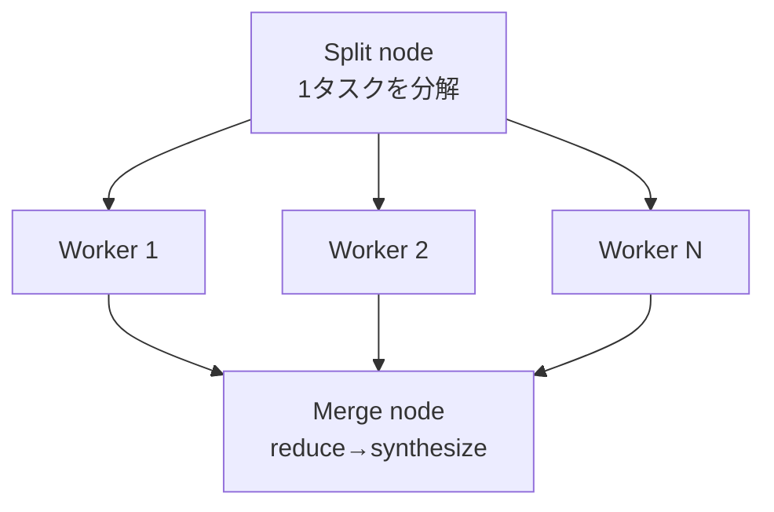

# グラフエンジニアリング（Graph Engineering with Claude）

> **TL;DR**: エージェント間のオーケストレーションを「ノード（仕事）」と「エッジ（実際に流れるデータ）」という語彙で捉え直し、"これは本当にエッジか" "バリアは要るか" を機械的に判定できるようにする設計規律。

線形の「Aして、Bして、Cして」という指示は、実は退化したグラフ——各ノードが入力エッジ1本・出力エッジ1本しか持たない一本鎖にすぎない。@0xCodez（movez.substack.com）は、Claude Code の [[concepts/claude-code-dynamic-workflows|Dynamic Workflows]] を使いこなす分かれ目を、この鎖をどう幅のあるグラフへ描き直すかに置く。

**エッジは「そして」ではない**。「ファイルを要約して、天気を教えて」の2つは要約結果を天気の応答が消費しないため、エッジで繋がっていない独立した2ノードにすぎない。@0xCodezは、あらゆる「そして」に対し「次のステップは前のステップの出力を読むか？」を問えとする。読まないなら待たせるだけ無駄で、線形スクリプトが不要な直列化をしているサインだと述べる。

**ノードには契約（contract）を持たせる**。境界のある入力・境界のある出力・単一の仕事、この3つが揃わないノードは並列化できない。Dynamic Workflowsでは `agent()` 呼び出しにJSON schemaを渡すことでこれを強制でき、次のノードは自由テキストをパースして祈る代わりに検証済み構造化データを受け取れる。

**バリアの要否を判定するスメルテスト**。`parallel()` は全結果が揃うまで待つバリア、`pipeline()` は各アイテムが独立に各ステージを流れるストリーミングで、遅い1件が他の全件を足止めしない。@0xCodezは「`parallel → 変換 → parallel` と書いていて、その変換にアイテム間の依存が無いなら、そこはコード（エッジ）で済ませるべきでバリアを重ねる理由にならない」という具体的な判定基準を示す。fan-in（統合）だけがバリアの正当な置き場所——重複排除・ランキング・空集合での早期終了など、全件が揃わないと成立しない処理に限る。

**サイクルは収束条件とセットでなければ暴走する**。未知サイズの発見タスク（バグ探索など）にはループバックのエッジが要るが、@0xCodezはここでの典型的な失敗を名指しする——重複排除の対象を「確認済みの結果」ではなく「これまでに見た全て」にしないと、一度却下された発見が毎ラウンド再浮上し、ループが同じ行き止まりを永遠に再発見し続ける課金マシンになる。停止条件は「K回連続で新規なし」（loop-until-dry）。

**モデルはノードごとに階層化する**。図の全ノードが同じ知能を要るわけではない。境界が明確で反復的なノード（抽出・分類）は安いモデルへ、判断が要る統合ノードだけ高いモデルへ回す。Dynamic Workflowsでは各サブエージェントがデフォルトでセッションモデルを継承するため、何も指定しなければ大規模runは全ノードがセッション階層の料金で課金される——`agent()` の `model` オプションで個別ノードだけ安いモデルへ逃がすのがこのレバーの使い方になる。

**グラフの形そのものがコストとレイテンシの最大のレバー**。`parallel()` か `pipeline()` かの選択がここに当たる。「コードが綺麗になる」「ステージが概念的に別」はバリアを選ぶ理由にならない——バリアの待ち時間は実測できる無駄であり、別であることと同期している必要があることは別だと@0xCodezは強調する。

**手で描けない仕事は自己ルーティングに任せる**。事前にグラフの形を計画できないタスクでは、プロンプトに「workflow」という語を含める、または `ultracode` を有効にすると、Claudeがオーケストレーションスクリプト自体を書く。うまくいった実行は `s` キーで `.claude/workflows/` に保存でき、以降は名前で再実行できるバージョン管理された資産になる。

## 観察ログ（未検証）

- 2026-07-20 @0xCodez: 本記事は同著者が2026-06-03に投稿した「6パターン・14ステップ」の二次まとめ（[[concepts/claude-code-dynamic-workflows]] の観察ログに既記録）を、フルコースとして展開したもの。X bookmark 3,057 / imp 557,563（2026-07-21時点）

## 問い

- fan-inのバリア判定（スメルテスト）を自分のwiki ingest/lint/reviewの各ステップに当てはめると、どこが本当のバリアでどこがただのコード変換か
- loop-until-dryの「確認済みでなく見た全てに対して重複排除する」という失敗回避策を、`.claude/skills/wiki-ingest/LESSONS.md` の蓄積や `wiki/tier_log.jsonl` の判定に応用できるか
- ノードの契約（schema）をwiki-ingestスキルの各ステップ（Tier判定・カテゴリ判定・インターリンク）に与えるとしたら、どこに境界を引くべきか

## 関連

- [[concepts/claude-code-dynamic-workflows]] — Dynamic Workflowsの機能詳細・パターンカタログ本体。本ページはその上位に立つグラフ思考の語彙
- [[concepts/dynamic-agent-org]] — 「loopがエージェント単体を、graphが組織構造をプログラム可能にする」という抽象化レイヤー整理（@Saboo_Shubham_）。本ページはその「graph」側を実装レベルへ展開したもの
- [[concepts/harness-engineering-roadmap]] — 同じ@0xCodezによる「ハーネスを積む」対の記事。ハーネス→ループ→グラフの3部作の最終層
- [[concepts/loop-engineering]] — ループ理論。グラフはループのさらに一段上の抽象化レイヤーという位置づけ
- [[concepts/multi-agent-patterns]] — Fan-Out/Orchestrator-subagent等、個々のパターンの実装詳細
- [[concepts/llm-model-selection-strategy]] — 工程分解型モデル選択の一般論。本記事のノード別モデル階層化と同型
