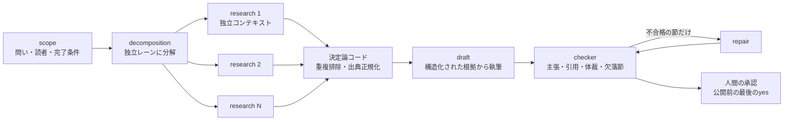

# 本番グラフの信頼性設計（状態・失敗・ルーティング権限）

> **TL;DR**: ノードとエッジの図が隠しているのは状態と失敗であり、@0xwhrrariは、耐久する状態・アーティファクト参照での受け渡し・ノード単位の失敗方針・決定論的に許可されたルートが揃って初めてグラフはデモから本番になると論じる。

箱と矢印の図が綺麗に見えるのは、システムがクラッシュから復帰しなければならなくなるまでの話だと@0xwhrrariは述べる。ノードとエッジの語彙、偽エッジの切断、ノードの契約、ダイヤモンド型、検査役の分離といった設計語彙は [[concepts/graph-engineering]] に厚く記述があり、@0xwhrrariも同じ結論に独立に到達している。本ページはそこに含まれない層——**実行が中断したあと何が残っているか、1ノードが死んだとき損害がどこで止まるか、ルートを決める権限を誰が持つか**——を扱う。@0xwhrrariの言葉では「プロンプトエンジニアリングは指示を改善し、コンテキストエンジニアリングはモデルが見るものを制御し、ハーネスエンジニアリングはモデルの周囲の環境を作り、ループエンジニアリングは1つの作業単位をフィードバックで改善し、グラフエンジニアリングは仕事全体を調整する。モデルはノードの1つにすぎず、プロダクトはその周囲のシステムだ」となる。

## 状態は図がいちばん隠す部分

本番のグラフには**耐久する状態（durable state）**が要る、と@0xwhrrariは述べる。そして受け渡しの原則を1つ挙げる——**巨大なトランスクリプトをノード間で動かさず、アーティファクトへの参照を動かす**。リサーチノードはレポートを保存してパス・ID・構造化サマリーを返し、レビュアーはそのアーティファクトを直接読む。3体のエージェントを経由した圧縮された語り直しを受け取るのではない。これでコンテキストの損失が減り、遷移が監査可能になると@0xwhrrariは述べる。記事はさらに「グラフはどの瞬間にも3つの問いに答えられるべきで、答えられないならそれはまだデモだ」と続けるが、その3問は記事内の図に置かれており本文テキストには含まれていない（元記事の図は未取得のため、ここでは列挙しない）。

この論点は [[concepts/12-factor-agents]] の Factor 5（実行状態とビジネス状態を分離しない）・Factor 6（シンプルなAPIで起動・一時停止・再開）を単体エージェントからノード群へ持ち上げたものと考えられる。

## 失敗はローカルなイベントとして設計する

鎖では1つ壊れたステップがワークフロー全体を凍らせる。グラフでは失敗を可能な限り小さい境界の内側に留めるべきだと@0xwhrrariは述べ、具体策を挙げる。

- **高価なノードの後にチェックポイントを置く**
- **書き込みを冪等にする**（リトライが副作用を二重に発生させないため）
- **ファイルを変更する並列ワーカーには隔離されたワークスペースを与える**
- **すべてのルーティング決定を、それを生んだ状態と一緒に記録する**

そして「信頼性は全ノードが成功することを願うところからは来ない。1つが成功しなかったときグラフが何をするかを決めるところから来る」とまとめる。ノードごとの失敗方針の一覧は記事内の図にあり本文には展開されていない。

## ルーティングを検査可能にする

**モデルは判断を下してよいが、その判断が何を起動できるかはグラフが強制する**。@0xwhrrariはこれを「分類器は確率的、許可されたルートは決定論的」と定式化する。これによりモデルの柔軟性を得ながら、システムに対する無制限の制御をモデルに渡さずに済む。OpenAIのビジュアルなAgent Builderは、エージェントの挙動が隠れたプロンプト連鎖ではなく検査可能なワークフローとして設計される方向への転換を可視化した例だと@0xwhrrariは位置づける。

同じ立場は [[concepts/graph-engineering]] の難所3（GoogleのADK 2.0の設計ルール）にも記録されており、別著者が独立に同じ結論へ到達している。

## エッジはデータ契約であり、配線にモデルを使わない

エッジの意味は「BがAの後に来る」ではなく「AがBの消費を許されたデータを生んだ」だと@0xwhrrariは述べる。この区別が効くのは、ワークフローの配線（plumbing）の多くがモデル呼び出しを必要としないからだ——配列の平坦化・重複除去・nullのフィルタ・ステータスの確認・レコードの結合はいずれも決定論的な操作である。**モデル呼び出しは判断のために取っておき、配線はコードでやる**。「すべてのエッジが別のエージェントになっているグラフは、自分の配線にトークンを払っている」と@0xwhrrariは書く。

ノードの契約についても、@0xwhrrariは4点を要求する——**1つの仕事・明示的な入力・構造化された出力・明確な失敗状態**。自由テキストは次のノードに何が起きたかを推測させる。契約が保たれる限りモデル・プロンプト・ツールを差し替えてもシステム全体を作り直さずに済むため、契約はノードの交換可能性そのものだと述べる。

## ほとんどのグラフは4つの形の組み合わせ

50個のパターンは要らないと@0xwhrrariは述べ、本番のグラフはおおむね次の4つの形の組み合わせだとする。

| 形 | 使いどき |
|---|---|
| **鎖（chain）** | 各ステップが本当に前の出力を必要とする場合。単純で予測可能、しばしば必要以上に遅い |
| **ダイヤモンド（diamond）** | 1つの仕事を独立した枝に分け、並走させ、結果を統合する。リサーチ・コードレビュー・デューデリジェンス・市場調査の主力 |
| **ルーター（router）** | 状態を見てタスクが必要とする経路だけを選ぶ。小さい仕事は安く済み、リスクの高い仕事は深いグラフへ回る |
| **制御されたサイクル（controlled cycle）** | 結果が不完全だと証拠が示すときだけ繰り返す。ハードな停止・予算・収束ルールが毎回必要 |

fan-outについては、並列化はいちばん理解しやすい利点でありいちばん濫用されやすい利点だと@0xwhrrariは注意する。5ノードが独立なら並走させる。ただし**各ステージの後にバリアを置いてはいけない**——joinが待つ価値を持つのは次のノードが完全な集合を必要とするときだけで、その例はソース横断の重複排除・全候補のランキング・選択肢の比較・カバレッジが十分かの判定である。各アイテムが独立に進めるならグラフはストリーミングのままにする。「並列は自動的に速いわけではない。トポロジーがシステムがどこで待つかを決める」。

サイクルには測定可能な収束が要る。「良くなるまで繰り返す」は停止条件ではないと@0xwhrrariは述べ、制御されたサイクルに必要なものとして**完了テスト・最大ラウンド数・トークンまたはコストの予算・過去の試行の記録・収束に失敗したときのエスカレーション経路**を挙げる。重複排除の対象は検証を通った発見だけでなく**これまでに見た全て**にする。そうしないと却下されたアイデアが戻り続け、グラフは同じ行き止まりを再発見するために永遠に課金する。

## 検証はエッジに置く

グラフでいちばんレバレッジの高いノードは、しばしば何も新しく生み出さないノードだと@0xwhrrariは述べる。その仕事は弱い成果物が下流へ進むのを止めることだ。検査役が確認できるものとして、すべての主張に出典があるか・引用された出典が主張を支持しているか・コードがテストを通るか・結果が要求されたスキーマに合っているか・独立した別経路が同じ結論に達するか、を挙げる。**1つのコンテキストの中で生成・承認・公開を同じエージェントにやらせない**。役割・プロンプト・失敗境界をそれぞれ分離する。Anthropicの本番リサーチシステムも同じ論理をより大きなスケールで踏んでいると@0xwhrrariは紹介する——リードエージェントが並列サブエージェントを調整し、発見が統合され、専用の引用ステージが根拠を付けてから結果がユーザーに届く。

## トポロジーがコストモデル

グラフは1体のエージェントより自動的に安いわけではなく、あらゆるタスクが艦隊を生むならはるかに多くのトークンを燃やしうると@0xwhrrariは述べる。形がレイテンシとコストの両方を決める。境界の明確な抽出・分類・整形には安いモデルを、分解・統合・難しい検証には強いモデルを使い、単純なタスクは短い経路へ流し、フルのグラフはそれに値する仕事のために取っておく。Anthropicはマルチエージェントのリサーチが幅優先の仕事で単体エージェントを実質的に上回りうると報告しているが、同時にはるかに多くのトークンを使うとも報告していると@0xwhrrariは紹介する。「グラフエンジニアリングはエージェントの数を最大化することではない。並列性・専門分化・独立した検証が十分な価値を生む場所にだけ調整コストを払うことだ」。

## グラフが誤答になるとき

@0xwhrrariの判断基準は、既存の議論とほぼ一致する。1エージェント1ループに留めるのは、タスクが短い・1つのコンテキストが関連情報すべてを保持できる・独立した枝がない・失敗が安い・人間が最終結果を素早くレビューできる場合。グラフへ移るのは、仕事が並列に走れる・ノードごとに違うツールや権限が要る・出力に独立した検証が要る・中断後に再開できなければならない・複数のループが状態を共有する必要がある・コストと権限を経路ごとに制御しなければならない場合。「1つのループから始め、依存関係がそれを強いるときだけグラフを描け」と@0xwhrrariはまとめる。

このうち**中断後の再開**と**経路ごとの権限・コスト制御**の2つは、他のグラフ論があまり前面に出さない移行条件であり、本ページの状態・失敗・ルーティング権限の3節がその裏側にある実装要件に当たると考えられる。

## 観察ログ（未検証）

- 2026-08-10 @0xwhrrari: Anthropicの「マルチエージェントのリサーチは幅優先の仕事で単体エージェントを実質的に上回るが、はるかに多くのトークンを使う」という報告は同記事からの孫引きで、Anthropic一次資料には当たっていない。X bookmark 1,740 / imp 1,738,952（2026-08-17時点）

## 問い

- 自分のwiki運用（ingest→lint→weekly生成）で、ノード間を渡っているのは「アーティファクトへの参照」か「トランスクリプトの語り直し」か。渡しているものを棚卸しすると、どこでコンテキストが失われているかが見えるのではないか
- 「書き込みを冪等にする」をwiki-ingestに当てはめると、同一ソースを二度ingestしたときにページの節・観察ログ・index行が二重化しない保証はどこにあるか（今回のように同じパスが2回渡されるケースを含む）
- マージ段で入力数を期待値と突き合わせて欠落を報告する仕組みは、`/tmp/ingest_result.json` の `sources_count` と `reflected_count` の差分検査として既に成立しているか。成立していないなら沈黙する欠落ノードをどう検知するか
- 「分類器は確率的、許可されたルートは決定論的」というルールは、カテゴリ判定（LLM）とTier判定（rule＋LLM併用）のどちらまで適用できるか

## 関連

- [[concepts/graph-engineering]] — ノード/エッジ/契約/偽エッジ判定/バリアのスメルテストという設計語彙の本体。本ページはその図が隠す状態・失敗・権限の層を扱う
- [[concepts/12-factor-agents]] — Factor 5（実行状態とビジネス状態）・Factor 6（起動/一時停止/再開）。本ページの耐久状態はこれをノード群へ持ち上げたもの
- [[concepts/multi-agent-patterns]] — フォールバック設計・Shared Stateの終了条件・古典的5パターン（Routing含む）。本ページの4つの形と対応する実装パターン集
- [[concepts/claude-code-dynamic-workflows]] — セッション再開・worktree隔離・ノード別モデル選択を実際に提供している実装。本ページの要件がそのまま機能として現れている
- [[concepts/loop-graph-grounding]] — 相互参照だけの循環したグラフはアンカー（生の実測）なしに壊れるという議論。検証をエッジに置く話の一段先
- [[concepts/harness-engineering]] — スタックの一段下、モデル周囲のコードとしてのハーネス
- [[concepts/eval-loop]] — 検査役ノードの品質ゲートとしての具体実装
- [[concepts/ai-engineer-interview-questions]] — 本ページの設計語彙（冪等・承認・予算・フォールバック）を「答えられるか」で測る面接10問。Q5〜Q7がここに対応する
