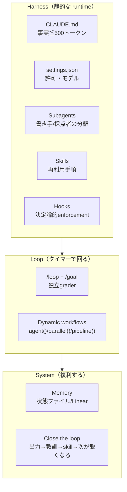

# ハーネス工学の構築ロードマップ（14ステップ・3階層）

> **TL;DR**: 1体のエージェントから自己改善システムまでを順序立てて積み上げるハーネス構築ロードマップ。ループは「タイマー付きのハーネス」にすぎず、出力が良いか屑かを決めるのは一階下——選んだモデル・許したツール・書いたコンテキスト・足したレビュア・残した記憶——で決まる。

ハーネスとは1体のエージェントが動く環境そのもの——思考するモデル・届くツール・それらの許可・起動時に読むコンテキストの4つが全表面で、subagents・hooks・memoryはこの4つのどれかを形づくる手段にすぎない。エージェントは「ツールを選び、実行し、結果を見て次を決める」while True ループであり、同じモデルでもハーネスが違えば別物になる。

**3階層を混同しないことが出発点**。多くの「エージェント設定がぐちゃぐちゃ」問題は3つの階を取り違えることから来る。ハーネス＝1体が住む静的なランタイム（モデル・ツール・許可・コンテキスト）。ループ＝そのハーネスをタイマーで起動し補助エージェントを生成し自分に食わせるもの。システム＝ループに複利するメモリが付いて「毎ランが次のランを鋭くする」状態。実務版の役割分担は、不変の事実はコンテキストへ・強制はhooksへ・手順はskillsへ・隔離はsubagentsへ。enforcementをCLAUDE.mdに書く、手順でコンテキストを膨らませる、といった配置ミスが一貫性のない高コストなエージェントの根本原因。なお、ハーネス全体はプロジェクト直下の `.claude/` 一つに収まり、「なぜ各ファイルが存在するか説明できる」範囲に小さく保つのが整然さの分かれ目。説明できないルール・hook・subagentは消す。

## 順序が教訓——積み上げの順番

ロードマップの核心は個々の部品でなく**積む順序**にある。順序を飛ばすと本番で壊れる。

1. **クリーンなハーネスで手動1回を信頼できるものにする**。デフォルトハーネス（空）は一回限りのタスクには十分だが、繰り返すなら毎セッション「プロジェクトを一から再導出・安全な操作にも許可待ち・終了で全忘却」のコストを払い続ける。
2. **コンテキストと許可を足す**。`CLAUDE.md` は毎セッション読まれる「立っている事実」だけに絞り、500トークン以下に保つ（手順はskillへ、フォルダ固有のルールは `rules/` へ）。`settings.json` は「取り消しが安いものは自動承認、高いもの（force-push・ファイル削除・秘密情報）は拒否か確認」で一度だけ決める。
3. **レビュアsubagentを足す**。subagentの最大の価値は並列性でなく、メイン文脈にノイズを入れないこと。最も価値があるのは「メインの出力を別の新鮮な文脈でチェックするレビュア」——自分の出力を自分で採点すると甘くなる。この書き手vs採点者の分離が、上のループすべてを信頼に足るものにする。
4. **hooksで決定論的enforcement**。hookはエージェントのライフサイクルの固定点で発火するシェルコマンドで、exit code 2でアクションをブロックできる。CLAUDE.mdは「提案」、hookは「強制」でモデルは言い逃れできない。危険コマンドを止めるPreToolUseゲートと、編集後に必ず整形するPostToolUseフォーマッタの2つがほぼ全ハーネスで元を取る。鋭いhookを1〜2個、20個ではない。
5. **memoryで複利にする**。エージェントはラン間で全忘却するが、ハーネスは覚えていられる。`agent-memory/` のMarkdownやLinearボードに「何を試したか・効いたか・失敗したか」を記録し、ランの終わりに書いてから離れ・始まりに読む。一般化した教訓はskillへ昇格させ全プロジェクトに効かせる。
6. **そのあとでループ**。設定済みハーネスをタイマーで回すのが `/loop`、`/goal` と組めば独立graderが客観条件で停止判定する。ループは知能を足さない——ハーネス内のルール・レビュアsubagent・安全hookを再利用するだけ。良いハーネスはループを瑣末にする。さらに複雑なタスクには、Claudeがその場で `agent()`/`parallel()`/`pipeline()` のJavaScriptを書く動的ワークフローがあり、これはハーネスが定義したsubagentとskillを編成する指揮者にすぎない。

## ループを閉じる——自己改善の正体

3階層がかみ合うのがこの段。各ランが出力を生み、レビュアsubagentがそれをチェックし、結果（合否・学び）がmemoryに書かれ、一般教訓がskillへ蒸留され、次のランが鋭いskillとリッチなmemoryを継承する。**モデルは一度も変わらない、周りのハーネスが鋭くなる**。これが正直な意味の「自己改善」——モデルが学ぶのでなく、ハーネスが蓄積する。これは [[concepts/skill-self-improving-loop]] の「会話履歴→Issue→PRの3段ループ」や [[concepts/self-refining-skills]] のLESSONS.mdアプローチと同じ骨格。

## ハーネスを腐らせる8つの失敗

- **デフォルトで走る**: コンテキストもルールも記憶もなく、毎セッション再導出。
- **肥大したCLAUDE.md**: 手順を立っている文脈に詰め込み毎ランを膨らませる。skillへ移す。
- **enforcementをhookでなくCLAUDE.mdに置く**: モデルは提案を無視できる、exit 2のhookは無視できない。
- **1体が書いて自分で採点**: 新鮮な文脈のレビュアsubagentを足す。
- **記憶がない**: 毎ランがゼロから。状態ファイルが明日の再開を作る。
- **悪いハーネスにループを巻く**: ループは屑を速く量産するだけ。土台を先に。
- **20個のhook**: 鋭い1〜2個が、誰も理解できない山に勝つ。
- **スキャンせず共有**: 漏れた秘密と過大な許可がインストールした全員に伝播する。

## 観察ログ（未検証）

- 2026-06-16 @0xCodez（二次まとめ・Substack）: 「10人中9人がデフォルトハーネス（ルール・subagent・hook・memoryなし）でClaude Codeを走らせ、なぜループが屑を生むのか不思議がる」と主張。ループに注目が集まる一方その土台が見られていないという問題提起。
- 2026-06-16 @0xCodez: Addy Osmaniの長文ループ論を引用——「ループ工学はハーネスの一階上に座る。ハーネスは1体のエージェントが動く環境、ループはそのハーネスがタイマーで動き補助を生成し自分に食わせるもの」。本ロードマップの3階層モデルはこの引用を土台にしている。
- 2026-06-16 @0xCodez: 「実務者が日々運用して得た経験則として、メインのメモリファイルは約500トークン以下に保て」と提示（単一ソースの推奨値）。
- 2026-06-16 @0xCodez: 結論「ループが栄光を得る、ハーネスが仕事をする。自己改善はモデルの性質では決してなく、あなたが周りに作るハーネスの性質だった」。@0xCodezは [[concepts/loop-engineering]] の4条件テストの整理者でもあり、本稿はそのループ論の土台＝ハーネス側を扱う対の記事。
- 2026-06-20 @_moto___（二次まとめ）: 本記事（@0xCodez）を「ハーネスエンジニアリング入門のよい記事」として紹介。Claude Codeを「指示して待つツール」から「条件を決めたら勝手に働き続ける同僚」へ移す採用経路を3ステップに圧縮——①/loopで試す ②デスクトップアプリで常駐 ③Routinesでクラウド自動化。本ロードマップの14ステップを「個人が実際に踏む導入順」に畳んだ要約（同一記事の別角度）。

## 問い

- このロードマップの「積む順序（手動1回→コンテキスト→レビュア→hook→memory→ループ）」と、自分のwiki ingestループの現状の積み方は一致しているか。飛ばした段はあるか。
- [[concepts/harness-engineering]]（理論：Agent=Model+Harness・5アーティファクト・3陣営）とこの構築ロードマップは、同じ概念の「理論層」と「実装手順層」の関係でよいか。重複と差分はどこか。
- 「説明できない部品は消す」を自分の `.claude/`（skills/hooks/handovers）に適用すると、削除候補はどれか。

## 関連

- [[concepts/harness-engineering]] — ハーネスの理論的全体論（Agent=Model+Harness・5アーティファクト・3陣営・5原則・Build to Delete）。本ページはその「構築手順」版
- [[concepts/loop-engineering]] — ハーネスの一階上＝ループ層。@0xCodez整理の4条件テスト・MVL・失敗パターン
- [[concepts/ai-engineer-roadmap]] — 「ハーネスこそ仕事の本体」の6フェーズ17週ロードマップ（より長い学習計画版）
- [[concepts/skill-self-improving-loop]] — 「ループを閉じる」の具体実装（会話履歴→Issue→Routines→PRの3段）
- [[concepts/claude-md-rules]] — CLAUDE.mdを事実に絞り行動ルール化する具体例
- [[concepts/claude-code-dynamic-workflows]] — Step内の「動的ワークフロー（agent/parallel/pipeline）」の機能詳細
- [[concepts/multi-agent-patterns]] — レビュアsubagent・fan-out等のオーケストレーションパターン
- [[concepts/graph-engineering]] — 同じ@0xCodezによる、グラフ層（ノード/エッジ/トポロジー）を掘り下げた対の記事。ハーネス→ループ→グラフの3部作の最終層
