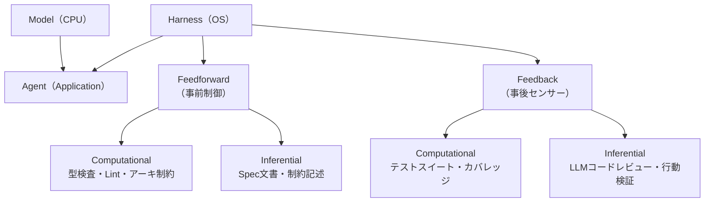

# Harness Engineering

> **TL;DR**: エージェント = モデル + ハーネス。ハーネスはモデルでないすべて（制約・フィードバックループ・コンテキスト・ツール許可）であり、同一モデルでもハーネス設計で13ポイント超の性能差が生まれる。2026年の工学的差別化は「最良のモデルを選ぶ」ではなく「最良の制約を設計し、不要になったら捨てる」に移った。

ThoughtWorksが定式化した `Agent = Model + Harness` が最も正確な定義。ハーネスとはモデルでないすべて——制約・フィードバックループ・エージェントが読むドキュメント・使用を許可されたツール——の集合体。ハーネスのないモデルは、コードベースを手探りで進む生のLMに過ぎない。馬具（harness）の語源の通り、「馬を賢くするのではなく、その力を有用な方向に向ける道具を設計する」思想。

**ハーネス = OSのメンタルモデル**: モデル = CPU（生の計算力）、コンテキストウィンドウ = RAM、ハーネス = OS、エージェント = その上のアプリケーション。OSがCPUの実力を決めるのと同じで、ハーネスがモデルの実力を決める。同一モデルでハーネスを差し替えると LangChain Terminal Bench 2.0 で旧52.8% → 新66.5%（+13.7pt）。Vercelはエージェントのツールを80%削減して性能が向上した。2026年の不快な真実: エージェントは難しくなかった。ハーネスが難しかった。

## 5つのハーネスアーティファクト

実際のハーネスを構成する5種のファイル・仕組み:

1. **AGENT.md / CLAUDE.md** — セッション開始時にエージェントが読むオンボーディングドキュメント。プロジェクトのコンテキスト・コーディング規約・アーキテクチャ決定・進行中の作業を記述。モジュールごとに1ファイル配置。これなしでは、エージェントは毎セッション何も知らない状態から始まる。
2. **JSON機能リスト** — 複数セッションにわたるビルドで「何が完了済みか」をエージェントが把握するファイル。各エントリに機能・検証方法・Pass/Failステータスを持つ。Markdown より JSON の方がエージェントが誤上書きしにくいことをAnthropicが発見した。
3. **セッション初期化ルーティン** — 毎回同じ7ステップで起動: 作業ディレクトリ確認 → gitログ読込 → 機能リスト確認 → devサーバー起動 → E2E確認 → 1機能実装 → コミット＆進捗更新。これがないと最初の20分をウォームアップに使い続ける。
4. **スプリント契約** — 実装前にGeneratorエージェントとEvaluatorエージェントが「何を作るか・どう検証するか」を協議するAI間設計レビュー。計画と実行を同一パスで行うと出力が不安定になる。
5. **構造化タスクテンプレート** — 実装前にコードベースを解析し、実存するファイルパス・シンボル名・既存パターン・具体的な受け入れ条件をマップする。ハルシネーションされたAPIやファイル構造での実装を防ぐ。

## 3陣営の独立的収斂

OpenAI・Anthropic・ThoughtWorksが調整なく同じ壁にぶつかり、異なる解を出した:

- **OpenAI（環境ファースト）**: 依存フロー（Types → Config → Repo → Service → Runtime → UI）を厳格化し、AGENT.mdをコードベース全体に配置、CI/CDに直結。実証: Sora Androidアプリを4人のエンジニア・28日・Playストア1位・クラッシュフリー率99.9%で完成。Codexは社内PRの70%を週次で処理。
- **Anthropic（実行者と評価者を分離）**: Planner（仕様作成）+ Generator（実装）+ Evaluator（ブラウザ自動化でテスト）の3役割分離。エージェントに自己評価させると「優れた出力」と答え続けるため、第三者的Evaluatorが必要。
- **ThoughtWorks（2×2フレームワーク）**: Feedforward（事前制御） × Feedback（事後センサー） と Computational（決定論的・ミリ秒） × Inferential（LLM使用・秒単位）の2軸で全制御を分類。Feedforwardだけでは制御が実際に機能しているか確認できない。

## 5つの普遍原則

3陣営が独立的に到達した一致点:

1. **コンテキストが指示に勝る** — 抽象的な指示より現実の状態（実ファイルパス・現在の進捗）を見せる。[[concepts/12-factor-agents]] の「コンテキストエンジニアリング」と同じ発見。
2. **計画と実行を分離する** — 同一パスでの計画+実行は信頼性を下げる。AI同士の協議でもよいが、分離ステップが必須。
3. **フィードバックループは非交渉的** — CI/CD統合・評価エージェント・テストスイートの何かで閉じなければ「指示付きプロンプト」に過ぎない。
4. **一度に一つ** — コンテキスト枯渇・整合性崩壊・要件のサイレントドロップを防ぐ強制インクリメンタリズム。
5. **コードベースがドキュメント** — 別の知識ベースをエージェント用に維持しない。規約・制約・アーキテクチャ決定がリポジトリになければエージェントは知らない。

## ハーネス崩壊（Build to Delete）

ハーネスの各コンポーネントは「モデルができないこと」を前提に書かれる。モデルが改善されると前提が消え、コンポーネントはオーバーヘッドになる:

- Opus 4.5: スプリント分解 + スプリントごとの評価が必須
- Opus 4.6: スプリント分解不要 + 単一パス評価（コスト38%削減）
- Opus 4.7: モデルが自己検証を開始 → Evaluatorの役割が縮小

"Build to delete" の原則: 定期的にコンポーネントをオフにして品質が変化するか測定する。変化しなければ削除する。Manus は6ヶ月で5回、LangChainは1年で3回ハーネスを再構築。死んだコンポーネントはすべての実行でトークンを消費するだけで価値をもたらさない。これは悪いエンジニアリングではなく、急速に改善するモデルの上に構築することの自然な帰結。

## 観察ログ（未検証）

- 2026-06-07: > 📌 X bookmark: 11,136（2026-06-08時点）— @steipete が "Here's your monthly reminder that you shouldn't be prompting coding agents anymore. You should be designing loops that prompt your agents." と投稿。impression 3,831,755。ハーネスエンジニアリングの本質を2文で表現した最も拡散したフォーミュレーション。
- 2026-06-07: @sairahul1 記事。ハーネスなし: $9・20分 → 動作するUI・コア機能破損。フルハーネス（Opus 4.5）: $200・6時間 → 動作するソフト・磨かれたUI（22倍コスト増）。Opus 4.5→4.6でハーネス簡素化により$124に削減（37%コストダウン）。
- 2026-06-07: LangChain Terminal Bench 2.0 同一モデル比較: 旧ハーネス52.8% → 新ハーネス66.5%（+13.7pt）。単一ソースの数字。

## 問い

- 自分のwikiハーネス（[[tools/claude-harness]]）のどのコンポーネントが最新モデルで「崩壊済み」か？定期的にオフにしてテストする仕組みを作れるか？
- @steipeteの「ループを設計する」という表現と[[concepts/ai-engineer-roadmap]]の「ハーネスが仕事の本体」は同じ主張の異なる粒度か、微妙に異なる主張か？

## 関連

- [[concepts/ai-engineer-roadmap]] — ハーネス設計者に求められる6フェーズロードマップ・eval4種・推奨スタック
- [[tools/claude-harness]] — ハーネスの実装例（Default-FAIL contract・Fresh-context evaluator・Agent-maintained handoff）
- [[concepts/multi-agent-patterns]] — Anthropic公式5ワークフローパターン・サブエージェント設計
- [[concepts/12-factor-agents]] — コンテキストエンジニアリング・ステートレスReducer設計
- [[concepts/agentic-coding]] — AIエージェントが自律的にコードを書く開発スタイル
- [[concepts/spec-driven-development]] — 仕様先行開発・コンテキストエンジニアリングとの接続
- [[concepts/ai-agent-building-blocks]] — 同著者(@sairahul1)によるエージェント入門（ReActループ＋脳/手/記憶/ループ/検証の5ブロック）。ハーネス概念の具体的構成要素にあたる
- [[concepts/harness-engineering-roadmap]] — この理論を「14ステップ・3階層の構築手順」に落とした実装ロードマップ版（@0xCodez）
- [[concepts/loop-anatomy]] — 1階上のループを5ムーブに解剖した枠組み。本ページの Generator/Evaluator 分離（Rajasekaran）を検証ムーブの中核として詳述
- [[business/startups-for-agents]] — ハーネスがデフォルトで読み込むツールになれば「golden」という投資テーゼ（@gregisenberg）。ハーネスをビジネス機会の側から見る視点
- [[tools/oh-my-openagent]] — Hashline（The Harness Problem / Can Bölük）を実装したエージェント基盤。「失敗はモデルでなく編集ツールのせい」という具体的打ち手
- [[people/uncle-bob-martin]] — 「エージェントのコードは読まず極端な制約で囲む」という著名実践者による体現事例
