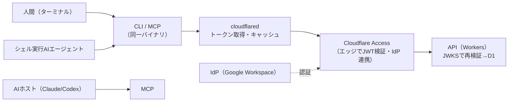

# IdP認証を共有する社内CLI/MCP

> **TL;DR**: APIキーを配布せず、API自体をIdP認証（Cloudflare Access等のエッジ層）で保護し、その認証をCLIとMCPで共有する。人間もAIも同じ身元・同じ認可経路で社内文脈にアクセスでき、入退社の反映はIdPの操作だけで完結する。

「会社をAI Readyにする」とは、Claude や Codex などのAIが人間と同じ業務文脈にアクセスできる状態を作ること。そのためには文脈を集約したAPIが人間からもAIからも参照可能でなければならない。AIにとって扱いやすいインターフェースは **CLIとMCP** の2つだが、ここで認証が問題になる。APIキーをAIに渡すのは漏洩リスク・配布管理・失効管理の三重苦を招く。この設計は「APIキーを配らず、認証境界をIdPに一元化する」ことでそれを回避する。

**核心は3点**。(1) 保護対象はAPIただ一つ（業務データの正本）。CLIとMCPサーバはそのAPIを呼ぶ2つの入口にすぎず、しかも**同一バイナリ**で提供する（`<cli> mcp` のようなサブコマンドで起動するとMCPサーバとして振る舞う）。(2) APIをCloudflare Access（エッジのアクセス制御）の内側に置き、IdPでログイン済みのリクエストだけを通す。`cloudflared` がトークン取得とキャッシュを肩代わりするため、CLIもMCPも秘密情報を一切持たない。(3) 「誰が社員か」の判断をIdPに一元化するため、入退社の反映はIdPの操作だけで完結する。

**認証フローは一方向**（クライアント→Cloudflare Access→API）で、JWTを**二段階で検証**する点が要諦。エッジ（Access）が `cf-access-token` を検証して通過させ、オリジンには `Cf-Access-Jwt-Assertion` ヘッダが付与される。オリジン（API）はそれをCloudflareが公開する **JWKS**（`/cdn-cgi/access/certs`）で再検証し、issuer（チームドメイン）とaudience（アプリ固有のAUD）の一致まで確認する。オリジンでも検証するのは多層防御——設定ミスや想定外経路でAccessを迂回したリクエストを確実に弾くため。公開鍵は定期ローテーション（既定6週間）されるので固定値で持たず必ずJWKSから取得する。

**境界は二重**になる。配布のゲートが **GitHub Organization メンバーシップ**（CLIはGitHub Packagesにprivateパッケージとしてpublishし、`read:packages` を持つOrgメンバーだけがインストールできる）、API実行のゲートが **IdP認証**。ただしパッケージの非公開化はアクセス制御の本体ではなく、あくまで入手経路を一段減らす層。セキュリティ境界はIdP認証であり、バイナリが流出してもIdPを通らない限りAPIには到達できない。退職時に両方の名簿（IdP / Org）から外せば、入手経路も実行権限も同時に失われる。

**MCP特有の運用ルール**: 起動時には認証しない（**遅延認証**——認証起因で起動が失敗するとホストから原因を追えなくなるため、ツール呼び出しのたびにトークンを取得し401/403なら一度だけ取り直して再試行）。AIに公開するツールは**参照系（読み取り専用）に限定**し、AIからデータを変更できないことを型レベルで保証する。AIは端末利用者がすでに行った cloudflared ログインのセッションをそのまま使うため、AI専用の認証情報は発行しない＝AIは「それを動かす人間の身元」で動く。

## 観察ログ（未検証）

- 2026-06-11 (@farstep_): スタートアップで「会社をAI Readyにする基盤システム」を開発中という文脈での自社設計の共有。CLIは出力先がパイプのとき機械可読なJSONへ自動切替するため、シェルを扱うAIエージェントからも同じコマンドで扱える、という実装上の工夫を主張。
- 2026-06-11 (@farstep_): コスト試算として「50人以下の組織ならIdP以外ほぼ無料で運用できる」と主張。根拠はCloudflare Access(Zero Trust)が50ユーザーまで無料・Workers/D1にも無料枠があり、実費はIdP（Google Workspace等）のライセンスのみ、というもの。単一ソースの試算。
- 2026-06-11 (@farstep_): IdPログインを行えない経路（外部Webhook・外形監視ヘルスチェック・ローカル開発）はAccessのBypassポリシーで対象外にし、Webhookは署名(HMAC)検証・ヘルスチェックは機密を返さない軽量EPで担保する。ローカル開発のバイパス経路は「本番に絶対に持ち込まない」運用前提。

## 問い

- 自分のwiki/AI基盤に当てはめると、Slack inbox や NotebookLM 連携を「IdP認証の内側のAPI」に寄せる構成は取れるか？ 現状のAPIキー配布をどこまで減らせるか？
- このパターンの認可は「人間の身元」に紐づくため、AIが人間の権限を超えられない。逆に「AIにだけ許す/禁じる」粒度の認可が必要になる場面はあるか？ [[concepts/ai-agent-governance]] の外部ポリシー（Cedar/Rex）との組み合わせは？
- MCPの「参照系のみ公開」を型レベルで保証する設計は、書き込みを伴うエージェント運用とどう両立させるか？

## 関連

- [[concepts/workload-identity-federation]] — APIキーを排しOIDC短命トークンで認証する隣接パターン（こちらはAnthropic API宛て、本ページは自社API宛て）
- [[concepts/ai-agent-governance]] — MCP認可の限界と外部ポリシーによるエージェント実行制御
- [[concepts/claude-code-security]] — Claude Codeのセキュリティ設定と組織展開
- [[tools/openai-mcp-tunnel]] — ファイアウォール開放なしでプライベートMCPサーバーを接続するアウトバウンドトンネル（境界設計の別解）
- [[tools/claude-mcp]] — Model Context Protocol（CLIと並ぶAIの入口）
- [[companies/cloudflare]] — Cloudflare Accessの提供元。2026-08-05発表のCloudflare OSは同じ「社内システムへの安全なアクセス」を製品として束ねる動き
