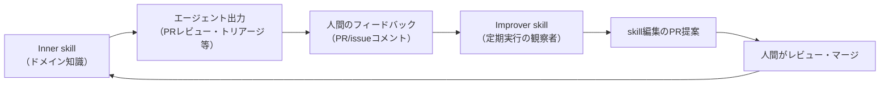

# Improver Skill パターン（inner/outer スキルの自己改善ループ）

> **TL;DR**: ドメイン知識を持つ inner skill と、蓄積した人間フィードバックから skill 編集 PR を提案する outer improver skill の2枚にエージェントを分け、フィードバックをセッション超えで複利化する Warp の設計パターン。improver skill はドメイン非依存で用途横断に再利用できる。

最初の一発プロンプトでタスクの80%が正しくても、残り20%がノイズとしてユーザー体験を壊す。Warp（AI搭載ターミナル・エージェント開発環境、創業者CEO Zach Lloyd）は社内のコードレビューエージェントでこの問題に直面し、プロンプトの手動リライトや AGENTS.md の改善を試したがスケールしなかった。Warpチームが突き止めた根本原因は、エージェント出力への人間のフィードバックがセッション終了とともに消え、エージェントのループから重要な文脈が失われることにある（Anthropic公式ブログのスタートアップ事例記事）。

解決策は Agent Skills を土台にした3要素構成。**inner/base skill** がドメイン知識と手順を保持し、タスクごとに実行される（PRが開いたらレビューを出す等）。**人間のフィードバック**は👍のような単純なものでもよいが、「この変数リネーム提案は、うちのコードベース規約ではこの型のグローバル変数はこの命名文脈を使う」のような具体的な理由付きが最も効くと Zach Lloyd は述べる。**outer/improver skill** はタスクごとでなくスケジュール実行される観察者エージェントで、蓄積フィードバックを取得し、エージェントの提案と人間の反応を突き合わせ、base skill への小さく焦点の絞られた編集を提案する。スキルはプレーンなファイルなので、この更新は通常の PR・コードレビューのワークフローに乗り、マージされれば次回実行が改善を継承する。

Zach Lloyd はこの単純さ自体を利点として挙げる。「base のドメイン固有スキルと、それを磨く improver skill があるだけ。このシンプルさがこのアプローチの美点」であり、スキルとは「知識をプロンプトに直接入れずファイルとしてエンコードし、エージェントが仕事の途中で参照できるようにするもの」と語る。Warp は現在このパターンを自社オープンソースリポジトリ全体で運用し、仕様書作成・レビュー・トリアージの各エージェントがそれぞれ自分の自己改善ループを持つ。

## 自己改善スキルの書き方6原則（Warpチーム）

- **ルールでなく原則を書く**: 「賢い人に指示するように書き、コンピュータをプログラムするように書かない」（Zach Lloyd）。網羅的な変数命名規則より「重複コードを探せ」のような方向づけが効く
- **なぜを説明する**: ルールの背後の根拠を与えると、エージェントは硬直的な指示への追従でなく問題について推論でき、汎化する
- **フィードバックは摩擦ゼロで集める**: PR や issue へのコメントなど、人がすでに働いている場所で、追加の提出ステップなしに自動で拾う。「摩擦の低さがシグナルを流し続ける」（Zach Lloyd）
- **スキルは小さく保ち progressive disclosure を使う**: 良いスキルファイルは大きくなく、すべてをコンテキストに流し込む代わりにリソースファイルやスクリプトを参照する（[[concepts/skill-building-best-practices]] と同じ原則）
- **フィードバックは質＞量、ただし量も効く**: 👍/👎の二値は「なぜ」を伝えないため、シニアエンジニアのドメイン固有で詳細な少数フィードバックが大量の浅いフィードバックに勝る。その上で質の高いシグナルのコーパスは大きいほどよい
- **improver skill にこそ手をかける**: ドメイン知識部分と違い improver skill は用途横断で再利用可能な機構であり、「コードレビューエージェントの improver skill は他のエージェントの improver skill と大差ない」（Zach Lloyd）。投資が直近のループを超えて回収される

## 実例：issue トリアージエージェント

Warp が公開するデモリポジトリ（warpdotdev/warp-agents-demo-github-issue-triage）では、新しい GitHub issue が立つと GitHub Action がエージェントを起動し、複雑さ・実現可能性を分析してラベル付与と修正方針の提案を行う。inner skill が各ラベルの意味と着手前のコードベース調査手順を保持する。

サンプル issue で inner skill は「ready to spec」ラベル（コントリビューターが仕様作成に着手できるサイン）を1つ見落とした。Warp チームのメンテナーはその場（issue 上）で、期待したことと期待した理由の両方を書いてフィードバックを残した。outer improver skill は Warp のエージェントオーケストレーション基盤 Oz 上でスケジュール実行され、GitHub に認証し、スキル同梱の Python スクリプトでフィードバック付き issue を収集して JSON に要約し、それをコンテキストに読み戻した上で、シグナルを捉える最小の編集——「UI/UX の形が未定義でも実際の問題を記述していれば ready to spec を付与する」——を inner skill への PR として提案した。人間がレビュー・承認・マージして次回実行が新しい知識を継承する。この最後の人間ステップが、実際に何が変わるかの統制を人間側に残す。スクリプト同梱自体もベストプラクティスで、毎回コードを書き直す代わりにスキルがリソースファイルを参照する。

## Warpチームのベストプラクティス表（記事からの転記）

| 問い | Warpチームの答え |
|---|---|
| スキルとメモリを混同していないか | スキルは手続き的で安定（「Xのやり方」・実行非依存・意図的に変更）。メモリは推論時にエージェントが自動書き込みし変わり続ける（[[concepts/skills-over-memory]] の線引きと同型） |
| improver ループは1本か、エージェントごとか | 中間で会う: テンプレート化した base ループが共通部分を持ち、ドメイン固有の重みを層で載せる。improver が数個なら各自1本、100個なら共有 |
| フィードバックが間違っていたら | 間違う前提で設計する。盲目的に受理させず、正気度チェック用の文脈を与え、誰の入力を数えるかフィルタし、フィルタ段か最終レビュー段に人間を残す |
| ドメインは検証可能か | 検証ハーネスを先に作り、参照コーパス生成→出力比較→修正の反復でエージェントに調整させる |
| 検証可能でないなら | golden 出力への決定論的 eval が使える所では使い、人間フィードバックに頼る所はドメイン専門家に限定する |
| システム全体の改善をどう知るか | 人間がすでに見ている大域メトリクス（マージまでの時間・コントリビューター数・コスト）を improver エージェントに還流させる。展開は crawl-walk-run で |

## 観察ログ（未検証）

- 2026-08-29: Warp の規模感（Anthropic公式ブログ記載）: 月間80万開発者・Fortune 500 の56%が利用・Warp 内の Claude Code セッション累計1,000万（週40万以上）・Warp Agent 会話総数4,000万・調達額$73M
- 2026-08-29: 「数百人のコントリビューター・数千件のコードレビュー」規模のオープンソースリポジトリ全体をこのループで管理しているとの Zach Lloyd の主張（改善効果の定量値は記事に無し）

## 問い

- このvaultの wiki-ingest は LESSONS.md 追記の内蔵型（[[concepts/self-refining-skills]]）だが、LESSONS.md を入力に SKILL.md 編集PRを定期提案する improver skill を外付けすると改善が複利化するか
- 「improver skill はドメイン非依存で再利用可能」は本当か。SonicGarden の triage スキル（[[concepts/skill-self-improving-loop]]）と Warp の improver skill から共通テンプレートを実際に抽出できるか
- フィードバックの収集場所を「人がすでに働いている場所」に限る原則は、PR/issue を使わない個人ワークフロー（このvault等）では何に対応するか

## 関連

- [[concepts/self-refining-skills]] — スキル内蔵型の自己改善（LESSONS.md追記）。本パターンは収集と改善を別スキルに外部化した形
- [[concepts/skill-self-improving-loop]] — SonicGarden の外部ループ型（会話履歴からの signal 抽出→Issue→triage→PR）。入力が会話履歴か PR/issue 上の人間フィードバックかが本パターンとの違い
- [[concepts/skill-building-best-practices]] — 小さく保つ・progressive disclosure・スクリプト同梱・gotcha 蓄積という書き方の原則が Warp の6原則と一致
