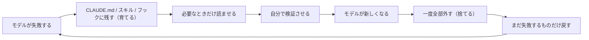

# 指示はパッチ — 育てて捨てるサイクル（Agent Skillsの作り方）

> **TL;DR**: CLAUDE.md・スキル・フックに書く指示はすべて「モデルができなかったことを補うパッチ」で、パッチには期限がある。失敗のたびに書き足して育て、モデル世代が変わったら一度全部外してまだ失敗するものだけ戻す。Boris Chernyの「育てろ」と「6か月ごとに捨てろ」は矛盾ではなく同じサイクルの別工程だ、と@kimuai08が整理した。

Claude Codeを作ったBoris Chernyは、Claudeがミスをしたらその場で注意して終わらせずCLAUDE.mdやスキルに残せと言い、同時に6か月ごとにCLAUDE.md・スキル・フックを全部消して何もない状態で何ができるかを見ろとも言う。@kimuai08はこの2つを最初は矛盾と読んだが、「すべてのプロンプトはパッチである。パッチには期限がある」というBoris Chernyの周辺で語られている一文で接続すると述べる。書いた指示は全部、モデルが自力でできなかったことを補うために書いたものであり、モデルができるようになった瞬間にそのパッチは不要になる。残っていると毎回読まれて判断を縛るので、不要なだけでなく邪魔になる。だから育てながら定期的に捨てる。

本ページは@kimuai08のX記事に基づく。記事はAnthropic公式ブログとBoris Chernyの発言を日本語で再構成した二次情報である。公式ブログ側の中身は[[concepts/skill-building-best-practices]]が正本で、本ページはその周辺にある「指示のライフサイクル」と、記事が独自に足した点に絞る。

## 育てる: 失敗を残す先には段階がある

Boris Chernyは修正のたびに最後に「同じミスをしないように、CLAUDE.mdを更新しておいて」と付け加える、と@kimuai08は紹介する。Claudeは自分向けのルールを書くのが驚くほど上手く、Anthropicの各チームはCLAUDE.mdをGitで管理して同僚のPRにも学びを追加する運用をしているという。@kimuai08はこれを「会話で修正すると1回賢くなる。スキルに残すと次の100回が賢くなる」と言い換える。残す先は3段階に分かれる（ソースからの転記）。

| 残したいもの | 置き場所 |
|---|---|
| 毎回守ってほしい原則 | CLAUDE.md |
| 特定の作業の手順 | スキル |
| 絶対に守らせたいこと | フック |

「絶対にやるな」を文章で書いても、長いセッション・曖昧な状況・外部からの変な指示で無視されることがある。本当に止めたいならAIの注意力に頼らずプログラムとして止める、という3段目が要点だと@kimuai08は強調する。この振り分けは[[concepts/claude-code-instruction-methods]]の「決定論的強制はhook/permission」と同じ線引きである。

## 捨てる: Ablationと6か月リセット

Opus 5が出た翌日のYC Startup Schoolでの対談で、Boris ChernyはClaude Codeのシステムプロンプトの80%以上を削除し、性能は落ちず、指示がないほうがモデルはわずかに賢かったと明かした、と@kimuai08は紹介する。残したものはモデルを賢くするためではなく製品としての体験を整えるためのもので、Boris Chernyのチームはシステムプロンプトを資産ではなく負債として扱っているという。同じ80%削減はAnthropicのThariqが公式ブログで公表しており、その設計思想は[[concepts/context-engineering]]にある。本ページはそれを「削り方の手順」の側から補う。

@kimuai08はこの手順をAblationと呼ぶ。日本語では除去実験にあたる。以下はソースからの転記。

1. システムプロンプトを全部削除する
2. 実際に使ってみて、どこで躓くか見る
3. 同じ問題で繰り返し失敗する箇所だけ、1行ずつ戻す
4. モデルが新しくなったら、また最初から

投機的に追加しないのがポイントで、理由は「モデルはその指示を使うたびに毎回読むから」だとBoris Chernyは述べたという。「念のため書いておこう」が毎回コストになる。

利用者への助言も同じ形で、6か月ごとにCLAUDE.md・スキル・フックを削除して何もない状態でモデルが何をできるか見てから必要なものだけ戻す。モデル世代ごとに振る舞いが違って性格も少し違うので、時間をかけて知ってそれに合わせて環境を調整する必要がある、というのがBoris Chernyの理由だと@kimuai08は紹介する。古い指示を残したまま世代を跨ぐと何が起きるかは、[[concepts/lean-prompt-rules-adaptation]]が@u1の実測として記録している。

## 検証を与えることが希少スキル

Boris Chernyは同じYC対談で、希少なスキルはもうプロンプトエンジニアリングではなく「少し難しすぎるタスクと、自分で検証する方法を与えること」だと述べ、タスク・ガードレール・終了条件を定義してあとはモデルに働かせよと続けた、と@kimuai08は紹介する。Anthropicの公式ブログが社内数百のスキルの中で最も測定可能な品質向上を生むのは検証スキルだと明記していることと合わせ、@kimuai08はAgent Skillの本質を「Claudeにやり方を教えることではなく、答え合わせの方法を与えること」と結論づける。

検証とはリンターや単体テストを走らせることではなく、Claude自身が成果物を実際に使えるかを確かめることだと@kimuai08は言う。Webアプリならサーバー起動、ブラウザを開く、ログイン、ボタン操作、表示確認、期待との比較、修正、再実行まで回す。Anthropic社内ではブラウザ操作・ターミナル多重化・各ステップのプログラム的確認・操作の動画記録までスキルに組み込んでいるという。

## 説明文の文字数上限という落とし穴

@kimuai08が元記事にはなく自分で調べて見つけたと述べる点である。スキルとコマンドの説明文には合計の文字数に上限があり、既定で15,000文字、トークンに直すと約4,000になる。超えるとスキルがエラーなしで一覧から落ち、Claudeは「見せられていないスキルは使うな」と指示されているので存在しないものとして扱われる。しかも使用頻度が低いスキルの説明文から先に消える。「作ったのに全然呼ばれない」の原因がここにあるケースがある、と@kimuai08は述べる。

確認は `/doctor` で、枠の拡張は環境変数 `SLASH_COMMAND_TOOL_CHAR_BUDGET=30000` で行う。ただし根本対処はスキルを減らすことで、増やすほどClaudeがどれを使うか判断するのに注意を割きマッチ精度も落ちる、というのが@kimuai08の見立てである。[[tools/skill-cleaner]]はこのプロンプトバジェット超過を検出する側のツールである。

## 作成手順（@kimuai08の13ステップ）

ソースからの転記。

| # | ステップ |
|---|---|
| 1 | 今週2回以上やった作業を探す。新しく作ろうとしない |
| 2 | まずスキルなしでやらせる。素のClaudeがどこまでできるか先に見る |
| 3 | 失敗した部分だけ抜き出す。その会社にしかないルール・そのシステムにしかない罠・判断基準・過去の事故だけを残し、一般知識は落とす |
| 4 | 1つのスキルに1つの仕事。調査・レビュー・検証・デプロイを混ぜない |
| 5 | 説明文をトリガーとして設計する。何をするか、どんなときに使うか、利用者が言いそうな言葉を入れる |
| 6 | SKILL.mdを目次にする。詳細はreferences、コードはscripts、フォーマットはassetsへ。本体は500行未満 |
| 7 | 判断が必要な部分は細かい規則でなく原則と理由を書く。頭のいい同僚に教える感覚 |
| 8 | 絶対に守らせたいことはフックにする |
| 9 | 検証を組み込む。Claude自身が成果物を実際に使って確認できるか |
| 10 | 新しいセッションで試す。過去の会話に依存していないか |
| 11 | スキルあり・なしで実タスク3つ以上を比べる |
| 12 | 失敗したらGotchasに追加する |
| 13 | 数か月ごとに全部外す |

やってはいけない設計として@kimuai08は8つを挙げる。巨大なSKILL.md、一般論を書く、1つのスキルに何でも入れる、手順の完全固定、「絶対にやるな」を文章だけで書く、作って評価しない、失敗するたび追加し続ける、外部のスキルを検証せず入れる、である。最後の項目についてはスキルの中身がAIへの指示としてそのまま実行されスクリプトも含められるため、出所不明のものを会社の資料を扱う環境に入れず、個人の練習用と業務用は環境ごと分けるのが無難だとする。

今日やることは1つで、CLAUDE.mdの末尾でもよいから直近でClaudeがやらかしたことをGotchasとして1行書く。Anthropic社内で一番いいスキルたちも数行と1つのGotchaから始まっている、と@kimuai08は締める。

## 観察ログ（未検証）

- 2026-09-03: 「Opus 5公開翌日のYC Startup School対談でBoris Chernyがシステムプロンプト80%超削除・指示なしの方がわずかに賢かったと述べた」は@kimuai08経由の二次情報で、対談そのものは未参照。[[concepts/context-engineering]]のThariq公表（2026-07-24）とは整合する
- 2026-09-03: 説明文の合計上限15,000文字・使用頻度の低いスキルから先に落ちる、は@kimuai08の単独調査。`/doctor` で自分の環境を確かめる

## 問い

- このvaultのCLAUDE.md・wiki-ingest SKILL.md・hooksを一度全部外してFable 5.1で何が起きるか試す価値があるか。wiki-ingest SKILL.mdは長く、どの行が「まだ失敗する」パッチなのかを知らない
- このリポで有効なスキル・プラグインは合計100件を超える。`/doctor` で説明文予算を超えていないか、wiki-ingestが黙って一覧から落ちる条件に当たっていないか確認する
- [[concepts/self-refining-skills]]のLESSONS.mdは「育てる」側だけを持つ。蓄積した教訓にも期限がある、という視点でLESSONSの棚卸し工程を足すべきか

## 関連

- [[concepts/skill-building-best-practices]] — 本ページの元記事が下敷きにしたAnthropic公式ブログの正本（9カテゴリ・gotchas・description=トリガー・progressive disclosure・検証スキル）
- [[concepts/context-engineering]] — 同じシステムプロンプト80%削減をAnthropicのThariqが公式に語った設計思想。本ページは「削り方の手順」と利用者向け運用の側
- [[concepts/lean-prompt-rules-adaptation]] — 古いrulesを残したままモデル世代を跨ぐと何が起きるかの実測（@u1）。6か月リセットが必要な理由の実例
- [[concepts/claude-code-large-codebase]] — 「3〜6ヶ月ごとの棚卸し」を先に述べていたページ。本ページはそれを原理（パッチには期限）と手順（Ablation）へ展開
- [[concepts/claude-code-instruction-methods]] — CLAUDE.md／スキル／フックの3段振り分けの公式フレーム
- [[concepts/claude-md-multilayer-design]] — 「この行を消すとClaudeは実際に間違えるか」を各行に問う手順。Ablationを1ファイル単位で実践する形
- [[concepts/self-refining-skills]] — 「育てる」側の実装パターン（LESSONS.md蓄積）
- [[concepts/skills-over-memory]] — 指示ファイルを短く保ち決定を変える行だけ残す、という同じ問題意識
- [[tools/skill-cleaner]] — スキルのプロンプトバジェット超過を検出するCLI。説明文上限の落とし穴に対する道具側
- [[concepts/product-role-archetypes]] — Boris Chernyの別の発信（5アーキタイプ）
- [[design/ochiai-ai-design-method]] — 同じ@kimuai08による別記事（AIデザイン指示の再構成）
- [[concepts/fable-5-1-prompting]] — Fable 5.1向け公式ガイドの業務向け7本。「7本を全部貼ると精度が落ちる・困っている1〜2本だけ選ぶ」は本ページの「投機的に追加しない」の利用者側の実践形（@Charlie_no_site）
- [[concepts/shikumika-vs-tejunsho]] — 「見なくなった手順は消し、やめたこと欄に理由つきで移す」「例外は2回目で初めて手順化する」という、人間のマニュアル運用側の同じサイクル（MUJIGRAM・@smark_x）
- [[concepts/gpt-6-astra-skills-prompting]] — Codex 側の同じサイクル。GPT-6 Astra のリリースを機にスキル・AGENTS.md の各指示を「まだ要るか」で再審査せよと Eric Provencher（OpenAI）が述べ、スキル過多で説明文が切り詰められる Codex 固有の挙動も報告
