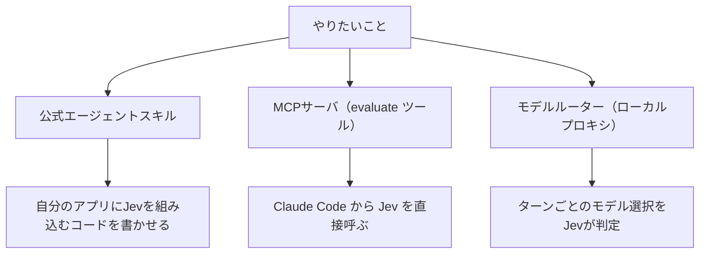

# Claude Code に Jev をつなぐ3ルートと周辺ツール

> **TL;DR**: 判断モデル [[models/jev]] を Claude Code につなぐ経路は「公式エージェントスキル（Jevを呼ぶコードを書かせる）」「MCPサーバ（Claude Codeの道具にする）」「モデルルーター（Claude Code のモデル選択自体をJevに任せる）」の3つで、目的によって使い分ける。発表から数日で、文脈の選別・Stopフックでの完了検証・スキルの並べ替えといった Claude Code 周りの実装が大量に公開された。

@karoukun_ai の記事は、Claude Code で時間とお金が溶けるのはコードを書く部分でなく、その手前の「この指示はどのモデルに回すか」「このファイルは読む必要があるか」「この出力は合格か」という細かい判断で、そのたびに文章を書くためのAIを呼んでいるのが今の標準だ、という問題設定から始まる。その判断だけを安い専用モデルに移すのが Jev の使いどころで、考え方そのものは [[concepts/decision-layer-model]] にまとめた。記事は公開リポジトリ・公式ドキュメント・公開投稿から集めた二次まとめで、@karoukun_ai 自身が手元で確かめたのはウェイトリスト登録から公式スキル導入までだと明記している。

## ルート1: 公式エージェントスキル

TypeSafe 公式コンソールの Quickstart に載っている方法で、Claude Code なら `claude plugin marketplace add typesafe-ai/skills` → `claude plugin install typesafe@typesafe-ai`、他のエージェントなら `npx skills add typesafe-ai/skills --skill typesafe-ai` を使う（公式はどちらか一方だけを使うよう指示）。@karoukun_ai は、これを入れても Jev 自体は動かず（呼ぶには別途APIキーが要る）、Claude Code の挙動も変わらない、あくまで Jev を呼ぶコードを書くときの指針だと注意する。向いているのは自分のアプリに Jev を組み込みたい場合である。@karoukun_ai は公式ウェイトリストに登録して半日足らずでコンソールに入れたとも書いている（発表直後の大量招待の時期と重なった可能性がある、と本人が留保）。

## ルート2: MCPサーバで Claude Code の道具にする

Claude Code から Jev を直接呼ぶ最短経路で、@karoukun_ai が中心に紹介するのは **typesafe-mcp**。Go の単一バイナリで、公開するツールは `evaluate` ひとつだけ。state（判断材料）と choice / noul / score の型付き質問をそのまま渡すので、質問を組み立てるのはエージェント側になる。README によると `evaluate setup mcp` の1コマンドで Claude Code・Claude Desktop・Codex に一括登録され、OpenRouter のキーでも動く（その場合は OpenRouter の Decisions エンドポイント経由で請求も OpenRouter 側。アルファ扱いのパスで移動の可能性ありと README に明記）。

自前で書く例として、`@modelcontextprotocol/sdk` で `evaluate` だけを公開する軽量サーバを作り `claude mcp add jev-gateway -- node ...` で登録した個人ブログが紹介されている。そのブログの筆者は1回あたり約0.0000147ドルだったと書いている。

## ルート3: モデルルーターでモデル選択を任せる

Claude Code がどのモデルを使うかをターンごとに Jev に判定させる経路。**jev-router**（gargpratyush 作・MIT）はローカルにプロキシを立て、1ターンにつき1回だけ「どの階層のモデルが必要か」を Jev に尋ねる。README によると TypeSafe に送るのはユーザーのプロンプト本文だけで、遅延が増えるのはターン最初の1回だけ（ツールのループ中は増えない）。Jev が落ちても現在のモデルのまま素通しする fail-open 設計で、CLI の認証情報には触れない。

同じ発想の [[tools/jev-model-router]]（@dani_avila7）について、@karoukun_ai はメインモデルのルーティングが既定でオフになっている理由を「途中で切り替えるとプロンプトキャッシュが壊れるから」と説明している。安いモデルに切り替えたつもりが長いプロンプトのキャッシュ（[[concepts/prompt-caching]]）を捨てて逆に高くつく、という落とし穴を設計で避けている例として @karoukun_ai は評価する。

## Claude Code の外からの呼び出し口

@karoukun_ai が挙げる経路は TypeSafe 直接API・Vercel AI Gateway・Cloudflare Workers AI（モデルID `typesafe/jev`、コンテキスト32,000トークン）・LiteLLM のパススルー（TypeSafe の API はストリーミングを提供しないと LiteLLM のドキュメントに明記）・LangChain の `langchain-typesafe`（`TypeSafeClassifier` に state と questions を `.invoke()` で渡す）の5つで、TypeSafe 本体の招待が無くても経路は複数開いている。

Cloudflare 公式例の読み方として @karoukun_ai が解説する要点は次のとおり。`questions` の各キー（例: `is_urgent`）は自分で付けるラベルで、返りの `answers` に同じ名前で入る。各質問は `type`・`instructions`・`criteria` の3点セットで、`criteria` の書き方だけが型ごとに違う（noul は true/false それぞれの条件、choice は選択肢名と説明の組で選択肢名がそのまま返る、score は低い順の配列で返りは1.04のような連続値）。`criteria` は省略もでき、判断がはっきりした質問なら instructions だけで動く。質問を増やしても1つの state に対して並列処理されるため速度はほとんど変わらない。Choice と Score には0〜1の confidence と確率分布が付くが、Noul は確率そのものが答えなので confidence という別枠は返らず、この違いを知らずに閾値を組むと片方で分岐が書けなくなる、と @karoukun_ai は注意する。

## Claude Code 周りで公開された実装

@karoukun_ai は「発表から2日で GitHub に300以上の関連リポジトリ」という個人ブログの報告を引き、有志の一覧（awesome-jev 系リポジトリ3本）から Claude Code 周りで効きそうなものを紹介している。系統に分けると次のようになる。

- **文脈を汚さない・削る** —— Winnow はツールの実行結果を文脈に入れる前に今のタスクと関係あるかを判定する（後から掃除せず最初から汚さない）。yoshi は Claude Code / Codex 向けの文脈削減プロキシで、削減量を実測で出すことを掲げる
- **何を差し込むかを選ぶ** —— skillranker はインストール済みスキルを今のセッションに必要な順で並べ替える Rust 製 CLI とフックで、該当なしなら棄権する。jev-skillful はプロンプトごとにスキル・MCPサーバ・エージェント・コマンドから差し込むものを選び、効いたかまで測る
- **モデル・推論の深さを選ぶ** —— jev-router、jcm-router（メッセージごとにモデルと推論の深さを選ぶが、キャッシュの効いたメイン会話には手を出さない）、jev-codex-router（Codex 側でモデル・思考の深さ・速度モードを選ぶ）
- **完了を疑う Stop フック** —— limpet はエージェントが早まって終了しようとするのを平易なルールに照らして止める。jev-belay は完了の主張を信じる前にトランスクリプトに証拠があるかを確かめ、ファイルが変更されたのに検査が通っていないときだけ4問の Jev 呼び出しを1回使い、エラー時は必ず通す
- **ガードとレビュー** —— jevwire（制約を厳しくはできても緩められない一方向設計）、Jev Review（変更を Jev の判定で評価するコードレビュー用ワークフロー）、foreman（複数エージェントの開発ラインで進めるか止めるかを Jev に任せる）、zod-jev（Zod の形の検証に Jev の意味の検証を重ねる）、semdecide（Unix パイプラインや CI に型付き判定を入れる。終了コードの契約があるぶん壊れにくいと @karoukun_ai は評価）
- **探索・操作** —— blink（ファイルシステムを歩く探索役を複数走らせてコードベースを検索）、BrowserClaw（ログイン済み Chrome を保ったまま操作する MCP サーバで、DOM を刈り込み Shadow DOM と iframe も貫通すると説明されている）

中国語圏でも @Pluvio9yte が「Jev の API を手に入れたらこれを真似すればいい」というリストを投稿しており、1番目が [[tools/jev-ultrafast]]、2番目が Claude Code 向けの **fast-jev-compaction** である。捕捉できた本文は「给 Claude Code（Claude Code に…）」で途切れており、文脈の圧縮を Jev で行うものと名前からは推測できるが、中身と作者は未収集である。

Stop フックで完了の主張に証拠を求める limpet・jev-belay は、Haiku を評価器に使う [[tools/claude-code-goal]] の完了判定と同じ位置に、生成しない判定モデルを置いたものと考えられる。jev-belay が「ファイルが変わったのに検査が通っていないときだけ呼ぶ」という発火条件を持つのは、判定を安くしても呼び出し回数を絞る設計が要ることを示している。

## 手を出す前の確認と落とし穴

@karoukun_ai が挙げる注意のうち、[[models/jev]] の仕様・苦手の一覧に無いものは次のとおり。

- MCP サーバを登録しても起動済みのセッションにはツール定義が反映されない。`claude mcp list` で Connected なのに not found になるならセッションを開き直す（個人ブログの報告）
- Vercel AI Gateway は無料枠でもカード登録を求められた、という個人ブログの報告がある
- Jev は返信文もコードも書かないので、判定後に文章が要るなら Claude などの生成モデルを別に置き、その料金も別途かかる
- Jev 自体が速く安くても、ネットワーク・候補生成・閾値・集約・フォールバックを含むシステム設計で最終的な数値は大きく変わる（日本語の技術ブログの指摘）
- 記事を書く・投稿を作る・調べものをするといった作業が主用途なら、公式スキルを入れても普段の動きは何も変わらない。効くのは分類・抽出・ランキング・振り分けをアプリに組み込むときである

目的別の逆引きとして、@karoukun_ai はとりあえず試すなら typesafe-mcp、アプリに組み込むなら公式スキル、モデル選択の自動化なら jev-router か jcm-router（メインモデルを切り替えない設計のもの）、トークン削減なら Winnow か yoshi、出力検証なら jev-belay か limpet を勧める。最初の一歩は「自分の作業で毎回発生している判断を3つ書き出し、それを今いくらで回しているかを数える」ことだと結んでいる。

## 観察ログ（未検証）

- 2026-09-20: 「発表から2日で GitHub に300以上の関連リポジトリ」は個人ブログの報告の孫引きで、数え方は未確認

## 問い

- このwikiの Claude Code 運用で、毎回発生している判断を3つ書き出すと何になるか（ingest のカテゴリ判定、粒度判定、既反映チェックなど）。それを今いくらで回しているか
- jev-belay 型の「完了の主張に証拠を求める」Stop フックは、日本語のトランスクリプトでも誤判定なく働くか
- fast-jev-compaction の実体（リポジトリ・作者・圧縮の方法）を確かめ、[[concepts/decision-layer-model]] で紹介された「instant compaction」と同じものかを見る
- Winnow（入る前に判定）と yoshi（入った後に削る）は、同じセッションでトークン削減量と取りこぼしにどれだけ差が出るか

## 関連

- [[models/jev]] — 本ページがつなぐ判断モデル本体。仕様・評価値・公式が認める苦手の一覧
- [[concepts/decision-layer-model]] — 生成LLMから小さな分岐の判断を切り離す設計論。本ページはそれを Claude Code に当てはめる具体的な経路
- [[tools/jev-model-router]] — ルート3の実装例。メインモデルをセッション開始時にしか選ばない理由がプロンプトキャッシュ
- [[concepts/prompt-caching]] — メインモデルの途中切り替えで失われるキャッシュの仕組み
- [[tools/claude-code-goal]] — Stop hook と Haiku 評価器で完了を判定する /goal。limpet・jev-belay と同じ位置の仕組み
- [[tools/jev-ultrafast]] — @Pluvio9yte のリストで fast-jev-compaction と並んで最初に挙げられた、Jev で操作と対象を1往復で決めるブラウザエージェント
