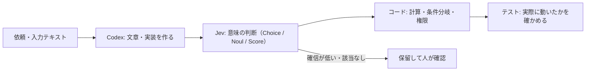

# Codex に Jev の公式スキルを入れて判断を切り分ける

> **TL;DR**: TypeSafe の公式スキルを Codex に入れても Codex 自体は賢くならない。効くのは「文章・コードは Codex、意味の判断は [[models/jev]]、計算と条件分岐はコード」と処理を分け、判断の問いと検証方法を整えたときで、@MakeAI_CEO はその導入手順・7つの応用案・6つの精度設計をまとめている。

@MakeAI_CEO の記事は、2026-09-21時点の公式資料と公開コードを確認したうえで書かれた二次解説で、応用例は「実装案であり、APIを実行して得た検証結果ではない」と本人が明記している。記事が最初に正すのは Jev への誤解で、Jev の入力はテキストのみ（文章・JSON）で、返すのは選択・採点・確率という決まった形式の判断だけだ。画像・音声・動画を直接読まず、長文やコードも生成しない。動画を扱うなら別の仕組みで文字起こしや場面説明を作ってから判定させる。「申請当日に承認される」という紹介も公式の保証としては確認できず、早期アクセス扱いだと @MakeAI_CEO は書く。考え方の全体は [[concepts/decision-layer-model]]、Claude Code 側のつなぎ方は [[concepts/jev-claude-code-integration]] にまとめてある。

## 導入はスキル・APIキー・動作確認を分ける

@MakeAI_CEO の手順では、公式サイトで利用登録してコンソールで APIキーを作り、環境変数 `TYPESAFE_API_KEY` に置く（会話に直接貼らない）。スキルは Codex を使うプロジェクトで `npx skills add typesafe-ai/skills --skill typesafe-ai` を実行し、インストール先に Codex を選ぶ。標準はプロジェクト単位で、全体に入れるなら `-g` を付ける。出回っている紹介文では `--skill` が長いダッシュ「–skill」に化けており、半角ハイフン2本が正しいと @MakeAI_CEO は注意する。

Codex CLI や IDE 拡張では `/skills` で確認し、`$typesafe-ai` で明示的に指定できる。スキルと SDK は別物で、スキルは Codex 向けの手順書、SDK（Python なら `pip install typesafe-sdk`）は作ったプログラムから API を呼ぶためのライブラリである。最後に架空の問い合わせ1件で、キーを表示させずに接続を確かめる。「インストールできた」と「APIが実際に動いた」を分けて確認するだけで初期設定の見落としが減る、というのが @MakeAI_CEO の勧めだ。

## スキルの本質は「Jev に全部やらせない」

@MakeAI_CEO によると、公開されている SKILL.md は最新ドキュメントを参照し、必要な判断だけを Jev に任せる方針を書いたもので、API の呼び方だけでなくどこを AI に任せどこをコードに残すかまで教える。返金対応の例では、Jev は「返金希望が読み取れるか」だけを判定し、購入からの日数や返金上限はコードで確認し、返信文は Codex が作り、実際の返金は権限と承認のある処理だけが行う。

分担の効果を示す根拠として、@MakeAI_CEO は TypeSafe の「スキル選択を補助する」公開実験を紹介する。182種類のスキルから候補を絞って上位3件を詳しく確かめ、「どれも使わない」という判断も残したうえでエージェントに渡す構成で、488件の依頼に対する結果は次のとおりとされる。

| 評価項目 | エージェント単独 | TypeSafeの補助あり |
|---|---|---|
| 適切なスキルがある依頼での選択ミス | 16.8％ | 7.3％ |
| 適切なスキルがない依頼での不要な使用 | 9.8％ | 4.0％ |

ただしこれは [[tools/hermes-agent]] のスキル群・Claude Haiku 4.5・Jev 1.12 の組み合わせで、依頼にはスキル説明から生成した問題が含まれ実利用より判断しやすい可能性がある、と @MakeAI_CEO は留保する。Codex のコード正解率が同じ割合で上がるという結果ではない。

## 応用案7つ（未検証の実装案）

- **問い合わせを分類して終わりにしない** —— 「ログインできない。昨日から仕事が止まっている。担当者に代わってほしい」を担当分野（Choice）・有人対応の希望（Noul）・影響度（Score）で別々に判定し、Codex に担当者向けの一覧を作らせる。自動返信の前に仕分けの補助から始める
- **社内資料から回答に必要な部分を選ぶ** —— 年度などの確定情報はコードで確かめ、関連性だけを Jev に判断させる。「そもそも返金制度はない」のような前提に反する資料も重要な証拠なので捨てない
- **引用があるのに根拠になっていない箇所を見つける** —— 引用文が原文に存在するかは文字列照合、その引用が主張を支えるかは Jev、という二段構え。「出典が主張を支える」と「出典自体が正しい」は別問題
- **数字を作らせない** —— 金額・電話番号・メールアドレスはコードで候補を抽出し、どれが請求総額かを Jev に選ばせ、最後にコードで原文をコピーする。候補漏れと「該当なし」の扱いが肝になる
- **Codex の文章を観点別に見直す** —— 「読者の悩みに答えているか」「専門語を説明しているか」「断定に根拠があるか」を分けて評価し、問題が出た観点だけ直させる。重大な問題を平均点で隠さず、必須条件は好みの評価と別に扱う
- **Codex が使うスキルの候補を絞る** —— 公式スキルを入れても Codex 標準のスキル選択は置き換わらないので、候補選定スクリプトを別に用意する。@MakeAI_CEO はそれより先に不要なスキルを減らし使用条件を明確にするべきだとし、OpenAI もスキルの説明が多すぎると省略や競合が起きると説明していると書く（[[concepts/gpt-6-astra-skills-prompting]] と同じ方向）
- **高価なモデルを難しい案件だけに使う** —— 小型モデルで抽出し、原文と対応が確認できない項目だけを上位モデルや人に回す。見逃し率と人の確認時間まで含めて得かを測る

## 精度を上げる6つの設計

@MakeAI_CEO が挙げる設計は、[[concepts/decision-layer-model]] の勘所と重なる部分が多いが、日本語での使用と評価設計に踏み込んでいる。

- **問いを小さく具体的にする** —— 「問題がありますか」でなく「返金を求めているか」に分ける。ただし区別に必要な前後の文脈は残す
- **質問IDで意味を伝えない** —— ID はモデルに送られないので、`refund_requested` と名付けても「顧客は金銭の返還を求めているか。料金への不満だけでは該当としない」と本文と基準に書く
- **state は関係が分かる形にする** —— 過去ログを貼らず `customer_message`・`order`・`policy` のように分け、顧客の希望と会社の規約を混ぜない
- **Score は各段階の状態を書く** —— 「作業を続けられる」「代替手段はあるが手間が増える」「主要業務が停止し代替手段がない」のように書く。各段階は独立に評価されるので「前の段階より深刻」という書き方は向かない
- **確率と confidence を混同しない** —— Noul の0.8は条件が成立する確率で深刻度80点ではなく、Noul には confidence が無い。Choice・Score の confidence は確率分布の集中度で、0.9でも正解率90％を意味しない。自動処理の閾値は自分のデータで決める
- **日本語は英語と同じ精度だと思わない** —— 公式は英語が最も得意と説明している。「質問も資料も日本語」「質問だけ英語」「日本語原文に英訳を添える」を同じ検証データで比べる。「できれば返金していただけると助かります」を返金希望として拾えるか、「返金は不要です」を誤判定しないかが試金石になる

## Codex 側は指示を増やさず「確認できる状態」を作る

@MakeAI_CEO は、Codex に古い記憶で API を書かせないことを最初に挙げる。公式スキル自身が実装前に最新の API・SDK 資料を確かめ、確認できない項目を作らない方針を持っている。[[concepts/agents-md-canonical]] の AGENTS.md には実行可能なテスト・使用環境・変更禁止範囲のような繰り返し必要な情報を置くが、「毎回すべて読め」「何重にも確認しろ」と増やし続けるのは逆効果になりうる、とも書く。

検証面では、Jev の採点と実際のテストを別扱いにする（「仕様を満たしていそう」という判定は実行の証拠にならない）、Jev も入力中の悪意ある指示に影響されうるので送信・削除の権限をモデルの判断に任せない、改善ループに「最大3回で止める」のような終了条件を置く、の3点を挙げる。評価では、調整用データと最終確認用データを分け、曖昧な表現・情報不足・否定文・複数要望・悪意ある指示を混ぜる。特に**自動処理した案件の正解率と、全体の何割を自動処理できたかをセットで見る**よう @MakeAI_CEO は強調する。難しい案件を全部人に回せば、自動処理部分だけの正解率は高く見えるからだ。

費用は jev-1.13.0 で入力100万トークン0.042ドル・出力無料（1億トークンで4.20ドル。別モデル・検索・文字起こしの費用は別）。比較実験では `jev-latest` でなくモデルIDを固定する。公式の70〜500ミリ秒という遅延は主に米国西海岸からの測定なので、日本では資料取得から最終結果までを測る必要がある、と @MakeAI_CEO は書く。

記事の最後には、外部への影響が出ない「問い合わせの仕分け」のローカル試作を Codex に作らせる長いプロンプトが載っている。骨子は、判断を3つに分ける・該当なしを保留経路に回す・計算と権限はコード・問いと閾値とモデルIDを1か所にまとめる・架空データのテストに「指示を無視しろ」を含める・評価のために正解ラベルを書き換えない・未実行のテストを成功と書かない、である。@MakeAI_CEO は「精度を上げて」とだけ頼まず、何を正解とし何を自動化せずどの結果で改善を判断するかを渡すことが大事だと結ぶ。

## 問い

- 自動処理率と自動処理部分の正解率をセットで見る評価は、このwikiの ingest 判定（カテゴリ・粒度）を自動化するときにそのまま使える。LESSONS.md の事例を最終評価用データに回せるか
- スキル選択実験の16.8％→7.3％は、スキル説明から生成した依頼での数字。実際の依頼ログで測ると差はどこまで縮むか
- 日本語の遠回しな表現（「できれば〜助かります」）で、質問だけ英語にする構成は本当に精度を上げるか

## 関連

- [[models/jev]] — 判断モデル本体。仕様・評価値・公式が認める苦手の一覧
- [[concepts/decision-layer-model]] — 「LLMが作り、Jevが決め、コードが実行する」設計論。本ページはそれを Codex に当てはめた実務層
- [[concepts/jev-claude-code-integration]] — 同じ公式スキルを Claude Code に入れる経路と、MCP・モデルルーターなど別ルート
- [[tools/openai-codex]] — スキルを入れる先のコーディングエージェント
- [[concepts/gpt-6-astra-skills-prompting]] — スキルを入れすぎない・説明文を短くするという、スキル候補の絞り込みより先にやるべき整理
- [[concepts/agents-md-canonical]] — Codex が読む AGENTS.md に何を置くか
- [[tools/hermes-agent]] — スキル選択補助の公開実験で対象になったスキル群の出どころ
