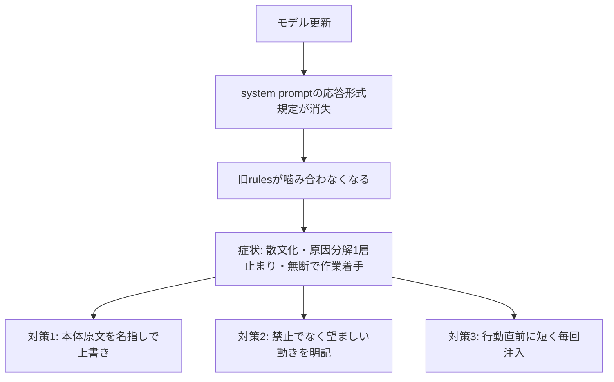

# lean system prompt時代のrules設計（応答形式規定の消失と3対策）

> **TL;DR**: モデル更新でシステムプロンプトから応答形式の規定が消えると、その空白を埋めるのは手元のrulesでなくモデルが訓練で内在化した既定の振る舞いになり、rulesは「本体原文の名指し上書き」「禁止でなく望ましい動きの明記」「行動直前への短い毎回注入」という3対策で書き直さないと効かなくなるという実測記録。

[[concepts/context-engineering]] がAnthropic公式の立場として示す「Claude 5世代でシステムプロンプトが80%以上削減された」という変化を、rulesを運用する側から実際に踏み抜いた記録が@u1による本記事である。[[tools/claude-code]] を[[models/claude-opus-5]]に切り替えた直後、同一セッション・同一rulesのまま、状況説明が見出しも区分もないフラットな長文になる、原因説明が症状の並列列挙で止まり「なぜ」を掘らない、複数案に評価軸が付かない、発話に返答せず先にツール実行へ入る、といった症状が急に出たと@u1は報告する。指摘し直しても浅い思考のまま噛み合わなくなり、対話を通じた検討そのものが成立しなくなったという。

同じrulesでもOpus 4.7や[[models/claude-fable-5]]では症状が出ない、という手がかりから、@u1は「rules側の劣化」ではなく「rulesが前提にしている環境」——実際にモデルへ配られているsystem prompt——の変化を疑った。output style等の注入を無効化した状態でOpus 5自身に自分のsystem promptを原文引用させて実測したところ、旧世代で濃く書かれていた応答形式の規定（散文か構造か、見出しや表の使い方、簡潔さ）が丸ごと存在せず、代わりに"When you have enough information to act, act."「網羅より推奨を」という自律方針が入っていたと@u1は述べる。

@u1はここで「規定が空白ならこちらのrulesがむしろよく効くのでは」という予想は外れたと振り返る。空白は利用者に委ねられた余白ではなく、モデルに訓練で焼き込まれた既定の動作へ委ねられたものであり、旧rulesは応答形式の規定が濃かった旧世代promptと並んで読まれる前提で書かれていたため、訓練された既定を覆すには書き方も届き方も弱すぎたという。

## 対策1: 本体原文を名指しで上書きする

@u1は全rulesを新system promptと突き合わせ、逆のことを言っている箇所を洗い出し、上書きしたいrulesは本体の原文をそのまま引用して名指しで優先を宣言する形に書き直したと述べる。「複数案には評価軸を付けて書くこと」のような一般論の追記では、本体の"give a recommendation, not an exhaustive survey"と並んだときにどちらを優先するかの手がかりがなく効かなかったという。発火条件も「重要な変更のときは」のような自己分類頼みの書き方から、「interruptを受けた」のような解釈の余地がない観測記述へ書き換えたと@u1は説明する。

## 対策2: 禁止ではなく望ましい動きを書く

旧rulesは「〜するな」の蓄積で、禁止は違反の検知には使えても代わりに何をすべきかを運ばず、新方針と衝突したときにモデルへ「禁止を避けつつ本体方針に従う」抜け道を与えてしまうと@u1は指摘する。「テスト未完了の状態でcommitを提案するな」を「commitを提案する時は、その成果物を使う人の操作手順で動かした結果を本文に書く」に変換する、というのが例に挙がっている。

## 対策3: 指示を届ける層を選ぶ

@u1はClaude Codeに指示を届ける経路が複数あり、実測すると効き方が違うと述べる（[[concepts/claude-code-instruction-methods]]が示す「ロード時点×圧縮生存×権威×コスト」の分類軸と対応する）。output styleは書き方の規定（構造で書く、評価軸を付ける）には改善が見られたが、進め方（発話にまず返答してから作業する）は止まらず、最終的にはUserPromptSubmit hookで毎発話の直後に短い1行を注入する方法で止まったという。コストはwrapper込みで1発話あたり約50 token。@u1が導く一般則は「変えたい行動の直前に、短く、毎回届ける指示がいちばん効く」というものである。

## Fable 5・Opus 4.7で症状が出ない理由

@u1が条件を揃えて（headless mode・output style無効）各モデルに自身のsystem promptを原文引用させて比較した結果、Opus 4.7はlean prompt適用対象外のため旧世代の長いpromptのまま動いており、旧rulesと噛み合っていたという。一方Fable 5は同じClaude 5世代でも実測するとOpus 5とは別のpromptが配られており、"a simple question gets a direct answer in prose, not headers and sections"のような散文方針を含む応答形式の規範を持っていたため出力の形が崩れにくかったと@u1は述べる。

## 観察ログ(未検証)

- 対策実施後、状況説明・原因説明に区分が戻る傾向が見られたが、セッション序盤はフラットな出力が残ることがあり継続観察中と@u1は述べる
- 「返答せず作業に入る」癖はoutput style単独では直らず、毎発話注入の導入で止まったが導入直後のため効果は観察中と@u1は述べる
- 「同じpromptに対する指示追従の容量がモデルごとに違う」という当初の仮説は、実測でprompt自体が別物と分かり撤回したと@u1は述べる。モデル固有の追従性の寄与度はprompt条件を揃えた比較をしていないため分離できていない

## 問い

- このvaultのCLAUDE.mdやスキル群は、モデル世代が変わった際に「本体system promptとの矛盾」を点検する手順を持っているか
- 対策3の「行動直前への短い毎回注入」パターンは、このリポのUserPromptSubmit hook設計に転用できるか
- Opus 5とFable 5でsystem prompt自体が別物という発見は、[[concepts/context-engineering]]の「4層それぞれへの適用ガイド」とどう整合するか

## 関連

- [[concepts/context-engineering]] — Anthropic公式が示す「ルールより判断力に委ねる」lean prompt化の設計思想。本記事はその実害と対策を利用者側から実測した続報
- [[concepts/claude-md-rules]] — 本記事が新system promptと噛み合わなくなったと指摘する「旧世代前提の明示ルール」体系そのもの
- [[concepts/claude-code-instruction-methods]] — 指示を届ける7手段の公式フレーム。本記事の「output style vs hook」という届け方の実測はこのフレームの実践的検証にあたる
- [[concepts/instruction-patch-lifecycle]] — 本記事が実測した「旧rulesが新世代と噛み合わない」現象を、指示は期限付きパッチでありモデル世代交代時に全部外して戻す（Boris Chernyの6か月リセット・Ablation）という運用原理の側から説明するもの（@kimuai08）
