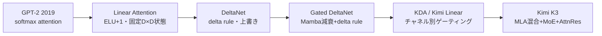

# 線形アテンションの進化史（GPT-2 → DeltaNet → Kimi K3）

> **TL;DR**: 固定サイズの状態（キャッシュ）しか持たない線形アテンション系列は、ソフトマックスの全ペア比較を諦める代わりに「新しい情報をどう書き込み、古い情報をどう追い出すか」を段階的に洗練させてきた。GPT-2（2019）からKimi K3（2026）までの7年間のアーキテクチャ変化を1本の系譜として辿った技術解説（@waterloo_intern）。

> 📌 X bookmark: 28,051（2026-07-29時点）

GPT-2（2019）からKimi K3（2026）への2.8兆パラメータという規模、GPT-2換算で22,580個分は、著者@waterloo_internによれば単なるスケールの結果ではない。decoder-onlyのTransformerは自己回帰生成の各ステップで最終位置のロジットしか使わないのに、律儀に全入力位置の表現を計算し続ける非効率を抱えている。KVキャッシュはこの再計算を避けるための記憶装置として導入されたが、記憶をO(N)で線形に伸ばし続ける代わりに固定サイズへ圧縮しようとすると、新しい情報をどう書き込み古い情報をどう消すかという「追い出しポリシー」の設計問題が生まれる。KimiK3に至るアーキテクチャの変遷は、この追い出しポリシーを段階的に洗練させてきた歴史だと著者は位置づける。

## Linear Attention: ソフトマックスを外し固定サイズの状態にする

ソフトマックスアテンションはq・k内積の後に非線形（指数関数）をかけるため、全クエリが全キーと結合してしまう。線形アテンションはELU+1のような特徴写像をqとkに別々に適用することで内積を再結合可能（re-associative）にし、増え続けるK・Vベクトルの集合を固定サイズのD×D状態へ折り畳める。ただしこの近似には代償があり、著者は「ELU+1はsoftmaxカーネルの表現力が劣る近似であり、精度低下の程度はアーキテクチャとワークロード次第」と述べる。原論文のO(N²)という枠組みには著者自身も一度混乱したと明かしている——FlashAttentionが存在せずKVキャッシュなしの再計算が一般的だった当時の文脈を踏まえないと誤読しやすい注意点だという。

## DeltaNet: 加算しかできないメモリに「上書き」を導入する

固定サイズのキャッシュは新しい情報を既存のD×D行列に加算するしかなく、各トークンが専用のスロットを持てない。Fast Weight Programmersの原論文（Schlagら）はこれを次のように指摘する。

> 「シーケンス長が記憶容量を超えると、モデルはオーバーキャパシティ状態に陥る。この状態下で正しく動作するには、モデルは記憶内容と動的に相互作用し、どのキー・バリュー連想を保持しどれを削除するかを選択的に決める必要がある……有限サイズの記憶へ新しい連想を際限なく加え続ければ、いずれ限界に達する」

DeltaNetはこの限界に対し、あるキーで読み出せる既存情報を一度引き算してから新しい値を書き込む「delta rule」で応答する。古い情報を消しながら新しい情報を同じ場所に上書きする仕組みだ。実装上の難所はprefillで、単純なdelta rule実装は逐次処理になり並列化できない。DeltaNet論文（Parallelizing Linear Transformers with Delta Rule）は、一般化Householder変換行列による一階線形再帰として定式化し直し、系列をサイズCのチャンクに分割してチャンク単位で並列計算できる形に再パラメータ化する。C=Nに設定すれば通常のO(N²)アテンションに一致し、C=1では純粋な線形アテンションに戻る。C=64や128が実務でよく使われるのは、その粒度でテンソルコア命令の効率が最大化されるため（著者はUMMAを例に挙げる）。FLOP数だけならC=1が最安だが、GPUの行列演算ハードウェアに効率よく乗るとは限らないため、実測のwall-clock時間では必ずしも最速にならない。

## Gated DeltaNet: Mambaの減衰とDelta ruleを組み合わせる

DeltaNetは「特定の置き換えを持つ連想」だけを忘れられる。文脈の切り替え時に複数の連想をまとめて消したり、容量を空けるために記憶全体を減衰させたりはできない。Mamba-2はここに、時刻ごとに前の状態全体を一律の比率で減衰させてから新しい状態を加える仕組みを導入した。ただしこれは全ての連想を等しく忘れる点でDelta ruleの精密さとは逆の弱点を持つ。Gated Delta ruleはMambaのゲート付き更新則とDelta ruleを組み合わせ、0〜1の値を取るパラメータalphaで「純粋なDelta rule（alpha=1）」と「記憶の全消去（alpha=0）」の間を切り替えられるようにする。実装はDeltaNetと同じチャンク並列の再パラメータ化を踏襲し、時刻xで書き込まれ時刻x+tで読み出されるトークンには累積減衰γʳ/γⁱ（prefix-sum計算の乗算版）がかかる。

## KDA / Kimi Linear: チャネル別のきめ細かいゲーティング

Kimi Delta Attention（KDA）はGated DeltaNetの単一スカラー減衰を、チャネルごとに独立した減衰値へ細分化する。この段階からGated DeltaNetとMambaを組み合わせるハイブリッドモデルの実験が始まったと著者は整理する。Kimi Linear論文は、統制された比較でfull attentionを上回ったと主張し、品質改善に加え最大6倍のデコードスループットを持つドロップイン代替として提示された（論文著者の主張、@waterloo_intern解説による）。Kimi Linearアーキテクチャは、DeltaNet Transformerと比べて3つの変更を加える——(1) Multi-head Latent Attention（MLA）層を挟むハイブリッド構成、(2) MLPをMixture-of-Experts（MoE）層へ置き換え、(3) alpha projectionでDeltaNetに追加容量を持たせる。著者はこれを「盲目的なスケーリングではない」と強調する。追加容量には「チャネル別の記憶減衰制御」という具体的な数学的役割があるからだ。

## Kimi K3: 全部を組み合わせた最終形

Kimi K3の言語バックボーンはKimi Linearに近い構造で、23個の4層マクロサイクルから成る。各マクロサイクルは3層がKimi Delta Attention、4層目がMulti-head Latent Attentionを使う。最初の層は密なフィードフォワードネットワークで、残り全層は潜在空間のMixture-of-Expertsを使う。専門家（エキスパート）は合計898個あり、うち2個は共有で全トークンを処理、残り896個からルーターがトークンごとに16個を選択する。活性化関数もSiLUベースの旧来経路からSiTUへ変更されており、融合カーネルなしでは新活性化が旧経路より約3倍遅くなる一方、共有エキスパートが圧縮された潜在空間で動作するためFLOPをほぼ半減させる。

KDAは一定サイズの再帰的記憶を、周期的なMLA層はコンテキストに対する全softmax検索を担う。もう一つの変更がAttnRes（Blockwise Attention Residual）で、12層ごとの境界で深さ方向の表現を選択的に取り出せるようにする。通常のTransformerでは各層への入力は全ての先行層の出力を等しい重みで加算した和だが、これは加算のみの再帰であるため後段の層ほど蓄積された残差へ影響を与えるために出力を大きくする必要があり、訓練を不安定化させうる。AttnResは各層ごとに学習されたクエリ・キー内積でこの重みを層ごとに動的化し、推論レイテンシを約2%増やす代わりに1.25倍の計算効率向上と、残差の希釈・隠れ状態の肥大化を抑える選択的な取得を両立させる。KDAが時間方向（コンテキスト内のトークン）の情報を固定サイズの状態へ圧縮するのに対し、AttnResは深さ方向（層をまたいだ表現）の情報を選択的に取り出す——同じ「情報が失われる」問題への異なる方向からの対策だと著者は位置づける。

## 中心的な主張: 追い出しポリシーとしての学習された選択

著者の結論は、固定容量の連想メモリには追い出しポリシーが要る、というものだ。純粋な加算だけの線形演算は容量に達すると必ず干渉を起こす。だからゲーティング・ルーティング・減衰といった学習された選択機構が必要になり、その中でもアテンションは依然として最も効果的な選択的読み出し機構だと著者は結論づける。GPT-2からKimi K3への変化は、スケールそのものではなく「モデルが何を記憶し、その状態をどう更新し、固定サイズの状態が保持しきれない情報をどう取り出すか」という設計判断の積み重ねだった。

## 問い

- Kimi Linearの「6倍のデコードスループット」はfull attentionとの公平な比較条件（シーケンス長・バッチサイズ）で測られたものか、原論文のベンチマーク設定を確認する必要がある
- AttnRes（深さ方向の選択的残差アクセス）とKDA（時間方向の固定サイズ状態）という2つの「情報が失われる問題への対策」を同時に持つ設計は、他のモデルでどこまで一般化・追試されているか
- [[concepts/attention]] のO(n²)問題に対する解として線形アテンション系列を位置づけたとき、自分のwikiのような検索・要約タスクで固定容量メモリの「追い出しポリシー」という発想が何かの比喩として応用できるか

## 関連

- [[concepts/attention]] — 本ページが置き換えを試みるsoftmax attentionの基礎機構（Q/K/V・O(n²)ボトルネック）
