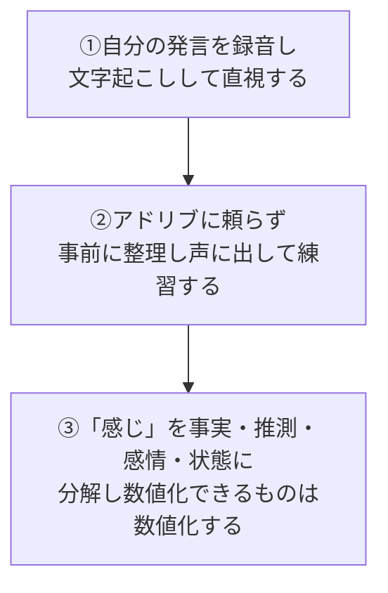

# 「〜な感じ」というぼかし言葉と説明責任

> **TL;DR**: 「進捗はだいたい終わった感じです」のようなぼかし言葉は、話者が本来負うべき定義・言語化のコストを聞き手に丸投げする行為であり、言い切って外れたときの責任を回避する保身のニュアンスを帯びる。@ysk_motoyamaはこれを「知的怠慢」と断じ、矯正の3ステップを提示する。

会議で「進捗としては、だいたい終わった感じです」と言われた側は、作業が完了したが未チェックなのか、8割終わってゴールが見えた状態なのか、単に本人の気分が乗っているだけなのかを脳内で翻訳しなければならない、と@ysk_motoyamaは指摘する。これは泥のついた野菜と生肉を渡して「あとはいい感じに解釈してください」と言っているのに等しく、説明の体裁を取った情報の未加工放置だという。「〜です」と言い切ることには訂正・謝罪という責任が伴うが、語尾をぼかす人は無意識に「感じを伝えただけだから、違っていても責めないでほしい」という予防線を張っていると著者は分析する。

## 矯正の3ステップ

1. **自分の発言を録音し、絶望せよ**: 「自分はちゃんと話せている」という思い込みは、自分の会議発言を文字起こしして読むと崩れる。意味のない「えー」「あー」と連発される「〜な感じ」を客観視する羞恥心が矯正の第一歩になる。
2. **アドリブで話せると思うな。練習してこい**: 説明中に「〜な感じ」と言ってしまうのは、脳内で文章が完結する前に口を動かし始めているから。スティーブ・ジョブズでさえプレゼン前に何日もリハーサルを重ねたとして、事前に「事実はどこまでで推測はどこからか」を整理し声に出してシミュレーションすることを著者は勧める。
3. **「〜な感じ」を分解する**: 「感じ」には事実・推測・感情・状況があいまいに混在している。数値化できるか（「売上はいい感じ」→「売上は目標比120%」）、事実か意見か（「PCが壊れた感じ」→「画面が起動しない〈事実〉。故障と判断する〈意見〉」）、どんな状態かを定義できるか（「使いにくい感じ」→「ボタンが小さく誤操作を誘発する」）の3軸で分解してからでないと口に出せない、という。

著者の結論は「曖昧な言葉で世界を捉えている人は、仕事の成果も曖昧なものになる」というもの。言葉のピントを合わせられる人は問題の所在を正確に捉え、解決策を導き出せるとしている。

## 観察ログ（未検証）

- 2026-07-22: 著者の経験則に基づく主張であり定量データはない。「〜な感じ」の使用頻度と評価・成果の相関などは未検証
- 2026-07-22: 末尾にnoteメンバーシップ（270記事以上・月額500円）の告知あり。[[concepts/self-evaluation-gap]]と同一の導線

## 問い

- 「感じ」を事実・推測・感情・状態に分解する3〜4軸は、[[concepts/structuring-ability]]が言う抽象↔具体の入れ子整理と同型の枠組みか
- 自分の会話・wikiページの文章にこの基準を当てはめた場合、どこが「〜な感じ」に該当するか

## 関連

- [[concepts/structuring-ability]] — 曖昧な概念を要素分解し定義し直す行為は、構造化力の「分けて見る」操作の実践形
- [[concepts/self-evaluation-gap]] — 同著者（@ysk_motoyama）。「仕事への姿勢の甘え」を指摘する点で同根のテーマ
- [[concepts/coachability]] — 言い切って間違いを認める率直さは、コーチャビリティが要求する正直さ・謙虚さと表裏の関係
- [[concepts/career-agency-variables]] — 同著者(@ysk_motoyama)。何をやるか/どうやるか/なぜやるかの3変数でキャリアの自己決定権を論じる別テーマの記事
