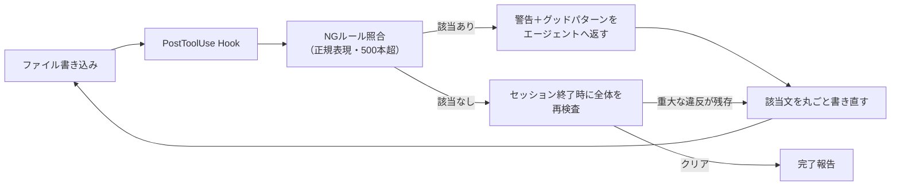

# LLMの日本語の癖をHookで機械検査する

> **TL;DR**: AIが書く日本語の癖は指示では消えないので、ファイル書き込み直後のHookで500本超のNGルールと突き合わせ、グッドパターン付きの警告をエージェント自身に返して文ごと書き直させる、という@yugen_matuniの運用。

書く前の注意で直らない理由を、@yugen_matuniは3つ挙げる。会話が長くなると指示は薄まる一方であること、モデルが変われば癖の出方も変わること、注意書きを増やすほど今度は別の場所で別の癖が出てくることである。著者はシステムプロンプトやCLAUDE.mdのような規約ファイルに「この表現は使わない」と書き並べたが、同じ表現が頻発したという。そこで軸を「書く前の注意」から「書いた後の機械検査」へ移し、Claude CodeやCodexが備えるHooks（エージェントの動作の節目に自作スクリプトを差し込む仕組み）のうち、ファイル編集の直後に発火するPostToolUseに検査を載せた。

止めずに直させるのが特徴だと著者は書く。検出時は処理をブロックせず警告だけを返し、書き直された内容にはもう一度検査がかかる。一方でセッション終了時には全体を再検査し、重大な違反が残っていればエージェントは該当文を書き直すまで完了報告できない。日常の書き込みは緩く、最後のゲートだけ固くする二段構えになっている。

なお、著者が挙げる癖の実例は「効果の中身を書かずに『効く』の一語で済ませる」「頼んでいない対比で『AではなくB』と否定から入る」「主語や助詞が抜けて誰が何をするのか読めない」「同じ文末が続いて単調になる」の4つである。

## 語だけ差し替えさせない

こだわった点として、著者は語のみの置き換えを禁止していると明かす。NGワードだけを別の語へ差し替えると、同じ問題が別の語形で残り、文章が破綻するからだ。そのため警告文は「検出箇所を含む文を丸ごと書き直す」ことを求める文面にしてある。検査対象は語だが、修正単位は文というずらし方になる。

## グッドパターンを対で持たせる

もうひとつのこだわりが、エラー検出だけで終わらせない設計である。500本のNGルールはすべて「こう書き直す」というグッドパターンと対になっており、検出時の警告には引っかかった語と一緒にそのグッドパターンが返る。「効く」を検出したら「真価は〜にある」「本領を発揮するのは〜」が返り、「AではなくB」の対比なら「不要なら肯定形で直接書く」が返る。

禁止だけを並べるとエージェントは避け方が分からず不自然な回避文を書きがちで、グッドパターンを添えてから書き直しの精度が上がった、と著者は述べる。これは[[tools/japanese-tech-writing]]の作者・鹿野桂一郎が「例文を取り除いたので、そこまで強くは効かないかもしれない」と留保した点に対する、運用側からの回答にあたると考えられる。規範の拘束力は禁止事項の数ではなく、良い形の提示とセットになっているかで決まる、という読みである。

## ルールは指摘のたびに増える

500本超というルール数は、一度にまとめて作ったものではない。著者がエージェントの日本語へ指摘を入れるたびに増えていったもので、指摘をルールへ登録するSkillを用意してあるため、指摘すると半ば勝手に登録されていくという。加えて週に1回ほど、会話履歴をエージェント自身に分析させ、繰り返し直している表現をまとめて登録している。指摘した瞬間にルール化すれば次からは機械が代わりに指摘してくれる、という点が同じ指摘を繰り返さない仕掛けになっている（[[concepts/skill-self-improving-loop]]の会話履歴→ルール化のループと同型）。

検出カウントを集計すると上位に来るのは「効く」と「AではなくB」のような対比構文で、モデルや会話が違ってもLLMの日本語には共通の癖がある、と著者は書く。

## 単語照合で拾えない癖は文書全体の集計で見る

正規表現の照合では拾えない癖があるため、著者は文書全体の集計による検出も併用している。

- 同じ文末（ます・です・ました等）が3文以上続いたら検出する
- です・ます調と常体の混在を、文末の分布を集計して検出する
- 比喩表現が同じ行や同じ文書内に重なったら、重ね使いとして警告する

「ますが連続する」ような単調さは、1文ずつ見ても違反とは言えない。文書全体で文末の種類を数えて、はじめて指摘できる、と著者は説明する。ここは正規表現とは別に、スクリプトで文末を数えて判定している。ルール表現の粒度（語 / 文 / 文書）と検査機構が対応している設計である。

さらに、シーンごとにルールのオンオフも変えている。造語（「◯◯メソッド」のような自作の言葉）の検査は、ビジネス文書ではオンにし小説ではオフにする。造語は創作では技法だから、というのが理由である。

## 観察ログ（未検証）

- 2026-08-14: ルール数500本超、および検出上位が「効く」と対比構文だという集計は著者の自己申告で、集計期間・対象文書数は示されていない
- 2026-08-14: 「私が日本語を直す回数は目に見えて減った。とはいえゼロにはなっていない」と著者。導入前後の定量比較はない

## 問い

- このvaultのCLAUDE.md「文章スタイル」節（補足の括弧は文末に置く・術語に一言添える・主張に主体を明記）のうち、どれが正規表現で書けてどれが書けないか。書けないものは文書全体の集計側に回せるか
- 500本のNGルールは、[[tools/no-ai-slop]]の20+パターンや[[tools/japanese-tech-writing]]の10カテゴリとどれだけ重なるか。日本語特有の癖はどこか
- 文末連続・文体混在の集計判定を、weekly生成やwikiページ生成の品質ゲートに移植できるか。[[concepts/eval-loop]]のように出荷前に止める形にすべきか、本ページのように止めずに直させる形にすべきか

## 関連

- [[tools/no-ai-slop]] — 英語圏のAIスロップ20+パターンを検出・除去するスキル。パターンの列挙という点は共通だが、あちらはスキル起動時の一括推敲、本ページは書き込み直後のHookによる常時検査という違いがある
- [[tools/japanese-tech-writing]] — 鹿野桂一郎の日本語文章規範SKILL.md。禁止事項の体系という点で本ページのNGルールと対応し、グッドパターンを対で持つ設計はその「例文を外すと効きが落ちる」という留保への回答にあたる
- [[concepts/eval-loop]] — 生成→採点→閾値未満を止める品質ゲート。本ページはセッション終了時の再検査でブロックする点が同型で、日常の書き込みでは止めない点が異なる
- [[concepts/claude-code-instruction-methods]] — Claude Codeの指示7手段を「決定論的強制はhook/permission」と振り分ける公式フレーム。本ページはその振り分けを文章品質に適用した実例
- [[concepts/skill-self-improving-loop]] — 会話履歴から自分のスキルを育てる自己改善ループ。本ページの「指摘のたびにSkillがルールを登録する」仕組みと同型
- [[concepts/claude-code-hooks-async]] — Hooksの別の使い方（非同期サブエージェント起動）
- [[tools/suiko]] — 同じ「事後の機械検査」を形態素解析ベースの決定論的CLIにした実装（nwiizo製）。本ページの正規表現＋Hook常駐に対し、辞書埋め込みのスタンドアローン診断・baseline差分・CI gateを提供し、書き直しはエージェントでなく人間の文脈判断に委ねる
