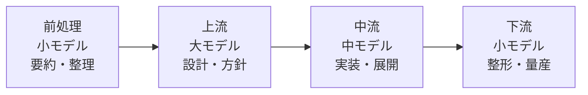

# LLMモデル選択戦略（工程分解型コスト最適化）

> **TL;DR**: タスクを上流（設計・方針）・中流（実装）・下流（整形・量産）に分解し、各工程に最適な規模のモデルを当てる。大モデルを全工程に使うのは最弱の運用で、前処理（小）→上流（大）→中流（中）→下流（小）の「サンドイッチ」往復が速度・コスト・質を同時に最適化する。

長く複雑なタスクほど大モデルの優位が拡大するという非対称性が、「最強モデルを何にでも使う」運用を最も非効率な選択にする。大モデルは応答が遅く1トークンあたりの単価が高いため、誤方向への実行をやり直すと「クレジット（コスト）と実行時間」の二重損失が生じる。この二重コスト構造を回避する設計原則が工程分解型モデル選択だ。

## 工程ごとのモデル配分

**前処理**（生メモ・議事録の要約・重複削除・構造化）は小モデルで十分。整理された文脈を上流の大モデルへ渡す「下ごしらえ」であり、小さなモデルが「入口（文脈整備）」と「出口（量産・整形）」の両端を担う。

**上流（設計・方針・難所突破）** には大モデル × 濃いコンテキストを投入する。方向を一発で決める工程で、ここでのズレは下流すべてを巻き戻すため最も投資対効果が高い。大モデルほど「最初に何を渡したか」で成果が引きずられるため、**コンテキストエンジニアリング**（前提・制約・ゴール・評価基準・参照資料を冒頭で渡し切る）が決定的に重要になる。途中で止めて修正しにくい設計ゆえに「走り出す前に決め切る」発想への転換が求められる。

**中流（実装・展開）** は上流で判断が済んでいるため過剰な推論力は不要。速度とコストのバランスを取る中モデル（Sonnet級）が最適。

**下流（整形・量産・反復）** は失敗しても作り直しが軽い領域。安く速く大量に回す小モデル（Haiku級）に任せる。ここを大モデルに任せるのはコストの垂れ流しになる。

## コストとタイパは別軸

**コスパ（単価）** はモデルの規模配分でしか改善できない。大モデルを並列実行しても1トークンあたりの単価は下がらない。  
**タイパ（速度）** は並列オーケストレーション（複数モデルを同時実行）で改善できる。

この二軸は競合しない。上流に大モデルを置くのは「質への投資」、下流に小モデルを置くのは「コスパ」、並列化は「タイパ」と役割が分かれている。実際の最適化は「どのモデルか × どのエフォート（推論量）設定か」の二軸で決まる。同じモデルでも最大〜低エフォートの段階があり、モデルの大小だけでなくエフォート設定も変数として扱う。

## 観察ログ（未検証）

- 2026-06-09 (@ozaken_AI): 「全部大モデルで回す」のが最強でなく、最弱の運用になると主張。上流の文脈づくりへの投資が最大のコスト節約になるとみる
- 2026-06-09 (@ozaken_AI): 「これからの実力差は上流にどれだけ文脈を積めるかで決まる」と予測。モデルは指数で強くなるほど最初の指示品質に成果が引きずられる
- 2026-06-09 (@ozaken_AI): 実務ではモデル × エフォート設定の二軸で連続的に最適点を探ると強調。単純な「大/中/小」の三分類より広い選択肢を想定
- 2026-06-10 (@cwmasaki): [[models/claude-fable-5]] はトークン単価が高いが、メインセッションをFableに据えたまま「トークン節約のためOpus/Sonnetを適切にサブエージェントとして切り出して実行する」プロンプトを書いておけば実用的、という運用Tip。重い実装トークンを別コンテキストのサブエージェントへ逃がし、高価なFableの主セッションにトークンを溜めない使い方（=工程分解戦略をFableオーケストレータ＋安価ワーカーの形で具体化）。プロンプト全文は未捕捉

## 問い

- 自分のワークフローで「上流→大モデル、下流→小モデル」を徹底している場面はどこか？ [[concepts/claude-usage-optimization]] のモデルスタッキングと統合できるか？
- 「冒頭で詰め切れた」の判断基準をどう持つか。コンテキストエンジニアリング品質の評価指標はあるか？
- [[models/claude-fable-5]] の「長い自律タスクほど差が出る」特性と、この工程分解戦略を組み合わせるベストプラクティスは？

## 関連

- [[models/claude-fable-5]] — この戦略が明示的に論じているMythos-classモデル
- [[concepts/claude-usage-optimization]] — モデルスタッキング・レートリミット管理（モデル選択の隣接概念）
- [[concepts/multi-agent-patterns]] — Pipeline/Fan-Outパターン（並列実行とコスト最適化の接点）
- [[concepts/loop-engineering]] — ループ設計でFable 5性能を引き出す手法
- [[concepts/prompt-engineering]] — 上流で「濃いコンテキスト」を作るコンテキストエンジニアリングの実践
- [[concepts/notebooklm-claude-workflow]] — 「上流に濃い文脈を渡し切る」原則の事実供給版：NotebookLMで網羅出力させてClaudeに渡す（@ai_jitan）
- [[concepts/agent-adoption-walls]] — 企業エージェント導入の「⑦モデル選択の自由度」＝プロバイダー非依存の運用（@kzkhykw）
- [[concepts/advisor-executor-pattern]] — 同型のサンドイッチ戦略を Fable 5×Sonnet 5 の2モデル・3パターンで具体化（別著者の収斂）
