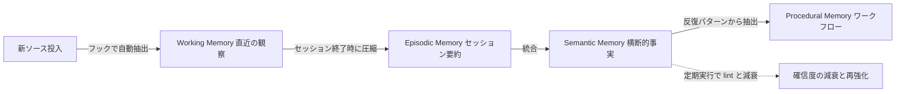

# LLM Wiki v2：「忘れる力」を足した知識ベースの青写真

> **TL;DR**: Karpathy の LLM Wiki に確信度スコア・4層メモリ階層・型付きナレッジグラフ・ハイブリッド検索・自動フック・忘却曲線・矛盾解決の7機能を足し、「均等に重み付けされたページのフラットな集合」を「記憶が強化され、弱化し、統合され、忘却される生きたシステム」へ変えるアーキテクチャの青写真（Nav Toor の投稿と Rohit Ghumare の Gist を KiKi@AIx個人開発が要約）。



[[concepts/llm-wiki]] の元パターンが抱える構造的弱点は「すべての知識を永遠に等しく有効として扱う」ことにある、と v2 の提案者は指摘する（KiKi@AIx個人開発の要約による）。3ヶ月前に書かれた事実と昨日確認された事実が同じ重みで扱われ、ページ数が200を超えると index.md による検索が破綻し始め、矛盾する情報が入っても検出されない。v2 は AI エージェント用の永続メモリエンジン agentmemory の知見をもとに、これらを7つの機能で補強する設計として提示されている。KiKi@AIx個人開発は、v2 が具体的なコード実装を含まないアーキテクチャの青写真であり、実装は参照プロジェクトの agentmemory に委ねられている点を注意事項として挙げる。

## 7つの機能

### 確信度スコアと減衰

すべての事実に確信度スコアが付き、スコアはソース数・最終確認日・矛盾の有無から算出される。要約が挙げる例では「プロジェクトXはRedisをキャッシュに使っている」という主張が2つのソースに裏付けられ、3週間前に最終確認され、確信度0.85であると記録される。確信度はエビングハウスの忘却曲線に基づいて時間とともに減衰し、アクセスや新しいソースによる確認が行われるたびに曲線がリセットされる。強化されなかった事実は徐々にスコアが下がる。

### メモリ階層（4層）

知識を4つの層に分け、各層はより圧縮され、より長命になる。人間の記憶が短期記憶から長期記憶へ固定化されるプロセスと同じ構造だと要約は説明する。

- **Working Memory（作業記憶）**: 直近の観察。まだ処理されていない生の情報
- **Episodic Memory（エピソード記憶）**: セッション単位のサマリー。作業記憶から圧縮して作る
- **Semantic Memory（意味記憶）**: セッションをまたいだ事実。エピソード記憶から統合して作る
- **Procedural Memory（手続き記憶）**: ワークフローやパターン。繰り返される意味記憶から抽出する

### 型付きナレッジグラフ

元の wiki はフラットなページとリンクの集合だったが、v2 ではエンティティに「人物」「プロジェクト」「ライブラリ」「概念」などの型を、関係に「uses」「depends on」「contradicts」「caused」などの型を持たせる。「AがBを引き起こした、3ソースで確認、確信度0.9」という形で記録し、グラフ走査でキーワード検索では見つからない接続を捕まえる。フラットなリンクでは「AとBが関連している」しかわからないが、型付きグラフでは「AがBにどう関係しているか」まで表現できる、と要約は述べる。

### ハイブリッド検索

BM25 によるキーワードマッチング、ベクトル検索によるセマンティック類似性、グラフ走査によるエンティティ関係の探索の3種類を Reciprocal Rank Fusion（RRF、複数の順位リストを1つに融合する手法）で統合する。BM25 は正確なキーワードに、ベクトル検索は意味的に近いが表現が異なる情報に、グラフ走査は構造的な関係にそれぞれ強く、3つが補完し合うことでどの角度からクエリが来ても答えが返る、と要約は説明する。

### 自動フック

「wiki を殺す最大の原因はメンテナンスだ」として、メンテナンスをイベント駆動で自動化する。新しいソースが追加されたとき抽出とグラフ更新が走り、セッションが終了したとき観察値が圧縮されて洞察として保存され、定期スケジュールで lint・統合・減衰処理が走る。人間はソースを投入し、質問を投げ、結果を考えることに集中する。

### 忘却曲線

数ヶ月間アクセスも強化もされなかった事実は優先度が下がる。削除ではなく非優先化である点を要約は強調する。減衰速度はカテゴリによって異なり、アーキテクチャの決定はゆっくり、一時的なバグ情報は速く減衰する。スコアは次の式で計算され、λ をカテゴリごとに設定することで重要な知識は長く残り、一時的な知識は自然に沈む。

```
final_score = relevance × exp(-λ × days)
```

「何を覚えるか」ではなく「何を忘れるか」の設計が、スケールするナレッジベースの条件になる、と要約は結論づける。

### 矛盾解決

矛盾をフラグするだけでなく解決まで行う。基準はソースの新しさ・ソースの権威性・裏付け証拠の量の3つで、公式ドキュメントの記述は個人ブログより重く、3つのソースで裏付けられた主張は1つだけの主張より重い。古い情報は削除されず新しい情報によって明示的に上書きされ、上書きの履歴が残るため、なぜ判断が変わったかを後からたどれる。

## 実装スペクトラム（6レベル）

v2 は段階的に導入できる青写真であり、レベル1から始めて問題が発生したときに次のレベルを足せばよい、と要約は述べる。

| レベル | 内容 |
|---|---|
| 1 基本的な wiki | ソースからページを作りインデックスを維持する。Karpathy の元パターンそのもの |
| 2 ライフサイクル | 確信度スコアと忘却曲線を足す。フロントマターに数フィールド追加するだけで始められる |
| 3 構造化 | エンティティと関係を型付きにし、グラフ走査を可能にする |
| 4 自動化 | フックによるイベント駆動のメンテナンスを入れる |
| 5 スケール対応 | ハイブリッド検索を導入し、数千ページに対応する |
| 6 コラボレーション | 複数のエージェントやチームが同じナレッジベースを共有する |

## 必要になる規模

KiKi@AIx個人開発は、すべての機能が必要になるのはナレッジベースが1,000件を超えるような規模からであり、数百件規模であれば元の Karpathy パターンで十分に機能する、と留保を付けている。投稿者は Vannevar Bush が1945年に描いた Memex を引き合いに出し、「Memex がついに構築可能になった。より良い文書やより良い検索があるからではなく、実際に仕事をする司書がいるからだ」と述べている、と要約は伝える。

## 観察ログ（未検証）

- 2026-09-05: KiKi@AIx個人開発の記事によれば、Karpathy の LLM Wiki は1900万インプレッション・99,300ブックマークを集め、GitHub Gist は数日で5,000スターを超えた（単一ソース数字。[[concepts/llm-wiki-vs-company-brain]] の観察ログにある VentureBeat 報道の「数日で5,000超のスター」とは整合）
- 2026-09-05: 「ページ数が200を超えると index.md による検索が破綻し始める」（v2 提案者の主張、KiKi@AIx個人開発の要約経由）。このwikiは373ページで index.md 経由の Query を運用しており、破綻の兆候が出るかを追跡する

## 問い

- このwikiは v2 のどのレベルにいるか。ソースの権威性（tier_log）・最終更新日（frontmatter の updated）・launchd による自動 ingest（フック）・validate_wiki による lint は持つが、確信度の時間減衰と矛盾の明示的な上書き履歴は持たない。レベル2「フロントマターに数フィールド足す」は試す価値があるか
- 減衰係数 λ をカテゴリ別に設定するなら、このwikiの models/（世代交代が速い）と concepts/（長命）にどう割り当てるか
- [[concepts/cerebras-knowledge-base]] の鮮度減衰・[[concepts/managed-agents-dreams]] の矛盾解消・[[concepts/self-owned-ai-memory]] の忘却曲線は、v2 の7機能と同じ問題への独立した収束と見てよいか。また [[papers/2026-peng-llm-memory-faulty]] が示す継続的メモリ更新による劣化を、v2 の統合・減衰は防ぐのか悪化させるのか

## 関連

- [[concepts/llm-wiki]] — 拡張元。本ページの7機能が補う弱点（均等な重み・index.md 検索の限界・矛盾の未検出）を持つ元パターン
- [[people/andrej-karpathy]] — 元パターンの提唱者
- [[concepts/llm-wiki-vs-company-brain]] — 同じ KiKi@AIx個人開発が v2 を「派生」の1つとして位置づけ、個人向けと企業向けの境界線を引いた記事
- [[concepts/cerebras-knowledge-base]] — 全文＋埋め込み＋IDF＋鮮度減衰を RRF で融合する企業の社内知識ベース実装。v2 のハイブリッド検索と同型
- [[concepts/managed-agents-dreams]] — メモリストアの重複削除・矛盾解消・インサイト統合を行う Anthropic の Dreams API。v2 の矛盾解決と統合に対応する
- [[concepts/self-owned-ai-memory]] — 会話要約をベクトル化し忘却曲線で減衰させる個人の自作 AI 長期記憶。v2 の確信度減衰を会話記憶に適用した例。@d5dx が @_mumumu の要約ポストへの返信で本記事をリンクし、両者を結びつけた
- [[concepts/agent-memory-layer]] — ユーザー所有の単一メモリ層を敷く設計思想。v2 のレベル6（複数エージェントの共有）と重なる
- [[concepts/knowledge-graph-llm]] — 型付きエンティティと関係で LLM を補強する側の入門
- [[concepts/context-graph-retrieval]] — RAG からコンテキストグラフへ移り k-hop 走査で「経路」を返す設計。v2 の型付きグラフ走査と方向が同じ
- [[papers/2026-peng-llm-memory-faulty]] — 継続的なメモリ更新でエージェントの記憶が劣化するという研究。v2 の統合・減衰の副作用を検証する視点
