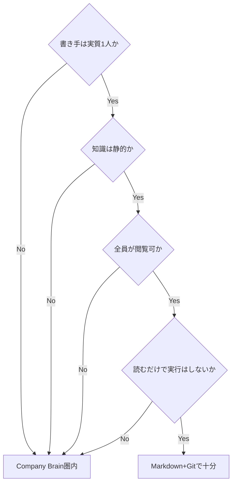

# LLM Wiki と Company Brain の境界線

> **TL;DR**: KarpathyのLLM Wiki（個人向け・書き手1人・静的ソース）とCompany Brain（企業向け・複数書き手・動的データ）の分岐点は権限・鮮度・意味の強制・複数の書き手・実行と監査の5点で、4つの質問に全部イエスならMarkdownとGitで足りるとKiKi@AIx個人開発が整理する。

2026年4月に[[people/andrej-karpathy]]が[[concepts/llm-wiki]]のgistを公開して以来、X上ではLLM Wiki v2（確信度スコア・記憶の階層化・忘却曲線を追加）や[[concepts/agent-memory-layer]]（GBrain・CASS）といった派生が相次いだ。KiKi@AIx個人開発はExtency Teamの分析を引いて、これらが設計思想は違っても保存形式ではそろってGit管理のMarkdownフォルダを選んでいると指摘し、ファイル形式の勝負はXの開発者コミュニティの中ではすでに決着していると評する。一方で同じ時期、Y Combinatorは2026年夏のRequests for StartupsでMonzo共同創業者のTom Blomfieldが「Company Brain」を重点テーマの1つに指名し、Sierra・Glean・Brain Co.・Hyperといった企業が同じ言葉を掲げ始めた。KiKi@AIx個人開発は、この2つの潮流は同じ問題を扱うようでいて守備範囲が違うとし、その境界線を引く記事を書いている。

## 5つの境界線

KiKi@AIx個人開発は、Karpathy式が前提とする「書き手が1人・ソースが静的・読者が自分とエージェントだけ」という3条件が崩れる場所を、そのままCompany Brainの出番だとして次の5点を挙げる。

- **権限**: Markdownのリポジトリには閲覧制御がなく、複数ソースから合成された記憶は元のどの文書より機密性が高くなり得る
- **鮮度**: CRMや在庫やチケットは時間単位で変わるが、取り込み時に一度だけ編集する方式では取り込んだ瞬間から現実とずれ始める
- **意味の強制**: 「ARRの定義」のような指標は散文では強制できず、部門ごとにエージェントが違う数字を答える事故は統制された定義の層でしか防げない
- **複数の書き手**: 司書が1人なら矛盾は起きないが、書き手が部門の数だけいれば矛盾の検出と調停・所有権・訂正の履歴が必要になる
- **実行と監査**: Company Brainは読むだけでなく返金や予約などの行動に接続されるため、誰が何を根拠に実行したかを追跡できなければ業務には使えない

この5点はいずれもモデルの性能では解決しないガバナンスの問題だとKiKi@AIx個人開発は結論づける。

## 3層メモリ論との接続

記事はSentraのAshwin Gopinathによる3層メモリ論（事実の記憶・やり取りの記憶・行動の記憶）を、Company Brain側の理論的支柱として引用する。詳細は[[concepts/company-brain]]に譲るが、KiKi@AIx個人開発が強調するのは「知識ベースは待つ。記憶は参加する」という区別で、検索窓の前で質問を待つのが知識ベース、顧客との電話の前に未達の約束を先回りして出すのが記憶だとする点である。この区別が、Karpathy式の「取り込み時に一度だけ編纂する」モデルとCompany Brainの間に横たわる本質的な差だと位置づけられる。

## 個人・小チームはKarpathy式で足りる

境界線を裏返すと判断基準になる。KiKi@AIx個人開発は「書き手は実質1人か」「知識は静的か」「全員がすべて見てよいか」「エージェントは読むだけで実行はしないか」の4問全部にイエスならMarkdownとGitで十分だとし、1つでもノーが混ざればその項目だけ外部の仕組みを足し、全部ノーになったらCompany Brain製品の検討圏内になるとする。GBrainのような企業向け製品ですら内部形式にMarkdownを選び始めている点を挙げ、Markdownで始めても後で無駄にはならないと述べる。

## 観察ログ（未検証）

- 2026-04: KarpathyのGitHub gist「llm-wiki」が公開から数日で5,000超のスターと数千のフォークを集めたとVentureBeatが報道（単一ソース数字）
- 2026-06-05: Garry TanのGBrain紹介ポスト「GBrain is your company brain」が12万超のインプレッション
- 2026-06: マーケターのericosiuが「12ヶ月以内にすべての企業がCompany Brainを動かす」と投稿し15万超のインプレッションを集めた（大胆な予測、楽観の先行を割り引く必要ありとKiKi@AIx個人開発自身が留保）

## 問い

- 自分のこのvaultは4つの質問に全部イエスで答えられるか。書き手は実質1人（自分＋エージェント）で、扱う知識は静的で、読むだけで外部実行はしていない——境界線に近づいたら何を最初に足すべきか
- Company Brain側の[[concepts/company-brain]]の実務5層モデル（capture/retrieval/source truth/permissions/feedback loops）は、この4質問モデルの「Noが1つ」段階に部分導入できる粒度か、それとも全部ノーになって初めて意味を持つ設計か

## 関連

- [[concepts/llm-wiki]] — この記事が起点として扱うKarpathyのオリジナル構想
- [[concepts/company-brain]] — Sentraの3層メモリ論・Single Grainの5層実務モデルなどCompany Brain側の詳細
- [[concepts/agent-memory-layer]] — GBrain/CASSが登場する個人〜チーム規模の共有メモリ層の議論
- [[tools/glean]] — Company Brainを製品として実装する代表例の1つ
- [[tools/knowledge-acquisition-skill]] — AWS Samples の LLM Wiki 実装。Git差分レビューと原典照合を前提にする運用結論が、企業利用側の要件と接続する
