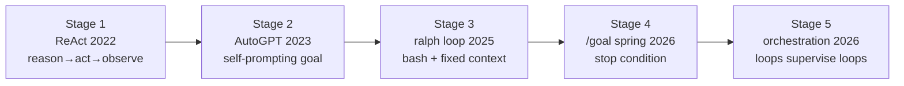

# ループエンジニアリング（Loop Engineering）

> **TL;DR**: エージェントをプロンプトする「人間」をやめ、エージェントをプロンプトする「ループ」を設計することで、自分がループの外に出る工学的転換。スケジューラー（cron）＋意思決定者（モデル）＋フィードバック機構の三つ組が本質。

> 📌 X bookmark: 15,092（2026-06-10 時点）

プロンプトエンジニアリングは「良いプロンプトを1回書いて、1回の応答を得る」という人間中心のスタイルだった。ループエンジニアリングはその構造を反転させる——人間は一度ループを書き、以降はそのループがエージェントと対話する。「誰がエージェントに指示するか」が人間からプログラムへ移行した形態であり、コーディングエージェントが当たり前になった2026年の開発スタイルの次層にある。

Boris Cherny（Claude Code 責任者）が3段階のラダーとして整理: ①自分でコードを書く → ②並行してClaude Sessionを複数プロンプトする → ③ループを書いてループがClaudeをプロンプトする。直近30日でClaude Code貢献の100%をClaude Code自体が書き259本のPRを出荷した実践例（Boris自身の報告）。

「ループ = cron + 意思決定者」の構造が核心: cronの部分（スケジュール実行）は1975年から存在するが、ループの本体はモデルが現在の状態を読んで次の行動をそのtickに判断する点が新規。ハードコードされた分岐でなくモデルが決断する。これを積み重ね、ループがループを監視・起動する多層構造が Stage 5 の「オーケストレーションループ」。

Stage 5 の具体例も報告が増えている。Steve Yegge の Gas Town は Mayor エージェント下で20〜30の Claude Code インスタンスが協調し、パトロールエージェントが git に状態を保存してクラッシュ後も継続する（Yegge のオープンソース実装・著者主張）。@steipete は codex にリポジトリのメンテを任せ、5分ごとに複数スレッドへ作業を割り振るループを回し、orchestrator スキルを triage・autoreview・computer use と組み合わせて一部はそのままマージまで到達すると報告する（[[tools/autoreview-skill]] / [[tools/skill-cleaner]] と同じ作者）。Peter Steinberger の crabfleet（[[tools/openclaw]]・「エージェント実行のミッションコントロール」）は、タスクをカード化して todo/running/human review/done のボードで動かし、各 run がハートビート付きの耐久実行として使い捨てクラウドサンドボックス上で走る。

LangChain の Sydney Runkle は、ループ設計の焦点を L1・L2（エージェント＋検証）から L3・L4（イベント駆動＋ヒルクライミング＝trace 分析からハーネス自体を書き換える外側の層）へ移すべきだと主張する。価値が複利で積み上がるのは、エージェントをエコシステムに埋め込み基準に応じて継続改善させる外側の層だからで、Steinberger・Boris Cherny・Karpathy が独立に「エージェントの潜在力はその周りに作るループにある」という同一結論へ収斂していると指摘する。泉水亮介はこれを外側ループ（観測→気づき→タスク化で backlog を積む）と内側ループ（計画→実行→検証で1件ずつゲートを通す）の二段構造として言い換え、「外側が何を、内側がどう」を分けるとそれぞれが薄く速くなるとする。

## 4条件テスト（ループ構築の前提）

ループはコストを持つ。以下の4条件をすべて満たす場合のみ、ループはリターンを返す（AlphaSignal分析より、@0xCodez整理）:

1. **タスクが繰り返される**: 週1回以上発生しないタスクはループより手動プロンプトが速く安い
2. **検証が自動化できる**: テストスイート・型チェック・ビルド・リンターのいずれかが失敗を検知できること。自動ゲートなしのループは「エージェントが自分の宿題を採点する」状態
3. **トークン予算がある**: ループはリトライ・コンテキスト再読み込みでトークンを消費し続ける。$20コンシューマープランでの重い検証ループは予算より先に請求書がくる
4. **エージェントがシニアエンジニア相当のツールを持つ**: ログ・再現環境・コード実行能力がないとループは盲目で反復する

**1条件でも欠けたら、ループではなく良いプロンプトが勝つ。**

### 30秒ループチェック（特定タスクへの適用前）

| # | 条件 | 不合格なら |
|---|------|----------|
| 1 | 少なくとも週次でタスクが発生する | 手動プロンプトに留める |
| 2 | テスト/型チェック/ビルド/リンターが不正出力を弾ける | 人間レビュー必須 |
| 3 | エージェントが書いたコードを実行できる | ループは盲目で反復するだけ |
| 4 | ハードストップがある（トークン予算・イテレーション数・タイムリミット） | 請求書か誰かの気づきで止まる |
| 5 | マージ・デプロイ・依存変更の前に人間レビューがある | 不可逆アクションに人間ゲートを |

**良い最初のループ**: CI失敗トリアージ・依存バンプPR自動化・Lint-and-fix・フレイキーテスト再現  
**悪い最初のループ**: アーキテクチャリライト・認証/決済コード・本番デプロイ・曖昧なプロダクト作業

## 構成要素（6要素）

@addyosmani と @masa_okamura108 の枠組みを統合した構成:

| 要素 | addyosmani版 | masa_okamura108版 |
|------|-------------|------------------|
| 起動 | **Automations**（スケジュール/イベント起動） | **Trigger**（何をきっかけに動くか） |
| 情報 | **Plugins & Connectors**（MCP経由のツール接続） | **Context**（どの情報を渡すか） |
| 実行 | **Sub-agents**（作成者と検証者の分離） | **Action**（何を実行するか） |
| 検証 | /goalの別モデル評価器 | **Verification**（成功したかの確認） |
| 記憶 | **Memory**（ディスク上のMarkdown/Linear） | **Memory**（結果や学びの永続化） |
| 上昇 | レビュー帯域が実質上限 | **Escalation**（AIのみで判断できない時の人間へのバックチャンネル） |
| 分離 | **Worktrees**（並列エージェントのファイル衝突防止） | — |

**スキル（Skills）** はループの再利用単位: 「2回以上やることはスキル化し、ループがスキルを呼ぶ」ことでプロンプトの代わりにライブラリが蓄積する。ループが鋭い名前付きスキルを呼ぶ構成は複利的に強くなり、毎回同じ文脈を再導出するだけのループはトークンを燃やすだけ。[[concepts/skill-building-best-practices]] 参照。

**6番目の要素はメモリ**: モデルはラン間でコンテキストをリセットするが、リポジトリは忘れない。ディスク上のMarkdownファイルや外部ボード（Linear）が状態の背骨となり、翌朝のループ起動が前日の続きから再開できる。

## 最小構成ループ（MVL）

4条件テストをパスしたら、「動く最小のループ」から始める。4要素のみ:

1. **自動化（Automation）**: スケジュール起動＋明確な停止条件（`/loop` in Claude Code or Codex Automation）
2. **スキル（Skill）**: 毎回ゼロから再導出しないためのプロジェクトコンテキスト1ファイル（SKILL.md）
3. **状態ファイル（State File）**: 翌日のループが「続き」から再開するためのMarkdownまたはLinearボード。エージェントは忘れる、リポジトリは忘れない
4. **ゲート（Gate）**: 不正出力を自動で弾くテスト・型チェック・ビルド

**順序が重要**: まず手動で1回信頼できる実行を作る → スキル化 → ループでラップ → スケジュール登録。この順を飛ばすと本番で壊れる。

**計測するべき指標**: *cost per accepted change*（採用された変更あたりのコスト）。採用率50%以下ならループが節約したはずのレビュー作業をループ自身が増やしている。

**`/goal` は契約として書く**: @omarsar0（Elvis Saravia）は、良い `/goal` は「プロンプトより契約に近い」とし、終了状態・到達を証明する根拠・破ってはならない制約・許される作業予算の4点を明示すべきだと整理する。どれか1つでも曖昧だとモデルが最も楽な解釈で埋め、早期停止・ショートカット・成功の再定義が起きる。

## 失敗パターン

@addyosmani は、ループが変えるのは「仕事がなくなる」ことではなく「仕事の重心が移動する」ことだと述べ、自動化が進むほど検証（Verification）・理解の負債（comprehension debt）・認知的降伏（cognitive surrender）という3つのリスクが先鋭化すると指摘する。

### Ralph Wiggumループ（静かに壊れる）

Geoffrey Huntley が命名。エージェントが完了すべきでないタイミングに完了トークンを出力し、ループが中途半端な状態で終了する失敗モード。以下の3条件が揃うと発生:

- **本物の検証者がない**: 「レビューして」と頼まれたサブエージェントだけがいる（2人の楽観主義者が同意するだけ）
- **ソフトな完了条件**: 「良さそうに見えたら完了」とエージェントが判断する
- **ハードストップがない**: レートリミットか人間が気づくまでループが走り続ける

対策: テスト・ビルド・リンターなど「パスするかフェイルするか」が明確なゲートをMVLの4要素として入れる。

### 理解の負債（Comprehension Debt）

ループが出荷するコードの速度が人間チームの理解速度を超えた時に発生する状態（Addy Osmani命名）。支払いの日は「誰も読んでいないシステムをデバッグしなければならない日」。対策: diffを読む・ゲートを定期検証する・アーキテクチャ作業をループから外す・ループ設計はペアで行う。

### 認知的降伏（Cognitive Surrender）

ループの出力に自分の意見を持つことをやめ、何が返ってきても受け入れる状態。「判断を込めてループを設計する」なら解決策、「考えたくなくて使う」なら加速剤。同じアクション、逆の結果。

### セキュリティ税

無人ループは無人の攻撃面。4つの脅威モデル:

| 脅威 | 対策 |
|------|------|
| 未レビューコードの出荷（SAST未適用） | SAST・依存監査・シークレットスキャンをゲートに含める |
| スキルへのプロンプトインジェクション | インストール前にスキルソースを監査する |
| ログへの認証情報漏れ | 本番ループでは詳細ログを無効化・サニタイズ |
| 権限スコープクリープ | 30日ごとに権限を再監査する |

## 観察ログ（未検証）

- 2026-06-08 @mvanhorn: Uber が Claude Code と Cursor の1人あたり月額上限を $1,500 に設定したところ、年間AI予算を4ヶ月で使い切ったと報告（単一ソース・ループ管理コストの実測例）
- 2026-06-09 @masa_okamura108: Codex `/goal` の Notion タスク自動実行ループが1日で43コミットを生成したが、修正範囲が元PRの趣旨を逸脱しほぼ全件却下（ループ設計ミスによる暴走の実測例）
- 2026-06-21 @rsensui: 「文脈は多いほど良い」への反証として ETH Zurich / LogicStar.ai（arXiv:2602.11988）を引用——AGENTS.md を肥大化させるとリポジトリ文脈なしより成功率が下がり推論コストが20%超増、人間が丁寧に書いた指示書でも約+4%止まりと主張（二次引用・未検証。[[papers/2026-li-skillsbench]] / [[concepts/claude-code-instruction-methods]] と同方向）
- 2026-06-30 HuaShu「Orange Book」（Osmani 枠組みの論文スタイル再構成・[[concepts/loop-anatomy]] の出典）: 発火点の @steipete ポストは800万ビュー到達と記載。「Claude Code の約90%は自身が書いた」等の流布数値は二次まとめでラフな参考に留めよと HuaShu 自身が注記

## 検証済み事実

- 2026-春: Claude Code および Codex CLI がいずれも `/goal` コマンドを公式実装（[[tools/claude-code-goal]] 参照）。Haiku 評価器による検証済み停止条件付き自律実行

## 問い

- ループの暴走失敗例（masa_okamura108の43コミット全却下）から自分のwiki ingest ループ設計は何を変えるべきか（特にEscalationの設計）
- [[concepts/eval-loop]] の「生成→基準採点→閾値未満を止める」とループエンジニアリングの Verification は同一の概念か、それとも eval-loop がよりメタな品質管理レイヤーか
- [[concepts/harness-engineering]] の「ハーネス = フィードバックループ設計」とループエンジニアリングの境界はどこか。ハーネスは静的な枠組み、ループは動的な実行パターンという分け方で整合するか
- 4条件テストで「トークン予算がある」は何を基準に判断するか。月額コスト全体の何%までループに使えると決めておくべきか
- Ralph Wiggumループの「静かな失敗」は自分の自動化（launchd ingest）で発生する可能性があるか。完了条件はどこで定義されているか
- LangChainの4レベルスタック（特にL4ヒルクライミング＝trace分析→ハーネス書き換え）を自分のwiki ingestループに入れるなら、何をトレースとして残すべきか。LESSONS.md追記は手動L4だが、これを分析エージェントで自動化できるか（[[concepts/skill-self-improving-loop]] のIssue→PR3段ループが参考になるか）
- @rsensui引用のETH Zurich研究（AGENTS.md肥大で成功率低下・推論コスト+20%超）が正しいなら、このwikiのCLAUDE.md・各SKILL.mdに「盛りすぎ」の兆候はあるか。[[concepts/claude-code-instruction-methods]] の200行基準と [[papers/2026-li-skillsbench]] のcompact優位で棚卸しできるか

## 関連

- [[concepts/agentic-engineering-workflow]] — 同著者(@mvanhorn)の上位ワークフロー論（plan.md先行・人間はシグナルに徹する）
- [[concepts/harness-engineering]] — ループを走らせる静的な制約・フィードバック機構の設計
- [[tools/claude-code-goal]] — Stage 4 の具体実装（Haiku評価器付き停止条件コマンド）
- [[concepts/codex-agent-loop]] — Codex CLI 内部のエージェントループ実装詳細
- [[concepts/multi-agent-patterns]] — Stage 5 に相当するマルチエージェントオーケストレーションパターン
- [[concepts/eval-loop]] — ループの「フィードバック（自己検証）」に特化した品質ゲートパターン
- [[concepts/skill-building-best-practices]] — ループの再利用単位となるスキルの設計指針
- [[models/claude-fable-5]] — Fable 5のParameter Golf・Continual Learning Benchでのループ有効性ベンチマーク（Anthropicリサーチャー実験）
- [[tools/claude-managed-agents]] — CMAのOutcomes機能がループの検証サブエージェントを自動生成する
- [[concepts/ai-agent-building-blocks]] — ReActループを5構成要素の中核に据えたエージェント入門（@sairahul1）
- [[concepts/skill-self-improving-loop]] — L4ヒルクライミングの具体実装パターン（会話履歴→Issue→Routines→PRの3段自己改善ループ）
- [[concepts/recursive-self-improvement]] — L4の戻り矢印が訓練シグナルへ届く先（trace/eval→RLファインチューニング）の延長線
- [[business/frontier-ecosystem]] — Satya「学習ループを早期に作り人的資本×トークン資本を複利させる」の元論
- [[concepts/harness-engineering-roadmap]] — ループの一階下＝ハーネスを14ステップで積む構築ロードマップ（同じ@0xCodezによる対の記事）
- [[tools/loop-library]] — 再利用可能なエージェントループの公開カタログ（Forward Future）
- [[concepts/goal-loop-routine]] — goal/loop/routine の動詞の使い分け（いつ止まるか・自分はその場にいるか）。@mvanhornのループ調査Part 2を分類軸として切り出したもの
- [[concepts/coding-agent-workflow-styles]] — 委譲低速ループ／高速制御ループの2類型。本ページはその委譲側の極北
- [[concepts/claude-code-instruction-methods]] — @rsensui の「最小のAGENTS.mdが正義」を公式版で裏付け（CLAUDE.md 200行未満・指示ミニマリズム）
- [[tools/makeloop]] — `/loop` プロンプトを会話＋コードベースから自動生成するコマンド。Verify/State/Stop の3要素は本ページの最小構成ループと同型、生成器自身を自己改善する設計
- [[concepts/loop-anatomy]] — 本概念の解剖学版：1ターン＝5ムーブ×6パーツ、欠落＝5アンチパターン、4つの沈黙コスト（HuaShu Orange Book の統合枠組み）
- [[tools/stripe-minions]] — エンタープライズ実例：決定論ゲート×LLM交互配置で週1,300本のマシン生成PRをマージ。信頼性は制約の質から
