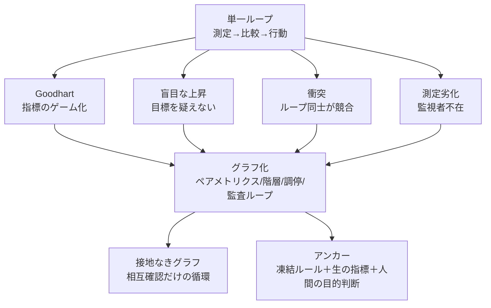

# ループからグラフへ、そして接地（Grounding）

> **TL;DR**: 単一ループの構造的失敗はループ同士が監視し合う「グラフ」に組み替えれば解決するように見えるが、@IntuitMachineは、グラフ自体も生の現実に触れる「アンカー」を持たない限り同じ失敗をより静かに・より高価に繰り返すだけだと論じる。

Peter Steinbergerの「まだloopの話をしているのか、それともgraphの話に移ったのか」という9語のミームを出発点に、@IntuitMachineは自己改善ループが単体では必ず壊れる4つの理由を構造から導く。指標を最適化し続けると指標自体が実態から乖離するGoodhartの法則、ループが自分の目標（reference）の妥当性を問えない盲目な上昇、独立に作られた複数のループが互いを妨害する衝突、そして測定システム自体が実態から静かに乖離していく劣化——これら4つは個別のバグではなく単一ループという構造そのものの帰結だと@IntuitMachineは述べる。

MLOpsの本番パイプライン（チャンピオン・チャレンジャー比較＋ドリフト監視＋ロールバック＋訓練ループが決して見てはならないheld-outデータセット）や、企業のガバナンス構造（日次運用ループ→四半期経営ループ→年次監査ループ→取締役会）は、いずれもループを監視・拘束・調停するループの網＝グラフとして機能していると@IntuitMachineは指摘する。Goodhartにはペアの対抗指標を、盲目な上昇には上位ループによる目標オーナーシップを、衝突には調停ループを、測定劣化には独立監査ループを——4つの失敗はいずれもトポロジー（接続構造）の設計で解決できるように見える。

しかし@IntuitMachineが記事の核心に据えるのは、その先にある落とし穴だ。すべてのループが互いの数字だけを参照し合い、誰も生の現実——実際に着金した売上、実際に実行されたテスト、実際に残った顧客——に触れていないグラフは、単一ループより静かに、より高価に、より多くの緑のシグナルを灯しながら同じように失敗する。@IntuitMachineはこれを「循環的だが検証されていない」状態と呼び、グラフには最適化ループが変更してはならない凍結された規則と、議論の余地のない生の指標という「アンカー」が要ると論じる。さらに、「何をもって良しとするか」という最終判断そのものは機構が生成できず、現実の失敗に触れた人間が供給するしかないと結論づける。

## 問い

- 自分のwiki運用（ingest→lint→review）をループのグラフとして見た時、どのループが「アンカー」役（生の実測）を担っているかを棚卸しできるか。
- [[concepts/loop-engineering]]の4条件テストや[[concepts/eval-loop]]のゲートは、このグラフのどの位置（監査ループか実行ループか）に当たるかを整理すると設計が見えるのではないか。

## 関連

- [[concepts/loop-engineering]] — 単一ループのStage 5「orchestration: loops supervise loops」との対比・4失敗パターンの重なり
- [[concepts/dynamic-agent-org]] — 同じloop→graphのメタファーを「組織構造の可変性」という別軸で扱う@Saboo_Shubham_の議論
- [[concepts/goal-loop-routine]] — goal/loop/routineの動詞区別との接続
- [[concepts/eval-loop]] — 品質ゲートという「アンカー」の具体実装
- [[concepts/harness-engineering]] — ハーネスという静的制約とアンカーの関係
