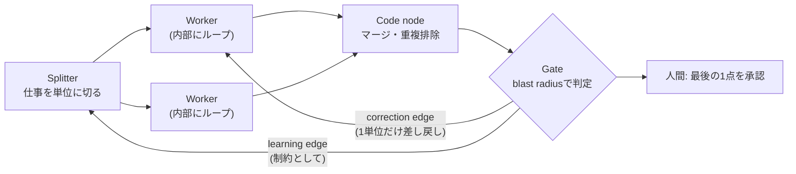

# ループとグラフで「最後の1手だけ承認する」設計（Loops and Graphs）

> **TL;DR**: ループはノードの中で1単位の仕事を正しくし、グラフはノードの間でどの単位が存在するかを決める。両方を作り、ゲートを影響範囲（blast radius）で開け、人間は取り返しのつかない1点だけを承認する。

エージェントの全ステップを人間が確認してしまうのは、人間以外に仕事を落とせるものが無いからだ、と @hanakoxbt は書き出す。そこから抜け出すには2つの層が要るが、ほとんどの人は片方しか作らないという。この記事は @hanakoxbt が自作の有料コース（agent-layers.vercel.app）への導線として公開したX記事で、以下は宣伝部分を除いた主張をまとめたもの。「そして」をエッジと取り違えるなというテスト（要約と天気の例）は [[concepts/graph-engineering]] で @0xCodez が示したものと同じなので、本ページはそこに無い論点を中心に扱う。

## ループは「失敗しうるチェック」のこと

@hanakoxbt はループを「作る→チェック→直す→緑になるまで繰り返す」の4部品に還元し、本体はチェックだと述べる。人間がいない間に仕事を不合格にできるものが無ければ、それはループではなくスケジューラにすぎない。多くの人は仕事を先に作り、最後に「別のモデルに出力を見せる」レビューを付け足すが、@hanakoxbt はこれを「楽観主義者2人の同意」と呼ぶ。条件はプログラムで評価できる形で先に書くべきで、とくに「エラーが出ていない」は正しさの証拠にならない。その上にループを組むと、予算が尽きるまで自信満々に同じ誤りを繰り返し、ログはずっと綺麗なままになるという（[[concepts/loop-anatomy]] の「no と言える検証」と同じ指摘）。

## ループの天井とグラフの役割

ループは1単位の仕事を良くすることしかできず、どの単位が存在するか・順序・待つ必要のない2ステップの存在には気づけない。@hanakoxbt は、各ステップは正しいのに全体が遅く形も間違っている状態を「ループを調整しても直らない、故障が単位の中に無いから」と説明し、人がモデルのせいにし始める瞬間こそ次の層が元を取り始める瞬間だとする。

関係は1文にまとまる、と @hanakoxbt は言う。**ループはノードの中に住み、グラフはノードの間に住む**。ループの無いグラフは未検証の仕事を並列に量産するので直列より悪く、グラフの無いループは誰も設計していないキューに並んだ非常に良い1ステップになる。

## 4種類のノード（1つはモデルではない）

@hanakoxbt の語彙は splitter・worker・code node・gate の4つだけ。

- **Splitter** — 仕事を単位に切って先頭に座る。切る軸を誤ると下流すべてが無駄になるので、どのノードより多くを決める。リポジトリをフォルダで切ると4体のワーカーが同じ3ファイルを監査し、影響範囲で切ると各ワーカーが他に見えないものを見る
- **Worker** — 1単位・1つのレンズ・自分専用のコンテキスト。コンテキストを共有させると最初の発見に他が引き寄せられ、「4倍払って1つの意見と3つのこだま」になる
- **Code node** — マージ・ランキング・重複排除・前後比較。答えが1つに決まる処理をモデルに通すとコスト・遅延・ばらつきを足すだけになる。@hanakoxbt の判定は「judge・decide・assess・summarize という語を使わずに変換を説明できるならコード」
- **Gate** — 後述の影響範囲で判定する

## 2本の戻り道と「バッチでなく単位を戻す」

戻り道の無いグラフはただのパイプラインで、来週も同じ死角から始まる。@hanakoxbt は機能するグラフには役割の違う2本の戻り道があるとする。

- **Correction edge（短い）** — ゲートが1単位をそれを作ったステップへ差し戻す。今回の実行を直す
- **Learning edge（長い）** — 受理された結果から導いた**制約**を splitter へ戻す。出力そのものは運ばず、ワーカーの指示でなく仕事の切り方を決めるブリーフに入る。以後すべての実行を直す

ほとんどの人は前者だけを作り、「速いが賢くならない」システムになると @hanakoxbt は述べる。

差し戻しで最も高くつく誤りは、バッチ全体を戻すことだという。4スライス中1つがテストに落ちたとき全部を戻すと、正しかった3つが書き直されて「良くなったのでなく違うだけ」になり、再検証で無関係な理由から落ちうる。1件の失敗が4件の不確かな結果に化け、2回やると収束しない。外からはモデルが失敗を繰り返しているように見えるが、実際は戻り道が正しい仕事を壊している、と @hanakoxbt は述べる。差し戻しには4つの情報を添えるとするが、その一覧は画像で未捕捉。本文で強調されているのは**スコープ行**で、これが無いとエージェントが隣の問題まで直し、1スライスの修正が誰もレビューしていない4ファイルの差分に膨らむ。試行は3回まで。3回直して通らないなら問題はその単位を生んだ計画の側にあり、ループからは計画が見えない。

## ゲートは確信度でなく影響範囲で開ける

確信度スコアに閾値を置く設計を @hanakoxbt は「変数が違う」と退ける。確信度は判断材料の中で最も弱く、その理由はモデルが影響を及ぼせる唯一の入力だからだという。強い変数は「間違っていたら何が起きるか」で、取り消しコストで仕事を3つのレーンに分ける。

- **可逆かつ局所** — 文言変更・テスト・カバレッジのある独立関数。悪いマージの代償はrevert1回なので最初に開けてよい
- **可逆だが広い** — 共有ユーティリティ・スキーマ追加など多数の呼び出し元に触れるもの。決定論的チェックと綺麗な軌跡（trajectory）でゲートする
- **取り消し困難** — マイグレーション・削除・本番データへの書き込み・送金。スコアにかかわらず開かない

3つ目は「非常に高い閾値」ではなく**開かないレーン**であり、閾値は調整されるが閉じたレーンは調整されないという違いが重要だと @hanakoxbt は強調する。開いたレーンの中でゲートが読む証拠の順序は、決定論的な結果→今回の実行の軌跡→このノードの仕事が過去にロールバックされた頻度→モデル自身の評価（最後）。

## どこから始めるか

@hanakoxbt の推奨順は、繰り返している仕事を1つ選び、splitter・レーン・マージ・ゲート1つ・戻り道1本を描く→**ゲートを最初に作る**→レーン→learning edge を最後に（受理する仕組みが無いと受理結果から制約を導けないため）。人間は結果の重大さが最も高く可逆性が最も低い1点に置き、マージの承認やどの修正を出荷するかの選択だけを担う。グラフの途中に置かれた人間は最も遅いノードになり、グラフは人が読む速度でしか走らなくなる、と @hanakoxbt は述べる。

締めくくりの3行は「答えだけでなく経路を測れ」「次に走るものを変えない判定はただのレポート」「恒久的な制約に変えなかった失敗には、また出会う」。

この「人間は最後の1点だけ」という配置は、[[concepts/ai-review-bottleneck]] が扱う「人間のレビューがボトルネックになる」問題に、流入を絞るのでなくレビュー地点そのものを1つに減らす側から答えたものと読める（wiki側の解釈）。

## 問い

- wiki-ingest の差し戻し（lint で落ちたページの再生成など）は、単位でなくバッチを戻していないか
- LESSONS.md への追記は learning edge に当たるが、ワーカーの指示（スキル本文）でなく「切り方」を決める側に届いているか
- 影響範囲の3レーンをこのリポの自動化（auto-sync の push、公開サイトのデプロイ、wiki ページ生成）に当てはめると、どれが「開かないレーン」になるか

## 関連

- [[concepts/graph-engineering]] — ノード/エッジ/契約の語彙と偽エッジテストの本体（@0xCodez 他）。本ページはそこに無い戻り道・ゲート・人間の配置を扱う
- [[concepts/loop-anatomy]] — ループの1ターンを5ムーブに分解した枠組み。「ループの床は評価器」という同じ結論
- [[concepts/dynamic-agent-org]] — loop がエージェント単体を、graph が組織構造をプログラム可能にするという同じ2層の整理（@Saboo_Shubham_）
- [[concepts/ai-review-bottleneck]] — 人間のレビューがボトルネックになる問題を個人運用の側から扱うページ
- [[concepts/x-ops-subagent-company]] — 統括1体が8チームを束ね人間は承認だけする、非エンジニア向けの同型の実践例（@giver_itora26）
