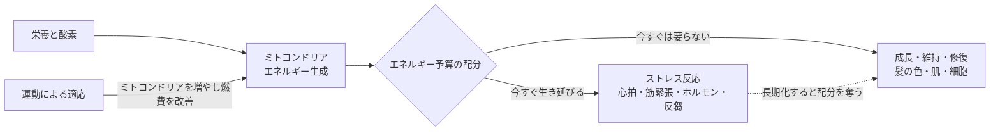

# ミトコンドリアとエネルギー配分から見た老化

> **TL;DR**: 老化を「時間とともに一方向へ進むもの」でなく「限られたエネルギーをどこへ配分しているか」の問題として捉え直す視点。コロンビア大学でミトコンドリアと老化を研究する Martin Picard 博士の仕事を、脳科学をもとに上達を研究しジムで指導もする @tanizakimiki が紹介した。

出発点は、1本の髪の中で「黒→白→黒」と色が変化している毛が実際に見つかったことにある。髪は伸び続けるので、1本を根元から毛先までたどれば木の年輪のようにその時期の身体の状態を読める、と @tanizakimiki は説明する。研究チームが色の変わった時期とその人の生活を照らし合わせると、強いストレスを受けていた時期と白くなった時期が重なり、ストレスが軽くなると再び色を取り戻していた例が見つかった。

## 白髪は一方通行ではなかった

ある女性の髪では、黒かった部分が途中で白くなり、その後また黒く戻っていた。色が戻る変化はかなり短い期間で起きていたという。

ただしこれは「ストレスを減らせば白髪が全部黒くなる」という話ではない、と @tanizakimiki は釘を刺す。博士らのモデルでは、髪が白くなるまでにある程度の閾値があり、まだ境界付近にいる毛には戻る余地がある一方、何年も前から白髪になっている毛まで簡単に元へ戻るわけではないと考えられている。

それでもこの研究が示すのは、少なくとも一部の老化現象は「一度老いたら戻らない」ほど単純ではない、という点になる。

## エネルギー予算という見方

ミトコンドリアは「細胞の発電所」と呼ばれ、食事から得た栄養と呼吸で取り込んだ酸素からエネルギーを作る。歩く・考える・心臓を動かす・傷ついた細胞を修復する、そのどれもがこのエネルギーで動いている。

Picard 博士はしかし、ミトコンドリアを単なる発電所としては見ていない。老化を考えるうえで重要なのは「どれだけエネルギーを持っているか」よりも「そのエネルギーをどこへ使っているか」だ、というのが博士の立場だと @tanizakimiki は紹介する。身体が使えるエネルギーには予算があり、会社の予算と同じで、突発的なトラブル対応に多く使った日は設備投資や社員教育に回る分が減る。

強いストレスを感じると心拍数が上がり、筋肉が緊張し、ストレスホルモンが分泌される。嫌な出来事を何度も思い返すことや、まだ起きていない未来を心配することにも身体は反応する。博士らは細胞を使った実験で、ストレスホルモンを与えると細胞のエネルギー消費が大きく増えることを確認している。ただしこれは培養細胞の実験であり、人間がストレスを感じたときに消費エネルギーがそのまま60%増えるという意味ではないと博士自身が明確に否定している、と @tanizakimiki は補足する。

重要なのは、ストレス反応にもエネルギーが要るということ。そのぶん何かの予算を削らなければならず、優先順位が下がりやすいのが「今すぐ生き延びるためには必要ない仕事」――髪の色を保つ、肌や細胞を修復するといった成長・維持・修復にあたる。ライオンに追いかけられている最中に身体が目尻のシワを修復しようとはしない、というのが @tanizakimiki の挙げる比喩で、これは生き残るうえでは正しい判断になる。問題は、現代ではライオンに追われていなくても、仕事・人間関係・お金・将来への不安・終わった失敗の反芻によって、似た反応が何週間も何か月も続いてしまうことにある。

## 運動は「増やす」でなく「燃費を良くする」

この見方に立つと、老化対策として考えるべきは「もっとエネルギーを入れること」ではなくなる。食べる量を増やせば若々しくなるわけではなく、重要なのは今あるエネルギーを効率よく使える身体にすることになる。

その代表が運動である。運動中は筋肉が普段より多くのエネルギーを要求し、最初はきつい。だが身体はその負荷を経験したあとに適応し、次に同じ負荷が来たときにもう少し余裕を持って対応できるよう変化する。その一つがミトコンドリアを増やすことで、博士は運動を続けることで筋肉のミトコンドリアが増え、心臓や血管を含めた身体全体のエネルギー利用が効率化していくと説明している。

運動そのものはエネルギーを使う行為なのに、続けている人ほど「疲れにくくなった」と感じる。これはエネルギーが無限に増えたのではなく、同じことをするのに必要なコストが下がった、つまり身体の燃費が良くなったと捉えるとわかりやすい、と @tanizakimiki は書く。以前は階段を上るだけでかなりのエネルギーが必要だったのが、適応後は同じ階段をより少ない負担で上れるようになり、そのぶん余裕が生まれる。博士はこの効率化によって、成長・維持・修復に使えるエネルギーを確保しやすくなるという見方をしている。

## 結論は地味になる

ここから出てくる対策は、適度に身体を動かしてきちんと回復する、食べ過ぎを避ける、そして自分が慢性的に何に反応し続けているのかに気づく、という地味なものになる。ミトコンドリアとエネルギーの視点を通すと、昔から言われてきた習慣がなぜ大切なのかが違って見えてくる、というのが @tanizakimiki の結びである。

同じ年齢でも元気な人と急に老け込んだように見える人がいて、その差のすべてをミトコンドリアで説明できるわけではない。それでも「あと何年若くいられるか」を考えるより、自分の限られたエネルギーを何に使わせているのかを考えるほうが、老化の捉え方としては有効だという主張になっている。

## 観察ログ（未検証）

- 2026-09-10 @tanizakimiki が紹介: 1本の髪の中で黒→白→黒の変化が確認され、色が戻る変化はかなり短い期間で起きたとされる症例（二次まとめ・原論文未参照）
- 2026-09-10 @tanizakimiki が紹介: 培養細胞にストレスホルモンを与えるとエネルギー消費が大きく増えたという実験結果（二次まとめ・原論文未参照。ヒトへの外挿は博士自身が否定）

## 問い

- 「自分が慢性的に何に反応し続けているか」を実際に棚卸しする手段は何か。[[concepts/mental-conditioning]] の反芻対策と同じ入口から入れるか
- エネルギー供給を足す [[concepts/creatine-cognitive-performance]] と、配分を変えるこの視点は、どちらを先に試すべきか。両者は同じ「予算」の別の側面を触っているのか
- 白髪の可逆性は閾値付近に限るとされるが、原論文ではその閾値をどう定義し、何で測っているのか

## 関連

- [[concepts/creatine-cognitive-performance]] — ATPの再生を補強してエネルギー供給側から介入するアプローチ。本ページは同じATPを「どこへ配るか」の側から見る
- [[concepts/mental-conditioning]] — 反芻を止める休息設計。本ページの言う「ストレス反応が修復の予算を奪う」状態への直接の対策にあたる
- [[concepts/performance-habits-40s]] — 悪習慣→ストレス→さらなる悪習慣のループを引き算で断つ自己管理論。ループが続くとなぜ老けるのかの機構を本ページが補う
- [[concepts/dopamine-detox]] — 短時間の強い刺激への反射的逃避を断つ実践。反応し続ける対象を減らすという点で配分の問題に接続する
