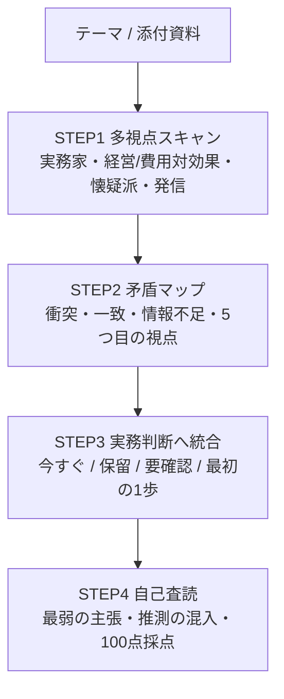

# 多視点スキャン→統合の実務判断プロンプト

> **TL;DR**: Stanford STORM由来の「いきなり答えさせず、4視点でスキャン→矛盾を地図化→実務判断へ統合→自己査読」を1本のプロンプトに畳んだ、後戻りの大きい意思決定向けテンプレート。

AIに「この施策どう思う？」と一発で聞くと、多くの人が言いそうな平均的整理に寄り、実務で本当に詰まる粒度——今すぐやるべきことは何か、無料で戻せる改善はどれか、運用で詰まるのはどこか——が出てこない。原因はモデル性能ではなく「問いが浅い」ことにある。だから先に必要なのは答えではなく視点で、実務家・経営者・懐疑派・提案者の目で見てから判断へ統合すると、出力の質が変わる。

## 仕組み（4ステップを1プロンプトに）

Stanford STORM は、いきなり文章を書かせず、テーマにどんな視点があるかを出し、視点ごとに問いを立て、集めた情報を骨子へ統合する研究システム（arXiv 2402.14207、stanford-oval/storm）。その「文章を書く前に問いの幅を広げる」発想を、記事作成だけでなく実務判断へ転用したのがこのプロンプトの骨格にあたる。元の手法は4回コピペして順に進める重さがあり、それを実務で毎回回せるよう1本へまとめている。

1. **多視点スキャン** — 同じテーマを4つの視点で順に分析させる。実務家視点（運用で詰まる点・確認漏れ）、経営/費用対効果視点（時間・コストに見合うか、今やる/後回し/費用対効果が悪いの仕分け）、懐疑派視点（弱点・過大評価・止めるべき判断）、発信/提案視点（記事や提案で相手に刺さる切り口）。
2. **矛盾マップ** — 4視点をもとに、どの判断がぶつかるか、どちらの根拠が強いか、全視点が一致する確からしい判断、情報不足で断定できない判断、そして見落としている5つ目の視点を整理させる。
3. **実務判断へ統合** — サマリー・重要発見トップ5・今すぐ使える判断・保留すべき判断・追加で確認すべき一次情報・最初の1ステップ・記事化の主軸を、1枚のブリーフィングにまとめさせる。
4. **自己査読** — 自分の分析を査読させ、最も弱い主張・要確認の数字や仕様・推測が混ざった箇所を挙げ、100点満点で減点理由つきに採点させる。この自己採点は出荷前の品質ゲートとして働く（[[concepts/eval-loop]] と同じ発想）。

前提として「事実と推測を分ける」「入力にない数値・URL・仕様・事例を作らない」「不明点は要確認と明記」をプロンプト冒頭で縛り、AIが整った見た目で一次情報にない数字を混ぜ込むのを抑える。

## 「答え」より「仕分け」が実務的価値

このテンプレの効きどころは、AIが正解を出すことではなく、判断を時間軸で仕分けられることにある。AIに相談すると施策が同じ重さで横並びになりがちだが、実務では「今日やること／今週確認すること／四半期で見ること／まだ断定しないこと」は別物で、無料で戻せる変更と審査や手数料が絡む変更も別物。後戻りが大きい意思決定ほど、この仕分けが効く。逆に翻訳・ファイル名変更・小さなCSS修正など要件が決まった軽作業には重すぎて向かない。

## 関連手法との違い

複数視点で盲点を炙り出す発想は共通しても、機構が異なる。[[concepts/llm-council]] は複数のAI（または複数サブエージェント）を**並列**にポーリングし匿名ピアレビューで競わせるKarpathy原型なのに対し、本テンプレは単一AIに1本のプロンプトで4ステップを**直列**に演じさせる。懐疑派視点は [[concepts/ai-red-teaming]] の敵対ペルソナによる弱点出しと、視点の分担は [[concepts/ai-persona-interview]] と重なる。プロンプト技術カタログとしては [[concepts/prompt-engineering-playbook]] のマルチエージェント系技法に位置づく。

## 観察ログ（未検証）

- 2026-06-25 (今野健介 / @workwithai): tatsukiさん（@nobel_824）が紹介していたStanford STORM型の考え方を、実務判断用に4ステップ1プロンプトへ畳んだと述べている。
- 2026-06-25 (今野健介): ある高単価ECの改善提案で試した事例として、事前に自作した提案資料とAIの論点整理は「大枠ほぼズレなかった」と報告。集客より購入直前の離脱を先に見る／無料で戻せる改善から始める／支払い手段拡充は主施策でなく補助策、といった整理が自作資料と近かったとする（単一事例・未検証）。
- 2026-06-25 (今野健介): よかったのは正解を出したことでなく「判断の仕分け」ができたことだと主張。AI相談の価値は一発で凄い答えを出すことでなく、判断の前に視点を増やし・反論を出し・今すぐ進めることと確認してから進めることを分けることにあるとまとめている。

## 問い

- 4視点（実務家・経営・懐疑派・発信）を直列で演じさせる本テンプレと、並列複数AIの [[concepts/llm-council]] で、盲点検出の質に実際どれだけ差が出るか
- 自分のwikiのQuery/Review判断やingest前のソース評価に、この多視点→自己査読プロンプトを組み込めるか
- 「5つ目の視点を出せ」「100点で自己採点せよ」という指示は、毎回意味のある追加を生むのか、それとも定型的な体裁返しに堕すのか

## 関連

- [[concepts/llm-council]] — 複数AIを並列ポーリングし匿名ピアレビューで盲点を出すKarpathy原型。本テンプレの単一プロンプト直列版に対する複数AI並列版
- [[concepts/ai-red-teaming]] — 敵対ペルソナに自社を攻撃させ弱点を潰す手法。本テンプレの「懐疑派視点」に対応
- [[concepts/ai-persona-interview]] — AIに複数ペルソナと心理状態を与え独立収束をシグナルにする手法。視点分担の土台
- [[concepts/prompt-engineering-playbook]] — プロンプト設計40技術のカタログ。本テンプレが属するマルチエージェント系技法の上位整理
- [[concepts/eval-loop]] — 生成→基準採点→閾値未満を止める品質ゲート。STEP4の自己査読と同じ発想
