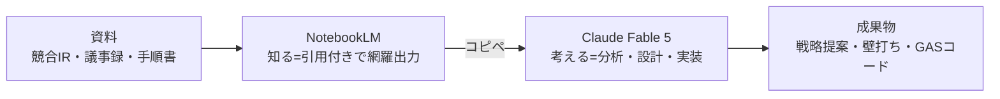

# NotebookLM×Claude 分業ワークフロー（知る／考える）

> **TL;DR**: NotebookLMで引用付きの事実を「知り」、[[models/claude-fable-5]] で深く「考える」——2つのAIを直接つながず「コピペ」だけで橋渡しし、幻覚しない事実基盤の上に最強の思考力を走らせる分業パターン（@ai_jitan）。

分業する理由は、2つのAIの強みと弱みが正反対に噛み合うからだと @ai_jitan は説く。NotebookLMは入れた資料からしか答えず全回答に引用元が付くため「事実を正確に知る」ことに強いが、資料の外にある発想や複雑な戦略立案は限定的。逆にClaude Fable 5は思考力・コーディング力で最強クラスだが、何も与えないとネットの一般論やもっともらしい推測で答えてしまう。多くの人がAIで成果を出せないのは、この「考えるAI」に事実収集まで丸投げしているからだ、というのが著者の診断（比喩では、一流シェフに食材の仕入れまでやらせている状態）。だから黄金ルールは「NotebookLMで正確に知り、それをClaudeに渡し、Claudeに深く考えさせる」の一言に集約される。

## ハンドオフの肝：要約させず「網羅出力」させる

この分業の成否を分けるのは、NotebookLMから事実を取り出すときの指示だと @ai_jitan は強調する。放っておくとNotebookLMは「要約」しようとするが、要約は読む分には最適でもClaudeに渡す材料としては情報が足りない。そこで「このあとClaudeで詳しく分析したいので、必要な事実・データを要約せず、網羅的に、徹底的に、限界の文字数を超えて出力してください。固有の数値・具体例・引用は省略せず残してください」と指示する。1回で出し切れなければ「数値だけ」「事例だけ」と要素を分けて複数回出力し、全部まとめて渡す。Fable 5は100万トークンを読めるので、渡す情報量がそのまま答えの鋭さになる、という主張。

これは工程分解型のモデル選択（[[concepts/llm-model-selection-strategy]]）が説く「上流の大モデルに濃いコンテキストを渡し切ることが成果を左右する」原則の、事実供給版と考えられる。NotebookLMが「入口（文脈整備）」を、Fable 5が「思考の本体」を担う構図になっている。

## 3つの実践パターン

@ai_jitan は黄金ルールの応用例を3つ挙げる。

- **リサーチを徹底分析に変える**: 競合各社のサイト・IR資料・ニュースをNotebookLMに入れ（信頼できる情報源を自動収集する Fast Research 機能も使える）、「要約せず事実ベースで網羅的に整理」させる。出力をそのままClaudeに貼り、各社の戦略の意図の推論・業界1年後の3シナリオ予測・まだ誰も狙っていない市場機会の特定・打ち手3案（根拠/手順/想定リスク付き）まで踏み込ませる。長く複雑な思考を破綻なく走り切るFable 5だからこそ4段階分析を最後までやり切れる、という位置づけ。
- **事実ベースの本気の壁打ち**: 自社の数字・過去の企画結果・参照フレームをNotebookLMに入れて現状を整理させ、その「正確な現状認識」をClaudeに渡して「賛成・反対の両面から、甘い肯定でなく厳しい指摘も含めて」相談する。判断の土台が自分の事実なので抽象論で終わらない。「1年後に失敗していたら原因は何か」と未来から逆算させるのも有効だとする。
- **面倒な作業をコードで自動化**: 業務手順・条件分岐・例外的ケースをNotebookLMで網羅的に要件化し、それをFable 5に渡してGAS（Google Apps Script）等のコードを書かせる。AIコード生成の失敗原因の多くは要件の曖昧さにあり、網羅要件を先に固めるのが成否の分かれ目だという。注意点として、Claudeに貼った時点で情報はNotebookLMという閉じた領域の外に出るため、顧客名や社外秘はサンプルに置き換えてから渡すよう促している。

## 観察ログ（未検証）

- 2026-06-10 (@ai_jitan): 以前は丸1日かかっていた競合分析が、この分業で1時間ほどで「戦略提案書の手前」まで進むようになったという体感（単一ソース・個人の実測）。

## 問い

- この「知る／考える」分業は、自分のwikiワークフロー（sources/で知る → Claudeで考える）と同型ではないか。ingest→Query の設計に明示的に落とし込めるか。
- コピペの手動ハンドオフをMCP/API連携で自動化すべき局面はどこか。手動の摩擦が「事実を確認するゲート」として機能している可能性もある。
- NotebookLMの「網羅出力」プロンプトは、[[concepts/llm-model-selection-strategy]] の上流コンテキスト設計とどこまで同じか。

## 関連

- [[models/claude-fable-5]] — 「考える」側のモデル。長く複雑なタスクほど差が開く特性が4段階分析を支える
- [[tools/notebooklm]] — 「知る」側のツール（カスタムプロンプト・隠し機能）
- [[tools/notebooklm-beginner-guide]] — 同じ @ai_jitan によるNotebookLM単体の運用（振り返り／攻略本ノート）
- [[tools/notebooklm-studio-prompts]] — 同 @ai_jitan のNotebookLM出力設計プロンプト集（網羅出力の型に接続）
- [[concepts/llm-model-selection-strategy]] — 上流に濃い文脈を渡し切る原則の事実供給版
- [[concepts/token-management]] — Fable 5に大量投入する運用のコスト面
