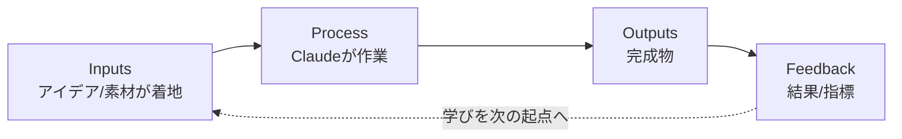

# Obsidian + Claude 第二の脳：構築手順

> **TL;DR**: Obsidian（保存層）と Claude（その上の脳）を一晩で繋ぐ初心者向けエンドツーエンド手順。差別化点は配線そのものでなく、意見の強い3つの設計判断——プロジェクト単位の入出力フォルダ・単一プロジェクトをvaultとして開く文脈スコープ・「言葉でなく鍵で制御する」安全規律。

> 📌 X bookmark: 10,382（2026-06-22 時点）

「Obsidianをノートアプリ、Claudeをチャットボットとして別々に使う」段階の一段上にある、構築そのものの手順書。要素技術（vaultをAIの永続メモリに据える設計思想）は [[concepts/obsidian-claude-second-brain]] と共通だが、このページの価値は**未経験者が install から autopilot まで迷わず辿れる順序**と、その途中で下す3つの設計判断にある。

**接続機構**: Obsidian 側に Local REST API プラグイン（コミュニティプラグイン・vaultへの入口を開く）を入れ、Claude Code から `mcp-obsidian`（uvx 経由のMCPサーバ）で繋ぐ。APIキーは Bearer の語を除いた本体文字列のみを渡す。Obsidian が起動している間だけ接続が生きる点が運用上の制約。

**オンボーディングは面接で行う**: CLAUDE.md を手書きせず、Claude に1問ずつ面接させて回答からプロファイルを合成させ、vaultルートの CLAUDE.md に書き出させる。以降は毎セッション自動ロードされ、自己紹介を繰り返さなくて済む。これは [[concepts/claude-projects-blueprint]] の「AIを社員化するオンボーディング」と同型の手法。

**プロジェクト単位の入出力フォルダ**: 仕事の領域ごとに専用フォルダを作り、中に Inputs / Process / Outputs / Feedback の4サブフォルダと、その領域専用の CLAUDE.md（単一ゴールとClaudeの役割を記述）を置く。アイデアは Inputs に着地し、Claude は Process で作業し、完成物は Outputs、結果と指標は Feedback へ——という決まった流れを作る。フォルダ階層で役割を固定する点は [[concepts/claude-code-work-folder]] の inbox/reference/draft/output/archive と同じ発想。

**単一プロジェクトをvaultとして開く（文脈スコープ）**: 巨大なvault全体でなく、作業対象のプロジェクトフォルダだけを「Open folder as a vault」で開く。するとClaudeはそのプロジェクトの CLAUDE.md しか読まず、無関係な文脈を無視する。プロンプトでなく**ディレクトリ境界で文脈を絞る**操作であり、「大きなvaultは計画する、単一プロジェクトは出荷する」と表現される。

**スキルとコネクタと自動運転**: 2回以上やる作業は markdown のスキルファイルに保存し、プロジェクトが名前で呼び出す。カレンダー・メール・Slack・Notion は OAuth で接続し、可能な限り read-only・スコープ限定で許可する。スキルが固まったら日次タスクとしてスケジュールし、vaultが夜間に自分を整理する状態にする。

**載っている安全規律「鍵であって、プロンプトではない（keys, not prompts）」**: エージェントに「これは消すな」と伝えるのは*提案*であって安全設定ではない。技術的に削除や送信ができるなら、いつかはやる前提で組む。制御は言葉でなく権限レベル（read-only・スコープ限定の鍵）で行う。これは [[concepts/loop-engineering]] のセキュリティ税・[[concepts/ai-agent-governance]] の外部ポリシー強制と同じ原則を、個人セットアップの言葉に落としたもの。

## 観察ログ（未検証）

- 2026-06-22 @undefinedKi: LLM Wiki パターンは Andrej Karpathy が2026年4月に広めたものと帰属（[[concepts/llm-wiki]] と整合）。セットアップは一晩、使うほど毎日鋭くなると主張
- 2026-06-22 @undefinedKi: スクラッチ配線を避ける既製リポ3本を紹介——claude-obsidian（AgriciDaniel製・executive/builder/creator/researcher のロール別プリセット同梱）、obsidian-second-brain（eugeniughelbur製・/obsidian-save等43コマンド・Claude/Codex/Gemini横断）、second-brain-starter（coleam00製・面接→計画生成→plain text+Pythonで構築）。GitHubスター数の記載はなく一次確認推奨
- 2026-06-22 @undefinedKi: 有料プラン（Pro $20/月）必須で無料枠では動かないと明記（単一ソースの運用前提）。impression 430万・like 2,287・bookmark 10,382

## 問い

- Inputs/Process/Outputs/Feedback のプロジェクト構造は、本wikiの sources/ → wiki/ 構造とどちらが運用に向くか。Feedback→Inputs の還流は Weekly Insights のループに相当するか
- 「単一プロジェクトをvaultとして開く」ディレクトリ文脈スコープは、Claude Code の subagent（独立コンテキスト）と比べて分離手段としてどちらが堅いか
- keys-not-prompts を本vaultの launchd ingest（書き込み権限を持つ）にどう適用するか。現状の権限スコープは「言葉でなく鍵」になっているか

## 関連

- [[concepts/obsidian-claude-second-brain]] — 同じObsidian+Claude領域の「30ワークフロー/プラグイン網羅カタログ」。本ページは構築手順、あちらは何をするかの一覧
- [[concepts/obsidian-personal-os]] — Obsidian+Claude Code+N8Nの3層アーキテクチャ重心の設計。本ページは初心者向け配線手順重心
- [[concepts/llm-wiki]] — Karpathy提唱のLLMが継続メンテする知識ベース（本記事が起点として明示引用）
- [[concepts/claude-code-work-folder]] — Inputs/Process/Outputs/Feedback に対応する作業フォルダ設計（プロンプトより先に棚を作る）
- [[concepts/claude-projects-blueprint]] — CLAUDE.md面接でAIを社員化するオンボーディング設計図
- [[concepts/claude-md-rules]] — vaultルートCLAUDE.mdの行動ルール設計（keys-not-prompts の暴走止めと同方向）
- [[tools/claude-mcp]] — Local REST API ⇄ Claude を繋ぐMCPの仕様
