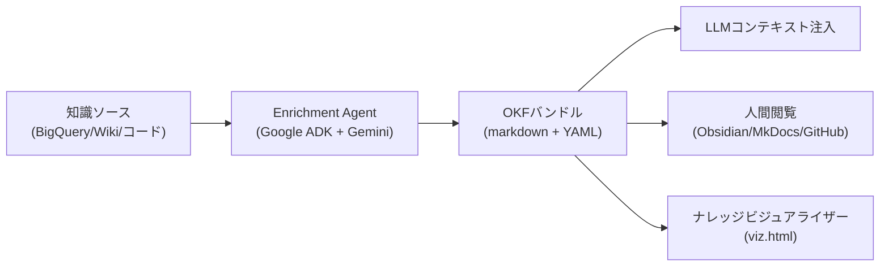

# Open Knowledge Format (OKF)

> **TL;DR**: Google CloudのSam McVeety/Amir Hormatiが提唱するMarkdown+YAMLベースの知識表現フォーマット。[[concepts/llm-wiki|Karpathyの「LLM wiki」パターン]]をベンダー中立の標準仕様に昇格させ、異なるチーム・エージェント・ツール間で知識を相互運用可能にする。

知識管理の本質的な問題は「サービスの乱立」ではなく「フォーマットの不在」にある。チームごとにWiki・カタログ・コードコメントに散らばった知識を、任意のAIエージェントが読めるよう組み立て直すコストが毎回ゼロから発生している。OKFはこの問題をサービスでなく仕様で解く——SDKなしに誰でも作れ、integration なしに誰でも読め、gitの中で生き続けられる知識の形式を定義する。v0.1 は 2026-06-15 に公開された。

## 仕様の核心

OKFバンドルはディレクトリ構造のmarkdownファイル群。1ファイル = 1「概念（concept）」で、ファイルパスがその概念のIDとなる。

**フロントマター**（クエリ・フィルタリング用の構造化フィールド）:
- `type` — 概念の種別（table, dataset, metric, runbook 等）
- `title` / `description` — 人間向けの要約
- `resource` — 外部リソースへのリンク
- `tags` / `timestamp`

**markdownボディ**（LLMと人間が実際に読む部分）: スキーマ、サンプルクエリ、プロセ説明、他概念へのクロスリンク

バンドルには自動生成された `index.md` が含まれ、エージェントや人間が階層を1レベルずつナビゲートできる。概念間のリンクはディレクトリ階層（木構造）を超えたグラフ構造を形成する。

設計上の4つの「ただの〜」: **ただのmarkdown**（任意エディタで読める）、**ただのファイル**（tarballで配布可能）、**ただのYAMLフロントマター**（クエリ可能な最小フィールドのみ）。

## [[concepts/llm-wiki|Karpathyパターン]]との関係

[[people/andrej-karpathy]]が提唱した[[concepts/llm-wiki]]パターン——「LLMは退屈しないし、相互参照の更新を忘れず、一度に15ファイルを処理できる」——と同じ発想を、複数チーム・複数エージェント間で共有できる仕様に昇格させたもの。Obsidianボルト、AGENTS.md/CLAUDE.mdファミリー、エージェントが参照するindex.md/log.mdなど、すでに多くの実装が「マークダウン+フロントマター+クロスリンク」に収束しているが、フィールド名の合意がなかった。OKFはその最小公分母を固定する。

## Enrichment Agent（リファレンス実装）

Google Cloud Platformがリリースした公式のOKFプロデューサー実証（Google ADK + Gemini + BigQuery）:

1. **BQパス**: BigQueryメタデータから1概念=1OKFドキュメントを自動生成
2. **Webパス**: LLMがクローラーとして動き、seed URLから権威ある補足ドキュメントを選択して概念を豊かにする。`--web-max-pages` でクロール数をキャップ

サンプルバンドルが3つ公開（GA4 eコマースデータセット・Stack Overflow・Bitcoin）。`visualize` サブコマンドでスタンドアローンの force-directed グラフHTML（`viz.html`）を生成できる。

## 既存標準との関係（競合でなくスタック）

OKFは既存の仕組みと競合せず「積み重なる（stack）」関係にある。OKFは「何を知っているか」をファイルで渡し、[[tools/claude-mcp]] は「今何ができるか」をAPIで呼ぶ。役割が違うため代替ではなく並べて使う。

| 標準 | 役割 | OKFとの関係 |
|---|---|---|
| **OKF** | キュレートされた静的な知識をファイルで表現するフォーマット | 本体 |
| **MCP** | LLMが外部ツールを動的に呼ぶプロトコル | OKF=静的知識、MCP=ライブなツールアクセスで補完 |
| **llms.txt** | サイトに置く知識リソースへの「道しるべ」 | 補完 |
| **AGENTS.md / CLAUDE.md** | リポジトリに置く慣習ファイル | OKFがこのアドホックな慣習を標準化（[[concepts/agents-md-canonical]]） |

## 観察ログ（未検証）

- 2026-06-15 (Sam McVeety & Amir Hormati, Google Cloud): OKF v0.1として発表。「答えは別の知識サービスでなくフォーマット」と明言。Obsidian/Notion/Hugo/Jekyllなど既存ツールはMarkdown+YAMLフロントマターをすでに話せるため、追加UI不要でバンドルを閲覧・編集可能と説明
- 2026-06-17 (せーの, classmethod / dev.classmethod.jp): 手書きの最小バンドル＋ビジュアライザで検証したハンズオン所見。リファレンス実装のビジュアライザ v0.1 は SPEC §5.1推奨の `/` 始まり絶対パスリンクを `viewer/generator.py` で明示的にスキップしており（`if "://" in target or target.startswith("/"): continue`）、絶対パスで書くとedgeが0になる。相対パス（`./customers.md` 等）に直すと正常にグラフ化された。SPEC推奨と実装のあいだにv0.1段階のギャップがある（単一ソースの実測）
- 2026-06-17 (せーの): 自身のObsidian Vault 812ファイルを検査したところ25.4%（206件）が意図せずOKF v0.1準拠（frontmatter＋非空type）だった。既存のtype値（memo 55・knowledge 25・meeting 19件など）がそのままOKFのtype値として機能。残り606件はtypeを足すだけで準拠可能、との単一ソースの測定

## 問い

- このObsidian vaultはOKF v0.1準拠か？フロントマターのフィールド名（type/resource/timestamp 等）が異なる点は互換性を壊すか
- OKFが普及した場合、[[concepts/llm-wiki]]のような独自規約を持つチームはどこを妥協して合わせるか
- Enrichment AgentのWebパスはクロールコストとしてどの程度のGeminiトークンを消費するか

## 関連

- [[concepts/llm-wiki]] — Karpathy提唱の元パターン。OKFはこれを標準仕様化したもの
- [[people/andrej-karpathy]] — LLM wikiパターンの提唱者として直接引用されている
- [[concepts/obsidian-personal-os]] — ObsidianボルトはOKFの主要なコンシューマー候補
- [[concepts/agent-memory-layer]] — エージェントが共有知識層にアクセスする設計思想と連動
- [[companies/google]] — OKFの発案・公開元
