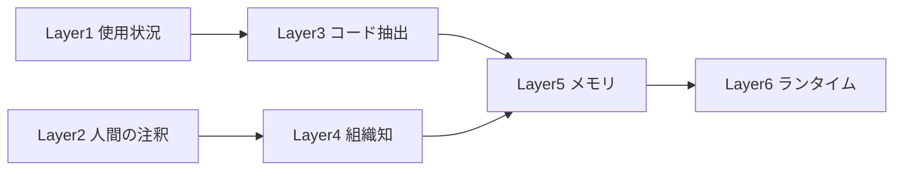

# OpenAI社内データエージェントの6層コンテキスト設計

> **TL;DR**: OpenAIが自社データ基盤向けエージェントで採用した、コンテキストを6層に分けて管理する設計。スキーマ＋RAGだけでは「どのテーブルを使うべきか」を選べず精度が止まるため、層を1つずつ積み上げて埋めていく。

データエージェントやText-to-SQLの開発は、たいてい「スキーマをプロンプトに入れる→精度不足でRAGを足す→それでも足りない」で止まる。原因はスキーマ情報だけでは構造の似たテーブル群から「選ぶ」ことができない点にある。たとえば `orders`・`order_events`・`order_snapshots` はカラム名だけ見ればどれも注文データだが、どれが集計の正解か（重複の有無・イベントソーシング用か日次集計用か）はスキーマに書かれておらず、誰かの頭の中かSlackの過去ログに埋もれている。OpenAIのアプローチは、コンテキストの「量」でなく「種類」を増やすことでこの壁を越える。

6層は2つの軸で整理できる。**静的→動的**: Layer1〜3は事前に計算・収集しておけるもの、Layer4〜6は質問のたびに変化する。**機械的→人間的**: Layer1・3は自動化で集まり、Layer2・4は人間の知識を要し、Layer5・6はその中間（人間の行動を機械が記録・活用する）。どの層が欠けても精度は落ち、スキーマ＋RAGのみの構成はこの6層のうち1〜2層しかカバーしていない状態に相当する。

## 6層の構成と自社での再現方法

| Layer | 内容 | 自社で再現するなら |
|---|---|---|
| 1. テーブル使用状況 | クエリ頻度・鮮度・行数・参照ダッシュボード数を毎日収集 | BigQuery `INFORMATION_SCHEMA.JOBS` / Snowflake `ACCOUNT_USAGE.QUERY_HISTORY` の集計をテーブル選択のランキングに使う（ベクトル化不要） |
| 2. 人間による注釈 | 全テーブルでなく「よく使われるテーブルの紛らわしいカラム」「似たテーブルの使い分け」に絞って記述 | dbtの `schema.yml` description、なければスプレッドシートでも効果がある |
| 3. コードエンリッチメント | dbtモデル・Airflow DAG・BI定義からテーブルの実際の使われ方を機械的に抽出 | ドキュメントは古びるが本番SQLは常に最新。テーブル名での全文検索だけでも十分役立つ |
| 4. 組織知 | Slack・Notion等に散在する暗黙知（「このダッシュボードが合わないのは `is_active` の定義がチーム間で違うから」等） | 分析チームのQ&Aを50件ほど手動で集めるだけでLayer1〜3単独より精度が変わる。6層中もっとも構築が難しく差別化に効く |
| 5. メモリ | 対話履歴から「この人は売上をARRで聞く」等のパターンを学習 | Layer1〜4が整うまでは後回しでよい |
| 6. ランタイムコンテキスト | クエリ実行時点のテーブル行数・更新日時・直近のスキーマ変更 | 同上、初期段階では複雑さが増すだけ |

## 3つの設計原則

1. **ツールは少なく、コンテキストは厚く**: ツール選択の判断ミスを避けるため、SQL実行ツールは1つに絞り、そこに渡す情報を6層分厚くする
2. **目標を示し、手順は委ねる**: 「まずテーブル一覧を、次にスキーマを」という手順型プロンプトは想定外で破綻しやすい。目標とコンテキストを与え、順序はLLMに委ねる
3. **意味はコードの中にある**: ドキュメントは書かれた瞬間から陳腐化するが、本番で動くdbtモデルやパイプライン定義は常に最新。先に既存コードから抽出し、ドキュメント執筆は後回しにする

## 検証済み事実

- 2026-01: OpenAIが自社データ基盤に関する記事（著者: Bonnie Xu、Aravind Suresh、Emma Tang）を公開。社員3,500人超、70,000データセット、600PB超の環境が対象
- OpenAIのエージェントはOpenAI Embeddings APIで関連コードの埋め込み変換を行い検索可能にしている
- 精度評価にはEvals APIを用い、生成SQLとゴールデンSQL（正解SQL）を比較。コンテキスト層を1つずつ外して精度変化を測るアブレーション的アプローチを採用
- エージェントはGPT-5.2を搭載し、Slack・WebUI・IDE・Codex CLI（MCP経由）・ChatGPTアプリ（MCP connector）で利用可能
- セキュリティはパススルー型：エージェントはユーザーが元から持つデータアクセス権限のみを継承する

## 教訓（全文公開ブログより）

- **ツールは少なく**: 冗長なツールが複数あるとエージェントが混乱する。SQLツールは1本に絞り、渡すコンテキストを6層分厚くする
- **目標を示し、手順は委ねる**: 手順型の詳細プロンプトは想定外で破綻する。高レベルのガイダンスとGPT-5の推論に実行パスの選択を委ねると精度が向上した
- **意味はコードの中にある**: スキーマやクエリ履歴ではテーブルの「意味」は伝わらない。Codexでコードベースをクロールし、データパイプラインのロジック（鮮度保証・業務ルール）を抽出することで精度が大幅に改善した

## 観察ログ（未検証）

- 2026-03-05: @yam_drによる読解・再構成。「自社で再現するなら」の具体的手順（BigQuery/Snowflakeのログ集計、dbtのschema.yml活用等）は著者独自の応用提案であり、OpenAI記事の内容そのものではない
- 2026-03-05: 自社で厳密な評価パイプラインが組めない場合、10〜20個のゴールデンペア（質問＋正解SQL）を手作業で用意し、LLMに「同じ結果を返すか」を判定させる簡易評価から始めるのが現実的、という著者の提案

## 問い

- このLLM Wikiのingest/lintフローも「スキーマ（frontmatter）＋RAG的検索（index.md走査）」止まりの設計になっていないか。Layer4（組織知）に相当する「どのページとどのページが本当に関連するか」の暗黙知は[[concepts/llm-wiki]]のどこに蓄積されているか
- [[concepts/agent-memory-layer]]の「単一メモリ層」とLayer5（メモリ）は同じ問題の異なる粒度の解か
- アブレーション的評価（層を1つ外して精度を測る）は、自分の小規模なRAG/エージェント構築でも10〜20件のゴールデンペアで再現可能か
- [[concepts/agentic-data-analytics]]のAnthropicアプローチ（コロケーション＋スキル）と本ページのOpenAIアプローチ（コード抽出エンリッチメント）は、どちらが保守コストが低いか？

## 関連

- [[concepts/agentic-data-analytics]] — Anthropicが同時期に公開した業務分析エージェント設計。4層スタック（データ基盤・情報源・スキル・バリデーション）とスキルによる21%→95%精度向上
- [[concepts/agent-memory-layer]] — 全エージェントに共有メモリ層を敷く設計思想。Layer5（メモリ）・Layer6（ランタイム）の企業版に相当
- [[concepts/palantir-ontology]] — データとAIの間に業務文脈を保持する中間層という同型の発想。Palantirは「名詞＋動詞」、本ページは「6層」で構造化
- [[concepts/claude-code-context-hierarchy]] — Claude Codeの4層コンテキスト階層（Enterprise/Global/Project shared/Project just me）。スコープ軸での層分けという点で類似
- [[companies/openai]] — 本記事の発信元
