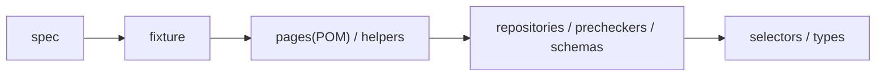

# 並列E2Eテスト設計

> **TL;DR**: E2Eテストの「遅い・壊れやすい」を解消する鍵はPlaywrightの並列設定そのものでなく、per-testデータ独立・層状アーキテクチャ・計測に基づくインフラチューニング・AIスキルによるflaky対策の機械的強制という4点セットだと株式会社BerryのQMSmart開発チームが実践レポートで示す。

実行時間30〜56分（timeout 150分設定）でPRでは回らず夜間バッチ止まりだった旧E2Eスイートに対し、同チームは既存スイートの改修ではなく並列実行前提の新アーキテクチャをゼロから設計した。ボトルネックはPlaywrightの設定ではなく「テスト同士がデータと状態を共有していること」で、構造さえ正しければ並列化は設定変更だけで済むという。

## per-testデータ独立とstorageState

すべてのテストは専用データをFactory経由でSupabaseに直接INSERTして作り、teardownで派生レコードからStorageファイルまで回収する。UI操作は検証対象の操作にのみ使い、前提データ投入はUIを通さない。ログイン省略のため、globalSetupで4ロール×各5アカウントのセッションをstorageStateとして事前生成し、各テストはCookie読み込みだけでロールを切り替える。5アカウントずつ用意するのは、並列workerが同一アカウントを取り合う干渉を避けるため。

## レイヤー構造とProject分割

spec から `page.locator(...)` を直接書くことを禁止し、待機戦略をPage Objectに閉じ込めることで「flaky対策が個々のspec作者の力量に依存しない」状態を作る（構造は冒頭の図）。Playwright projectは load（light/heavy）× release × feature の3軸で分割し、Edge Function呼び出し（PDF生成+S3、約60秒）を伴うheavyテストは`fullyParallel: false`で3並列、それ以外のlightは`fullyParallel: true`でworkers 5（CI）。並列度は「上げられるだけ上げる」のでなく計測に基づきproject単位で調整され、CPU競合起因のflakyが計測で判明した文書管理ドメインはlight=3/heavy=2に下げられている。

## インフラの隠れた限界

CIは`{load}-{release}-{feature}`単位で10ジョブに分割され、各ジョブが独立した8core Runner上で`supabase start`・Edge Functions・`vite build`（本番ビルド）・Playwright実行という「本物のフルスタック」を毎回構築する。並列度を上げるとPostgRESTのデフォルトDBプール（10）が枯渇して504が出たため、`PGRST_DB_POOL=30`を環境変数差し替えで注入している。

最も深い沼は数ミリ秒で返る謎の502だった。真因はHTTP keep-alive接続の「再利用レース」——KongのUpstream keepalive idle timeout（既定60秒）がPostgREST（Haskell Warp）のアイドルクローズ（約30秒）より長いため、サーバー側はもう閉じているのにKongはまだ生きていると誤認する30〜60秒の窓が恒常的に生じ、その窓で死んだソケットに書き込むと即時502になる。対処は`KONG_UPSTREAM_KEEPALIVE_IDLE_TIMEOUT=10`でKong側をWarpより短くし、それでも高負荷バースト時（125〜160 req/s）に残るvariantには`KONG_UPSTREAM_KEEPALIVE_MAX_REQUESTS=1`で接続再利用そのものを無効化した。非冪等リクエストのリトライで吸収する案は採らず、「再利用を無効化してレース面自体を消す方がCIの安定化としては構造的に安全」という判断による。

## 計測に基づくチューニング

チューニングを支える計装はいずれも`/proc`直読みのbashスクリプトで、追加パッケージなしにRunnerへ載せられる。CPU競合はPSI（`/proc/pressure/cpu`）を主指標にし、`full`（全runnableタスクが同時に待った＝枯渇度）をSEVERE判定の主指標、`some`（どれかが待った＝混雑度）をWARNの補助指標に使い分ける。CPU使用率100%は「よく働いている」と「足りない」を区別できないが、PSIはCPU待ちで止まっていた時間の割合を直接測れるため。Edge FunctionのS3・外部API待ちはプロセスがsocket待ちでsleepしておりCPU系指標に現れないため、`/proc/<pid>/fd`のソケットinodeと`/proc/<pid>/net/tcp`（コンテナ内プロセスは`/proc/<pid>/ns/net`でnetwork namespaceを特定し、namespace単位で読む必要がある）を突き合わせて外部向け接続の滞留を直接数える。

## Iron Law: flaky対策の明文化

flaky対策を個人のノウハウにせず、E2E作成スキルに「Iron Law」として明文化し機械的に強制している。`waitForTimeout`（固定sleep）は全面禁止でstate-based waitのみとし、CIは`--retries=0`で運用してリトライによるflaky隠蔽を許さない。不在判定（`not.toBeVisible()`）は要素が0個になった瞬間に即成立してしまうため、不在を主張する前に「描画されるなら同時に描画され終わっているはずの陽性要素」の出現を先に待つ。`innerText()`等の同期DOM read＋静的expectは全面禁止しauto-wait matcherに置き換える。ソート・フィルタのような「再取得後の表示が直前と一致しうる」操作は、操作前にレスポンス待ちを仕掛けてから実行する共通ヘルパで対応する。

## AIスキルによる機械的強制

これらのルールはドキュメントに書くだけでは守られないとして、Claude Codeのスキルとして運用に組み込まれている。`qms-e2e-author`は正典レファレンス4本の読了とIron Lawのセルフチェックリスト通過を強制する対話型テスト作成スキルで、`data-testid`やPage Objectの存在をgrepで実在確認してから使う・事前データ投入（S0）があればprecheckを必須実装する、といった制約をワークフローとして課す。`qms-e2e-impact-gate`はCIと同じ`impact-map.json`でコミット前にローカル実行し、`qms-investigate`はテスト失敗の根本原因を仮説→検証→絞り込みのサイクルで特定する。AIにテストを書かせる場合でも人間が書く場合でも同じ品質バーを機械的に通すことが、140テストまでスケールしても品質が均質な理由だとしている。

## 変更差分のみ実行するImpact Tests

全量6〜8分とはいえ全PRで10ジョブ×8coreを毎回回すのは重いため、テストコード自体の変更時のみ全量を実行し、アプリ実装（`src/**`・migration・Edge Functions等）の変更時は`impact-map.json`（変更ファイルパス→影響specのルール集）による差分実行に分けている。設計はfirst-match評価で具体的なルールを先に評価し、どのルールにも当たらないファイルやGitHub APIの変更ファイル一覧が3000件で切り詰められた場合は安全側に倒して全量実行にフォールバックする。判定ロジック自体のユニットテストも毎回実行し、判定ロジックの退行を防ぐ。

全量6〜8分（旧30〜56分）、影響範囲のみのImpact Testsは4〜7分となり、Vitest（components 約3分・repositories 約7〜8分）やESLint（約9分）と同じ所要時間感覚に収まった。「E2Eだけ結果を待たずにマージする」運用崩壊が起きなくなったという。副産物として、spec単位でURS（ユーザー要求仕様）の手順番号を刻む・動画とスクリーンショットと実ファイルを証跡としてHTMLレポートに添付する・PRごとに影響URSを自動トレースする、というQMS領域で求められるソフトウェアバリデーション記録としても機能している。

## 問い

- このリポジトリの `validate_wiki.py` のような決定論的チェックにも、「Iron Law」的に機械強制できるスキル化余地はないか
- PSIベースのCPU競合計測（`/proc/pressure/cpu`）は、GitHub Actionsを使う他プロジェクトのCIチューニングにどこまで一般化できるか
- Kongのkeep-alive再利用レースは「再利用する側のidle timeoutをサーバー側より短くする」という一般原理だが、自分が触るリバースプロキシ構成（nginx/Envoy等）で同種の窓は存在しないか

## 関連

- [[concepts/eval-loop]] — 生成物を基準に採点し閾値未満を止める品質ゲートの思想。本ページのIron Lawはテストにおける同型の品質ゲート
- [[concepts/skill-building-best-practices]] — Anthropic社内の9カテゴリで「Product verification」を最高ROIと位置づける主張と、本記事がスキルでテスト品質を機械強制する実践が対応する
- [[concepts/claude-md-rules]] — ルールを明文化し機械的に強制してミス率を下げる設計思想。CLAUDE.mdのルール強制とE2EスキルのIron Law強制は同じ発想の別実装
