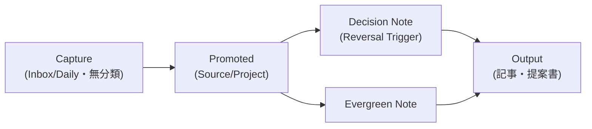

# Personal Intelligence OS（保存量でなく変換速度でVaultを測る）

> **TL;DR**: ノート数やGraphの見た目でなく「情報が意思決定・成果物へ変換される速度」を6指標で測り、入力時は分類せず昇格時にだけProperty型を足す3段階Schemaと、Decision Noteを第一級ページ種別として扱うVault設計（@ai_ai_ailover）。

多くのVault設計はフォルダ・タグ・プラグインという保存時の整理から入るが、記事はこれを「よくあるObsidian講座の大半が逆向き」と評し、「三カ月後、自分は何について悩んでいるときにこの情報を必要とするか」を先に決め、記録方法をそこから逆算する**検索起点（retrieval-first）設計**を出発点に据える。

## Two-Key Retrieval Ruleと3段階Property Schema

昇格した全ノートに、人間用の検索経路（タイトル・MOC・リンク・Alias）と機械用の検索経路（type・status・project等のProperty）の**両方**を持たせ、片方が壊れてももう片方で見つかるようにするのがTwo-Key Retrieval Ruleである。Property付与は入力時に20項目を埋めさせず、Capture段階（created/statusのみ）→Promoted段階（topics/source_notes/confidenceを追加）→Operational段階（owner/due/next_action等プロジェクト固有項目を追加）の3段階で最小構成から育てる。

## Knowledge ROIという評価軸

Vaultの性能はノート数・リンク数・Graphの見た目でなく、Capture Latency（保存までの時間・目標30秒）、Retrieval Time（検索到達時間）、Context Reconstruction Cost（過去ノートの文脈を復元するコスト）、Decision Traceability（判断の追跡可能率）、Output Conversion Rate（保存した知識が成果物へ再利用された割合）、Agent Executability（AIがVaultのルールを誤解せず検索・提案・検証できる割合）の6指標で測るべきだと述べ、`Knowledge ROI = (再利用された知識＋改善された意思決定＋回避できた失敗) ÷ 記録・整理・保守に使った時間` という式を提示する。ノートが増えても再利用されなければ分母だけが増えている、という評価の切り口である。

## Decision Noteを第一級オブジェクトにする

高収益な仕事ほど情報量より意思決定の質が重要になるとして、Decision NoteをVault内で最も価値の高いノート種別に位置づける。Decision/Context/Options Considered/Why This Option/Evidence/Assumptions/Reversal Trigger/Expected Signal/Follow-upという構成で、最重要フィールドは**Reversal Trigger**（何が起きたらこの判断を撤回・変更するか）とする。優秀な意思決定者は正しさを主張し続ける人ではなく、どの条件で自分の判断を変更するかを決定時点で書ける人だ、というのが記事の主張である。

## AIとの役割分担とSkill同期

AIにVaultの全ノートを自由編集させる運用を「監査されていないインターンへ会社の全資料を渡すのと同じ」と評し、人間＝目的・価値判断・最終承認・MOC編集、Obsidian＝原本・関係・履歴・ビュー、Claude＝意味の蒸留・比較・反証・文章化、Codex＝構造変更・スクリプト・検証・差分レビュー、Git＝復旧・監査、Validator＝Schema違反やリンク異常の検出という6者の役割分担を敷く。共有Skillは1箇所（記事の例では`90_System/AgentSkills/`）を正本にスクリプトで`.claude/skills`と`.agents/skills`へコピー同期し、破壊的Skillは自動起動を無効化するプラットフォーム側の設定（`disable-model-invocation: true`等）で明示実行だけに絞る。

## 観察ログ（未検証）

- 2026-07-24: 記事は「2026年7月時点でObsidianに公式CLIがあり、Obsidian 1.12.7以上のデスクトップ版が必要で、search/read/create/property:set/backlinks等をターミナルから操作できる」「サーバー上でVaultを同期する場合はNode.js 22以上が必要なオープンベータのObsidian Headlessを使う」と主張（単一ソース、要確認）
- 2026-07-24: 記事が紹介する2025年公開のブラジルの研究機関所属コンピューターサイエンス研究者7人のObsidian利用ケーススタディは、著者名・出典が本ポストに未記載で一次確認できていない

## 問い

- Two-Key Retrieval RuleとKnowledge ROIの6指標は、このvault（llm-wiki）にどう適用できるか。Output Conversion RateはWeekly Insightsや発信物への転換率として測れないか
- Decision NoteのReversal Trigger欄は、このvaultの設計変更・スキル運用ルール変更の記録にも導入する価値があるか
- 公式Obsidian CLIの実在・機能範囲は要確認（観察ログ参照）。導入すればこの環境の`obsidian:obsidian-cli`スキルとの関係はどう整理されるか

## 関連

- [[concepts/obsidian-personal-os]] — 同じ「崩壊しないVault」テーマだが3層アーキテクチャ＋8フォルダ＋N8N自動化が重心。本ページは検索経路設計とKPI測定が重心
- [[concepts/second-brain-operations]] — raw/entities/concepts/INDEXの4ピース構造・維持ループ・pay-per-readのコスト設計が重心の姉妹ページ。本ページのKnowledge ROI・6 KPIと接続可能
- [[concepts/obsidian-claude-second-brain]] — プラグイン/ワークフロー網羅型listicleの姉妹ページ
- [[concepts/agent-reflection-layer]] — エージェント自身の判断を確信度つきでdecisions-logに残す設計。本ページのDecision Note（人間の意思決定記録）と対になる
- [[tools/openclaw-agent-skills]] — 正本1箇所＋symlink/vendor配布という同型のSkill同期パターン（別ツール圏での収斂）
- [[tools/hermes-agent-personal-vault]] — 別ツール（Hermes Agent）でObsidian vaultを個人知識ベース化する姉妹実践
