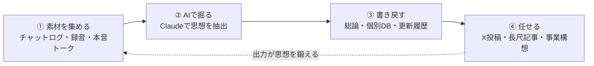

# 思想を外部記憶にする（書かせる→任せる）

> **TL;DR**: AIに任せて自分と区別がつかない出力を得る本体は、自分の思想を構造化して外部記憶（Notion等）に出すこと。フロントのAIは交換可能で、差を生むのは外部記憶の深さ。

同じ「〇〇について書いて」というプロンプトでも、判断軸がAIの中の平均にしかなければ出力は誰がやっても同じになる。これが「書かせる」＝丸投げで、署名を変えても気づかれない薄い文章になる。対して判断軸を自分の外側に構造化して置き、AIに毎回それを参照させると、出力は自分が書いたものと区別がつかなくなる。これが「任せる」＝権限委譲で、両者を分けるのは文体の模倣ではなく、判断軸＝思想を外に出してあるかどうかにある。

ここで重要なのは、文体と思想を分けて扱うことだ。語尾・口調・ペルソナ設定（いわゆる SOUL.md 的アプローチ）は文体の模倣にとどまり、出力の核に思想が乗らない。文体は服で、脱げて着替えられる。思想は骨格で、その人を内側から立たせている。服を真似てもその人にはならず、骨格まで写し取って初めてその人の出力になる。

この発想は AI 活用の定義そのものを置き換える。「AIに業務を投げること」ではなく「業務全体を設計して、そこにAIと人を配置すること」がAI活用だと捉え直す。解く・実行はAIに任せ、問う・選ぶ・意思を持つは人間が握る。この配置を設計するには判断軸が要り、判断軸を持たない人間は配置を設計できず結局は丸投げに戻る。だから「思想を持たせる」とは、AIに何かをインストールすることではなく、自分の思想を自分で言語化して参照可能な形で外に出すことが本体になる。AIはそれを毎回読みにいく装置にすぎない。

## 思想哲学DBの3層構造

思想を外部記憶にする具体的な装置として、ここでは Notion で管理する「思想哲学DB」という3層構造をとる。

- **総論ページ**: 思想の全体像を1枚に収める。4ブロックで構成する——①経歴・原体験（思想がどこから来たか。影響を受けた人物・作品も含む）、②特性データ（StrengthsFinder・MBTI・思考や行動の癖などの客観データ）、③核心思想の柱（大事にする価値観・世界観）、④実践論理（核心思想を現実の判断にどう翻訳するかのルール集。文章表現のレギュレーション＝避ける言い回し・好む語尾・句読点のリズム・漢字とひらがなの比率もここに書き込む）。
- **個別データベース**: 総論を支える具体データの集まり。「仕事観」「家族観」「テクノロジー観」などテーマごとに切り分ける。総論だけだと抽象度が高くタスクに落とせない場合、該当テーマの個別DBをセットで参照させる。
- **更新履歴ページ**: 総論を更新したら必ずペアで「いつ・何を・なぜ・きっかけ」を記録する。これがないと思想は「いつの間にか」変わり、変化を時系列で追えなくなる。

表現のレギュレーションまで書き込むのが、出力が表現レベルでも自分のものになる分岐点になる。経歴を書かなければAIは「平均的な経歴の人の文章」を、核心思想を書かなければ「最大公約数的な正論」を、実践論理を書かなければ「立派なことを言うが動けない人」の出力を返す——いずれも固有性が消え、誰が書いてもいい文章になる。

## 更新の順番——素材が先、AIは後

構造を作っただけでは外部記憶は死ぬ。運用で更新し続ける必要があり、その流れは2段階になる。まず素材を集め、次にAIで掘る。この順番が肝で、AIから入ろうとしても素材がなければ一般論しか返ってこない。

- **素材を集める**: 構えて書こうとすると思想は出ないため、構えていない場所に漏れているものをかき集める。プライベートのチャットログ、仕事のチャットでの判断を伝える発言、信頼する相手との本音トーク、移動中の独白録音などが密度の高い素材になる。
- **AIで掘る**: 溜めた素材をAIに渡し、「繰り返すこだわり・強い違和感・判断基準・一般論からズレた視点」を抽出させ、総論の4ブロックのどこに当たるかと一緒に返させる。自分では気づかない傾向を構造化して見せてくれる。
- **書き戻す**: 掘って出たものを総論・個別DBに追記し、更新履歴にペアで記録する。書き戻さなければ対話に埋もれて二度と参照されない。AIとの対話そのものも素材化できる。

使い方は重さの順に3段ある——X投稿の運用（思想の断片を出す。軽い）、長尺記事の執筆（思想を体系的に展開する。中程度）、事業構想（思想から未来を立ち上げる。最も深い）。いずれも最初に思想哲学DBを参照させるかどうかで、初稿が「ネットの一般論の塊」になるか「自分の判断軸で書かれた文章」になるかが分かれる。

## フロントのAIは交換可能

本質が外部記憶にあるなら、参照させるフロントのAIはChatGPTでもGeminiでもClaudeでも何でもよくなる。土台が同じなら乗り換えコストはほぼゼロで、新モデルの細かい差分やベンチマーク競争を追う必要も薄れる。差をつけるのは「どのAIを使うか」ではなく「どんな外部記憶を持っているか」になる。逆に外部記憶を持たない人間はフロントのAIに依存し、「このAIじゃないと書けない」状態になる。

さらに、思想を言語化して外に出す作業そのものが思想を鍛える。曖昧だったものが書くことで輪郭を持ち、矛盾に気づいて整理し、また書く。AIに任せられるのは副産物で、本体は自分が自分の思想をくっきり持てるようになることにある。

## 観察ログ（未検証）

- 2026-06-05: masaki_lipple が「AI時代に勝つのは、思想を外部記憶にした人間だけだ。フロントのAIが何であれ、外部記憶を持つ人間の出力は固有性を保つ。持たない人間の出力は最新モデルを使っても平均に飲まれていく」と主張（予測・断定）。
- 2026-06-05: masaki_lipple 自身が、思想哲学DBを参照させてAIに書かせた文章と自分の文章を並べて読み「区別がつかなかった」「これ俺が書いたっけと一瞬迷った」と述懐（単一ソースの体験談）。現代文の偏差値70超・文章歴20年と自称し、表現レギュレーションまで書き込んだ結果だとする。
- 2026-06-05: 総論は原稿用紙にして約20枚、個別DBは10〜20ページ規模、という著者固有の運用量。影響源としてエーリッヒ・フロム／アリストテレス／安宅和人／Mr.Children を挙げる。
- 2026-06-05: X投稿は5つのClaudeエージェント（種拾い→膨らませ→文体→文字数→最終チェック）に分業させ、全エージェントが同一の思想哲学DBを参照するため出力が「思想の断片」になる、という著者の運用。長尺記事はClaude Codeで初稿→3〜4回修正、事業構想は思想哲学DB全参照で「思想と整合するか」で詰める。
- 2026-06-05: リポスト者に「ClaudeとNotionに読み込ませると自分専用の思想哲学DBの設計を案内する」3層テンプレを配布、という告知（プレゼント目的の投稿。bookmark 3,824 / impression 約166万）。

## 問い

- 文体の模倣（[[concepts/llm-personality-injection]]）と思想の外部化は、出力品質にどれだけ差を生むか。表現レギュレーション（語尾・句読点・漢字比率）まで書けば本当に「自分の文章」に収束するのか、自分のwikiで検証できるか。
- この「思想哲学DB」は本vaultの [[concepts/llm-wiki]] と [[concepts/obsidian-personal-os]] とどう棲み分けるか。wiki は到達点（知識）の保存、思想哲学DBは判断軸の保存、という [[concepts/agent-memory-layer]] の「destination vs journey」と同じ軸で整理できるか。
- 「素材が先、AIは後」の更新ループは、本vaultの ingest／retro の流れに移植できるか。構えていない発話ログから判断軸を抽出する工程を仕組み化できるか。

## 関連

- [[concepts/agi-knowledge-moat]] — 競争優位が「知識の占有」から「知識生成ループ・触れる思想の源泉」へ移るという同じ問い。外部記憶の深さが差を生むという主張の上位フレーム
- [[concepts/agent-memory-layer]] — ユーザー所有の単一メモリ層を全エージェントの下に敷く設計。5つのClaudeエージェントが同一DBを参照する運用と同型
- [[concepts/claude-projects-blueprint]] — Identity/Rules/Knowledge Files で自分の声・基準・読者を学習させAIを社員化する6パート設計。思想哲学DBの実装版に近い
- [[concepts/llm-personality-injection]] — ペルソナ・性格をプロンプトに注入する手法。本ページが「文体（服）」として区別し、思想（骨格）と対比する対象
- [[concepts/obsidian-personal-os]] — 個人の知識・文脈を構造化して外部に置くパーソナルOSの設計（棲み分け対象）
