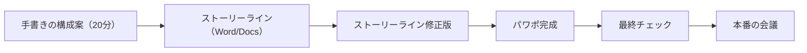

# 資料レビューを依頼するときの基本動作

> **TL;DR**: 「確認お願いします」の一言で資料を投げず、5回の赤入れを前提に納期から逆算し、相手の予定と閲覧環境を整え、何をどの観点で見てほしいかを言語化し、レビュー後は指摘のまとめ・今後のアクション・お礼を返す。

「これ、確認してください」という依頼が上司の側から困るのは、「確認する」という語がハイコンテクストで、何の観点で何がどうなっていることを見ればいいのかが決まらないからだ、と@ysk_motoyamaは書く。観点が指定されていなければ上司側がそれを考えるところから始めることになり、部下から思考の負荷を押し付けられている構図になる。著者はこれを上下関係の問題でなく、相手が年上でも年下でも失礼にあたる行為だと位置づける。

著者は管理職としてメンバーの資料を少なく見積もっても300件以上レビューし、そのうち依頼の作法ができている人は10人に1人くらいだと述べる。自身もかつてクライアントとの会議の前日に1回目の確認依頼を送り、上司にほぼゼロから資料を作り直された経験があると明かしている。

## 5回の赤入れを前提に納期から逆算する

上司との関係値がない段階では資料の一発OKはもらえないと考え、最初に接する上司なら最低5回は赤入れをもらう必要があると見積もる、というのが著者の基本姿勢である。5回の内訳は、目次や構成を書き出した段階、ストーリーラインをテキストで書き終えた段階、その修正版、パワーポイントで書き終えた段階、そして最終チェックになる。

このうち著者が強調するのは2回目である。いきなりパワーポイントを開かず、ワードや Google Docs で箇条書きしてストーリーを組み立てる。テキストになっていないものはどう頑張ってもパワポには落ちない、と著者は書き、ここで大量の赤入れを食らう前提を置く。4回目のパワポ段階では、載せるデータや図解の見せ方を指摘してもらい、誤字脱字は自分でチェックして上司にはさせない。

社内の30分程度の会議であればここまでの工数はかからないが、経営層の承認やクライアントとの合意が絡む場面ではこれくらいを見積もる、と条件を付けている。この逆算をすれば、本番前日に1回目の確認依頼を送るという発想にはならない、というのが著者の結論である。

## 依頼の前に相手の予定と閲覧環境を整える

著者が挙げる2つ目は、依頼前に30秒でいいから相手のカレンダーを見ることである。午前に重要会議があるなら確認をもらえるのは午後以降だと読む、金曜に有給があるなら木曜夕方の依頼をやめて火曜に出せるよう前倒しで作る、出張で移動が長いならパワポに加えてPDF版も送る、といった読み替えができる。著者はこれを相手のためでなく自分のためだと言い切り、人はどこまでいっても主観の生き物で、同じ成績が横並びなら主観的に気に入っているほうを優遇する、と理由を述べる。

3つ目は、レビューしやすい環境を整えること。難易度が最も低いぶん絶対に外せない点として、著者は資料の共有権限を付けることを挙げる。権限が付いていないやりとりが誇張なしで10回に1回くらい起きると書き、納期が迫った終業間際に権限なしの資料が届くのが最も腹立たしいと述べている。あわせて閲覧環境への配慮——移動中でも見られるようPDFやGoogleスライドの形で送ること——を挙げる。

## 確認観点を3パターンで言語化する

何を見てほしいかの言語化を、著者は3つのパターンに整理する。1つ目は資料全体の論理の整合性で、メッセージやストーリーラインに飛躍や矛盾がないか、単に情報を羅列していないかを見てもらう。2つ目は数値・データ・引用元の正確性で、桁や単位のミス、情報の鮮度は自分で厳重にチェックしたうえで、気になる点がないかを見てもらう。3つ目は読みやすさ・見やすさで、1ページあたりの情報量、グラフの見せ方、図解の伝わりやすさ、同じ意味の語の表記ブレなどが入る。

この3分類は、資料を渡す相手を上司からAIエージェントに置き換えても、そのまま依頼文の観点指定として使える形をしていると考えられる。

## レビュー後は指摘のまとめ・今後のアクション・お礼

レビューをもらった後の動きも見られている、と著者は書く。上司が気にしているのは、指摘したことを理解して資料に反映してくれるかどうかである。

1つ目は、指摘された内容を整理して理解を示すこと。「ご指摘いただいた点はXXXと△△△と○○○だと理解していますが、相違ないでしょうか」と確認すれば、ずれていればその場で訂正してもらえ、手戻りを防げる。2つ目は今後のアクションを伝えること。修正内容は会議後に自席へ戻って30秒で手が動かせるレベルまで具体化し、いつまでに何をするかは100人が読んで1通りの解釈しか生まないくらい具体的にする。3つ目はお礼と成果報告で、指摘の結果どんな成果が出たかを伝える。

3つ目の根拠として、著者はコロンビア大学の心理学者による『人に頼む技術』から、助けを求める人が留めておくべき「人を動かす力」の3番目が「有効性」であり、人は自分が誰かを助けたことが変化を起こしたという手応えを得たいのだ、という趣旨を引いている。

## 問い

- 3つの確認観点（論理の整合性／数値と出典の正確性／読みやすさ）は、レビュー依頼のテンプレートとしてAIへの依頼文にも使えるか。[[concepts/google-code-review]]のChange Author's Guideと突き合わせると、どちらの粒度が実務で回るか
- 「5回の赤入れ」は人間の上司を前提にした工数見積もりだが、AIに中間レビューさせる回数を挟むと、人間に出す回数はどこまで減らせるか。減らしていいのはどの回か
- 自分が依頼する側でなくレビューする側に回ったとき、観点の指定がない依頼をどう扱うか。観点を相手に書かせるか、自分で決めて返すか

## 関連

- [[concepts/self-evaluation-gap]] — 同著者(@ysk_motoyama)。自己評価と他者評価の乖離を扱う記事で、「一発でOKがもらえると思うのは自己評価が高すぎる」という本ページの前提と裏表になっている
- [[concepts/google-code-review]] — レビューを依頼する側（Change Author's Guide）と見る側の指針をコードで定式化したもの。観点を先に示す・レビュアーの時間を尊重するという骨格が共通
- [[concepts/coachability]] — 指摘を受け取れる能力の側。本ページのレビュー後3点セットは、コーチャビリティを相手から見える形にする実装にあたる
- [[concepts/team-leader-transition]] — フィードバックを与える側の型。本ページはそれを受け取る側から書いた対になる
- [[concepts/linguistic-hedging]] — 同著者(@ysk_motoyama)。「〜な感じ」で定義責任を相手に丸投げする話で、「確認してください」が観点を丸投げする構図と同型
