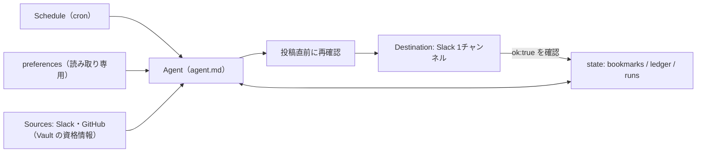

# スケジュール実行エージェント自動化の設計（Daily brief）

> **TL;DR**: Slack や GitHub を定時に読んで要点だけ投稿するエージェントを Claude Managed Agents で組むときの、Anthropic 公式の参照実装と6つの設計ルール（ブックマーク読み・読取失敗の明示・投稿直前の再確認・確認後に記録・設定は毎回読み直し・読み取り専用と予算上限）。

背景のジョブを無人で回すと、資格情報が切れて情報源を読めなくなっても誰も気づかず、好みの指定も守られなくなる。Anthropic の公式ブログ（claude.dev）はこの問題を挙げ、社内で使っている「定時に情報を集めて知るべきことだけ知らせる」自動化を [[tools/claude-managed-agents]] で作り直した参照実装 daily-brief を公開した（コードは anthropics/claude-quickstarts の managed-agents/daily-brief）。@ClaudeDevs（Anthropic 公式の開発者向けアカウント）はこの記事を「資格情報とメモリを持って Slack/GitHub を定時に読み、更新を投稿するエージェント」の作り方として紹介し、Claude Code のコマンド1つで設定でき、Max/Team プランに含まれる新しい API クレジットで動かせると告げている（クレジットの内訳は [[business/claude-plan-api-credits]]）。

## 構成要素と設定ファイル

記事は自動化を6部品に分ける: Sources（読む場所の名前つき一覧）・Destination（書き込んでよい唯一の場所）・Agent（モデル・ツール・手順）・Schedule（cron）・Memory（読み手の好みとエージェント自身の記憶）・Guardrails（読むだけの場所は読み取り専用、1回あたりの支出上限）。

参照実装のファイル構成（記事からの転記）:

| ファイル | 中身 |
|---|---|
| `agent.md` | モデル・ツール・指示 |
| `deployment.md` | スケジュール・タイムゾーン・予算・最初のメッセージ |
| `environment.yaml` | ネットワークの許可リスト |
| `memory_store_preferences.yaml` | 利用者の好み |
| `memory_store_state.yaml` | エージェントのブックマーク・台帳・メモ・実行記録 |
| `vault.yaml` | 資格情報を入れる Vault |
| `claude-lock.json` | `ant apply` が書くリソース ID |
| `slack/manifest.yaml` | Slack ボットアプリ1つ |

[[tools/ant-cli]] の `ant apply` コマンドがこれらを読んで Claude API のワークスペースにリソースを作り、ID を `claude-lock.json` に記録する。以後は Anthropic のインフラ上で定時実行されるので、手元のマシンを起動しておく必要はない。Managed Agents では agent.md はモデル・システムプロンプト・ツールの版つき設定にすぎず、実際に動かすのは deployment（Scheduled Deployments）で、スケジュール・Vault・メモリストア・予算を持ち、発火のたびに新しいセッションを起動する。スケジュールを待たずに試すには `ant beta:deployments run --deployment-id <id>` で手動起動する。

## Sources: 専用の資格情報とブックマーク

資格情報は Vault に置き、本物の値はコードが走るサンドボックスの外に留まる。記事によると経路は2通りある。GitHub は MCP サーバー経由で、サンドボックス外のプロキシが URL の一致する Vault 資格情報を探して付ける。Slack はサンドボックス内から bash ツールで curl を叩き、サンドボックスには `$SLACK_BOT_TOKEN` という不透明なプレースホルダーだけがあり、許可したホストへのリクエストが外に出る時点でプラットフォームが本物のトークンに差し替える。

記事は「直近24時間」のような固定窓で読ませるのをよくある誤りとする。実行が遅れれば取りこぼし、早まれば重複するからだ。代わりに情報源ごとのブックマーク（最後に読んだ最新項目のタイムスタンプ）を `bookmarks.json` に書かせ、次回はそこから読ませる。保存先はメモリストア `state` で、各実行のサンドボックスの `/mnt/memory/` にマウントされ実行をまたいで残る。

**読み取り失敗を「静かな日」と取り違えない**: MCP サーバーが落ちていたりトークンが切れていても実行は始まり、そのサーバーのツールが無いだけなので、エージェントは「新着なし」と報告してしまう。記事の対策は agent.md の3規則で、失敗した情報源のブックマークは動かさない・他の情報源でブリーフを書く・末尾に読めなかった情報源を1行で明記する（「pull requests unavailable this run」）。

## Destination: 投稿の確認と記録の順序

投稿先は Slack の1チャンネルで、読みに使うのと同じボットトークンで bash から `chat.postMessage` を叩く。bash ツールは既定で承認なしに動き、`slack.com` は environment の許可リストに入っているので、投稿に承認者は要らない。

記事が挙げる失敗は2方向ある。届いていない投稿を記録するとブックマークが進んで項目が永久に報告されず、届いたか不確かで再投稿すると読み手に同じブリーフが2回届く。agent.md の3規則で防ぐ:

1. チャンネルの直近メッセージに今日のタイトルがあれば投稿しない
2. Slack が `"ok": true` とメッセージ ts を返したときだけ送信済みとみなす
3. 台帳とブックマークはその確認の後でだけ更新する。結果が不明なら実行を「maybe posted」とし、他は何も変えない

実行記録 `runs/<date>.md` には投稿前に「posting」、確認後に「posted」とメッセージ ID、または「maybe posted」を書く。外部への書き込みを冪等にし状態の確定を最後に回すこの順序は、[[concepts/graph-reliability-design]] の「ノード単位の失敗方針（冪等な書き込み）」を1エージェントの実行単位に当てはめたものと読める（wiki 側の関連づけ）。

## Agent: 短く保ち、投稿直前に確かめる

参照実装のモデルは `claude-sonnet-5-5` で、web_search と web_fetch は無効化している。MCP ツールは既定で承認を求めるが無人実行では承認する人がいないので、GitHub ツールセットを `always_allow` にし、代わりに GitHub トークンを読み取り専用にしている。

agent.md の判断規則（記事からの抜粋）は、項目を載せる条件を「読み手が今日それに対して動く、または直前の判断を変える」に絞り、迷ったら載せない。件数（「12 open reviews」）は項目ではなく、詰まっているものにリンクする。台帳にあってまだ開いている項目は「still waiting, day 3」の1行で持ち越し、閉じたものは黙って落とす。投稿直前には報告する全項目の現況を情報源で再確認し、解決済みなら落とし、変化していれば直し、確認できなければ落として実行記録の cuts に残す。記事は「古い『まだあなた待ち』1件は、欠けた10件より信頼を損なう」として、状態をぼかさず断定するか落とすかを求める。リンクは手で組み立てず、PR の html_url や Slack の permalink を情報源からコピーさせる。

タイムゾーンも罠に挙がっている。サーバーのタイムゾーンで日付を計算して今朝を「昨日」と呼ぶ誤りを防ぐため、deployment.md の `timezone` で発火時刻を決め、本文2行目でエージェントに日付計算用のゾーンを伝える。

## Memory: 好みは読み取り専用、状態は台帳で

各実行は記憶のない新しいサンドボックスで始まるので、記憶が無ければフィードバックが定着しない。一方で記事は、古い記憶が解決済みの項目を「まだ待ち」と報告させたり、開いている項目を「報告済み」として落とさせたりすると指摘する。そこでメモリストアを2つに分ける。

- **preferences**（利用者のもの・エージェントは読み取り専用）: 読むチャンネルとリポジトリ、除外するもの、長さの上限、投稿先、止める条件
- **state**（エージェントのもの・読み書き）: ブックマーク、報告済み項目の台帳 `ledger.md`、実行ごとの記録、好みへの変更提案、情報源の癖のメモ（「最新50件しか返さない」）

好みのコピーをプロンプトに焼き込むと、変更済みの規則を適用し続ける。記事は毎回ファイルを読み直させ、読めなければ既定値で走らず停止して報告させる。台帳の各行は報告日・出どころ・変わらない ID（Slack のメッセージ ts や PR 番号）・最後に把握した状態を持つ。

## Guardrails: 読み取り専用と予算上限

エージェントは他人が書いたメッセージや issue を読み、その文章が指示として解釈されうる。記事は「従ってしまった場合にできること」を絞る方針を取る。GitHub トークンと preferences は読み取り専用、environment は許可リストのホストにしか出られない。仕込まれた指示はブリーフの中身（実行間で持ち越すメモ経由を含む）を変えうるが、GitHub への書き込みや規則の編集はできない。例外は Slack で、同じトークンで投稿もするため、ボットは読む・書く必要のあるチャンネルにだけ招待する。

支出上限は deployment.md の `budget`（`max_list_cost` をセント単位の文字列で指定、"500" は $5.00）で、各実行に満額が与えられる。記事は通常の実行コストの3〜5倍から始め、実測を見て締めるよう勧める。上限に達した実行は失敗せず `budget_reached` で一時停止するので、低すぎる上限は「ブリーフが静かになった」ように見える。ここでも「黙った」と「何もなかった」の区別が要点になっている。

## 始め方

`claude update` の後、Claude Code で `/claude-api managed-agents-onboard https://claude.dev/blog/building-effective-agent-automations/` を実行すると、claude-api スキルが記事を読んで構成を提案し、プロジェクトの agents/ フォルダにファイルを書き、`ant apply` でリソースを作る。記事はこれを出発点とし、情報源・投稿先・好みに合わせて改変するよう述べている。前提として Slack アプリ（manifest から作成）と GitHub トークンが要る。

[[concepts/ai-pre-judgment-automation]] は検知を普通のプログラムに任せ、モデルは提案までに留めて人間の承認後に実行する。本ページの設計は投稿まで無人で行う代わりに、書き込み先を1つに絞り、それ以外を読み取り専用にして安全側に倒している。外部への書き込み範囲が、承認を挟むかどうかの判断軸になっていると考えられる（wiki 側の推論）。

## 問い

- このwikiの launchd 定時ジョブ（auto-sync・weekly 生成）に「読取失敗を静かな日と区別する」「状態の確定は確認後」の2規則を当てはめると、どこが今は黙って失敗しうるか？
- 実行間で持ち越す state のメモ経由でのプロンプトインジェクションは、読み取り専用化では防げない。メモの汚染を検出する手段はあるか？
- 予算上限による一時停止を、読み手側でどう「静かな日」と見分けるか（記事の図にある heartbeat の具体像は本文に書かれていない）

## 関連

- [[tools/claude-managed-agents]] — 本設計の実行基盤（Vault・メモリストア・Scheduled Deployments・budget）
- [[concepts/graph-reliability-design]] — 冪等な書き込みとノード単位の失敗方針。投稿確認後にだけ状態を確定する順序の一般形
- [[concepts/ai-pre-judgment-automation]] — 同じく Slack/GitHub を定時検知する自動化だが、実行前に人間の承認を挟む対照例
- [[tools/ant-cli]] — `ant apply` でファイル群から API リソースを作る CLI
- [[business/claude-plan-api-credits]] — Max/Team の月次 API クレジットで本自動化を動かせる
