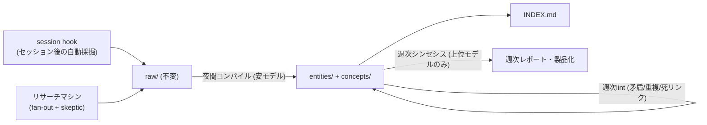

# 第二の脳の運用設計（コンパイルループ・リサーチマシン・読みのコスト）

> **TL;DR**: 出力の質はモデルティアでなく知識ベースが運ぶ——raw/entities/concepts/INDEXの4ピース構造を、モデルティアを振り分けたスケジュールループ（夜間コンパイル・週次lint・週次シンセシス）で維持し、skeptic付きリサーチマシンで養分を入れ、pay-per-readで読むコストを抑える第二の脳のフル運用設計（@EXM7777）。

最賢モデルが平凡な仕事を量産するのは能力の問題ではなく、ビジネス・読者・過去の決定を何も知らないまま推測するからだ、と @EXM7777 は診断する。同じモデルを自分の知識ベースに接続すると出力は別物になり、しかもファイルが増えるほど以後の全実行が賢くなる複利が効く。思想の土台は [[people/andrej-karpathy]] の [[concepts/llm-wiki]]（知識ベースをコードベースのように扱う——Obsidianがエディタ、モデルがプログラマー、wikiがコード）で、この記事の独自価値は、その思想を構造→backfill→維持ループ→リサーチ→コスト設計の順に「止まらず運用し続ける」システムへ落とし切った点にある。

## 4ピース構造と書き込みルール

構造は4つだけ——**raw/**（キャプチャした素材を無加工で置く読み取り専用の履歴）、**entities/**（クライアント・競合・ツール・人など具体物1つに1ページ）、**concepts/**（戦略・パターン・教訓などアイデア1つに1ページ）、**INDEX.md**（全ページを1行説明つきで列挙する玄関）。エージェントの仕事は「コンパイル」で、raw/ の新素材を読み、entityとconceptのページを更新しながらリンクを張っていく。

書き込みルールは4行に収まる、と @EXM7777 は言う——①1レッスン1ファイル＋冒頭に1行要約 ②複製を作らず既存ページを更新 ③誤りと判明したノートは削除 ④rawとコンパイル済みは常に分離。raw/ を不変に保つ理由は、同じエージェントが同じノートを読み書きし続けると詳細が滲み誤りが複利するためで、raw/ がground truthとしてwikiの下に残る。

ページ間の `[[リンク]]` はグラフのエッジであり、ここが価値の源泉になる。検索ベースの知識庫は成長するほど検索ノイズが増えて弱るが、リンクされたwikiは新ページが網に接続して周辺ページを強くするため成長するほど強くなる。回答時にエージェントは全走査でなくリンクを歩く（クライアントページ→キャンペーン概念→競合ページ）。

## backfillと監査ルール

初期投入は [[tools/claude-code-goal]]（/goal）による一括バックフィル。手持ち資産（過去のチャット履歴・ブックマーク・ノートアプリのエクスポート・クライアントフォルダ）を raw/ に入れてから走らせ、コンパイル済みの脳を受け取る。judgeとなる小型モデルは会話内しか読めないため、ゴールには読める証拠の提示を要求する。バックフィルを正直に保つ監査ルールは2つ——変更は必ずdiff（実際の前後の行）として出させ主張で済ませない／raw/ へのソースリンクを持たないページは信用せずフラグを立てる。

## 維持ループ（モデルティアの振り分け）

覚えていたら餌をやる脳は3週間で死ぬ、として維持は記憶でなくスケジュールで回す。

- **session hook**: セッション終了時に自動発火するスクリプトが、直前の作業から決定・捕捉したミス・確認済みパターンを日付つきノートとしてvaultへ採掘する
- **夜間コンパイル**: 安いモデルが当日の raw/ 新素材を読みwikiページを更新する（ルーチン作業はルーチンのティアで）
- **週次lint**: 矛盾・重複ページ・死リンクを狩る。放置されたwikiは腐るためこのループがグラフを清潔に保つ
- **週次シンセシス**: 上位モデルが唯一席を得るパス。vault全体を横断して「今週何が変わったか・何がドリフトしているか・何が注目に値するか」を書く

ルーチン作業をフラッグシップモデルに回すのは金を無駄に燃やす行為だ、というのが @EXM7777 のティア配分論で、[[concepts/llm-model-selection-strategy]] の工程分解型モデル選択と同型の判断になっている。

## リサーチマシン（fan-out + skeptic）

vaultを保管庫から優位性に変える入力側の設計。1つの質問を3〜5のサブ質問に割り、並列エージェントが別々のサーフェス（socials=実践者レイヤー、web=ドキュメント・価格、スクレイパー=本文全文）を探索する。全発見は「主張・ソースリンク・日付」のレシートになり、その後に**リサーチをしていない別エージェント（skeptic）が全主張を殺しにかかる**——単一ソースのhypeにはラベル、矛盾は表面化、生き残った発見だけが期限（expiry date）つきページとしてvaultに着地する。fresh-contextのチェッカーは自分の仕事をレビューするモデルに勝る、というのが攻撃を分離する理由。著者の実運用スタックは last30days（ScrapeCreators）・公式X MCP・yt-dlp・Perplexity deep research・Firecrawl。

## 読みのコスト設計（pay-per-read）

vaultは読むコストがリターンを下回るときだけ長期に機能する。コンテキストウィンドウを「入れたもの全てに課金される高い部屋」と捉え、CLAUDE.md（毎セッション自動ロード＝常時払いの税）は200行未満でvaultを指す索引に徹しさせ、内容を含めない。それ以外はpay-per-read——INDEX.mdを見てリンクを辿りgrepし、トレイルが指すページだけを開く。全フォルダ走査は決して起きない一手とする。大きな質問にはサブエージェントを送り、50ページを別コンテキストで読ませて結論1段落だけを持ち帰らせる（「高い部屋に置くのは決定であって図書館ではない」）。この設計は [[concepts/claude-code-instruction-methods]] の公式フレーム（CLAUDE.mdは200行未満・索引に徹せ）と一致する。

## 配線と出口

各プロジェクトのCLAUDE.mdに3行でvaultを指させると、マーケ（実際の読者ページと競合履歴に接地したブリーフ）・コンテンツ（自分の過去リサーチを引用し声を保つ下書き）・コーディング（プロジェクト別の生きたアーキテクチャノート）・クライアントワークの出力が即座に変わる、と @EXM7777 は述べる。さらにvault自体が製品になる——リサーチページは記事やガイドへ、コンセプトページはコースへ、クライアントページはケーススタディへ。最後に同期の警告として、エージェントの書き込み中にiCloud等が同期すると衝突コピーでvaultが壊れるため、同期系は1つに絞りgitをチェックポイント層に使えとする。モデルは交代し続けてもvaultは全ての交代を生き延びる——同著者の [[concepts/frontier-model-extraction]]（教師は死んだが抽出したものは残る）と同じ結論で締められている。

## 観察ログ（未検証）

- 2026-07-11: 会計タスクでクライアントの取引履歴なし≈70%精度、履歴ありで85%から始まり90%超へ、という @EXM7777 の主張（出所未提示の単一ソース数字）
- 2026-07-11: Anthropicの試験でFableがファイルベースメモリ付きデッキ構築ゲームをプレイし前フラッグシップ比3倍の改善、と @EXM7777 が引用（著者自身「1ゲーム・ベンダー試験・未再現」と注記した上で「必要コストはmarkdownフォルダ1つなので賭ける」と評価）

## 問い

- このvaultは夜間ingest・lint・Weekly Insightsを既に持つ。記事構成との差分は session hook・skeptic付きリサーチマシン・知識のexpiry date——どれが投資対効果最大か
- skeptic（fresh-context checker）は、本vaultで誤検知支配により撤去した独立審判と何が違うか。「新規リサーチの入口選別」と「既存ページの再採点」という工程の違いで結果は変わるか
- 「ソースリンクなしページはフラグ」は本vaultのsources必須規約と同じ。expiry date（鮮度の自己申告）は導入する価値があるか

## 関連

- [[concepts/llm-wiki]] — 記事が明示的に土台とするKarpathyの設計思想（本vault自体の正本）
- [[concepts/obsidian-claude-second-brain]] — 同領域の30ワークフロー/プラグイン網羅カタログ。本ページは維持ループとコスト設計の重心
- [[concepts/obsidian-second-brain-setup]] — 初心者向け配線手順重心の姉妹ページ
- [[concepts/obsidian-personal-os]] — Obsidian+Claude Code+N8Nの3層アーキテクチャ重心の姉妹ページ
- [[concepts/frontier-model-extraction]] — 同著者@EXM7777。「vaultはモデル交代を生き延びる」思想の抽出術側
- [[tools/claude-code-goal]] — backfillに使う/goal（証拠貼付を要求する完了条件の書き方も共通）
- [[concepts/claude-code-instruction-methods]] — CLAUDE.md 200行未満・索引に徹せの公式フレーム
- [[concepts/token-management]] — 読むコストを経営イシューとして扱う同系の視点
- [[concepts/llm-model-selection-strategy]] — ルーチンは安モデル・シンセシスのみ上位モデルという工程分解の一般形
- [[tools/hermes-agent-personal-vault]] — 別著者・別ツールでas_of日付・supersede運用・「直さず報告するだけの週次監査」という骨格が独立収斂した事例
- [[concepts/personal-intelligence-os]] — 同領域の姉妹ページ。本ページの維持ループ・コスト設計に対し、Knowledge ROI・6 KPI・Decision Note第一級化という測定・意思決定側の重心
- [[concepts/workflow-cloning]] — 同じ「vaultは手入れが要るから死ぬ」問題への逆向きの回答（@milesdeutscher）。維持ループを設計するのでなく、ノートでなく手順を保存してエージェントに実行させる
