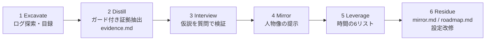

# セッション履歴ミラー（エージェントログの自己分析プロンプト）

> **TL;DR**: コーディングエージェントのセッション履歴を「誰にも演技していない最も正直な自己記録」として掘らせ、6フェーズ（Excavate→Distill→Interview→Mirror→Leverage→Residue）で人物像・時間の使い方・エージェント環境の改修まで導く全文公開プロンプト（@EXM7777）。

人は日記では読み手向けに演技し、セラピーでも取り繕うが、コーディングエージェントへの依頼では誰も演技しない——@EXM7777 はこの非対称を突く。ローカルのセッション履歴フォルダ（Claude Codeなら ~/.claude/projects）には、タイプした全依頼・始めて放棄したプロジェクト・3回頼んで一度も自動化しなかった修正が、すべてタイムスタンプ付きで残っている。モデルは以前からこの記録を読めたが、数ヶ月分の行動を一つの分析で保持して「星占いでなく真実」を返すのは [[models/claude-fable-5|Fable 5]] が最初だ、というのが著者の主張（かつて優れたセラピストと1年のセッションが必要だった水準の読み、と形容する）。プロンプトはファイルアクセスできるエージェントに1回貼るだけで動く設計になっている。

## 6フェーズの構造

1. **Excavate（発掘）** — Claude Code・Codex・OpenCodeなど各エージェントのセッションアーカイブを走査し、ツール名・パス・ファイル数・期間の目録を提示する。中身は一切読まず、採掘計画をユーザーが承認してから先へ進む。
2. **Distill（蒸留）** — ガードレール付きでログを証拠ファイル evidence.md に落とす。6つの節（繰り返すテーマ／放棄の墓場／修正パターン／反復税＝二度目に自動化すべきだった依頼／リズム／盲点＝ログに不在のもの）を、短い原文引用・日付・件数つきで埋める。
3. **Interview（面接）** — 証拠から最も強い仮説を5つ立てるが、明かさない。本人が自分で気づくよう設計した質問を1問ずつ投げ、回答がログと矛盾したら日付つき証拠を見せて再質問する。「言ったこと」と「やったこと」のギャップが最大の発見だとされる。
4. **Mirror（鏡）** — 人物像を提示する。信念は「時間をどこに使ったか」で測る・思考が速い所とループする所・避けているものと、その回避が守っているもの・「記録の全ページに現れるのに一度も口にしたことがないパターン」。最も痛い真実は最後に一度だけ言う（繰り返せば説教になる、という理由づき）。
5. **Leverage（てこ）** — 同じ証拠を仕事側へ向け、WASTE（時間が死ぬ場所）／DELEGATE（AIへ恒久委任・週あたり回収時間で順位付け）／FOCUS（自分にしかできない1〜2個）／DROP（やめること）／KEEP（守ること）／RHYTHM（タイムスタンプから割り出す深い仕事の時間帯）の6リストを、各項目に証拠と最初の一歩を付けて出す。「次の行動のない洞察はただの娯楽」と釘を刺す。
6. **Residue（残留物）** — 会話を成果物に変換する。6ヶ月後の自分向けの mirror.md、30日計画の roadmap.md、そして反復税を潰すCLAUDE.md/AGENTS.md改修案とカスタムスキル最大3本。既存設定への変更はすべてdiff提示・個別承認制。

## 設計上の工夫

- **コンテキスト・ガードレール**: セッションファイルの通読を禁止し、1ファイル150行まで・最大200ファイル・最新15/最古10/中間20のサンプリング・grep一斉スイープ（修正フレーズ・繰り返し依頼・3回現れて消えたプロジェクト・作業時間帯）で走査する。25ファイルごとに発見を evidence.md へ書き出して生テキストを捨てるため、履歴がどれだけ大きくても詰まらない。
- **証拠の基準**: 「パターンは日付つき3回以上の出現で初めてカウントする。1回はノイズ、11回は人格」。
- **解釈と収集の分離**: Phase 2では解釈を禁止する。「結論の下で集められた証拠は汚染されている」がその理由づけ。各フェーズ末尾にゲートがあり、満たすまで先へ進めない。
- **仮説非開示のインタビュー**: 「自分で到達した結論は人を動かすが、手渡された結論には人は反論する」ため、仮説は述べずに質問で気づかせる。
- **誠実性の制約**: 証拠が薄ければ「insufficient data」と言わせる（「重みを持って届けられた偽の洞察が、唯一回復できない失敗」）。診断・病理化の禁止、セッションデータの外部送信禁止、機密情報の引用禁止も明記されている。
- **出力水準の実例**: 「あなたは好奇心旺盛で学習好きですね!」は無価値で、「41セッションでリサーチシステムを作り、0セッションでそれをユーザーに出荷した。何の許可をリサーチしているのか?」が基準——と、プロンプト自身に良し悪しの対比が書き込まれている。

## 観察ログ（未検証）

- 2026-07-07: @EXM7777 は「プロンプト自体はどのモデルでも走るが、Fable以前のモデルはこの種の読みで星占いレベルしか返せなかった」と主張（単一ソース・下位モデルとの品質差は要検証）

## 問い

- 自分の ~/.claude/projects でこれを走らせたら、このvaultの課題である「知識→判断・発信・行動」の帰還ループ不在は、Phase 5のどのリスト（WASTE/FOCUS/DROP）として現れるか
- [[concepts/ai-strategist-prompt]] との差分——ガードレール付き証拠抽出・フェーズゲート・仮説非開示インタビューは、盲点指摘の精度にどれだけ効くのか
- 「日付つき3回以上で初めてパターン」という証拠基準は、このwikiの観察ログ運用（単一ソースの数字の追跡）に輸入できるか

## 関連

- [[concepts/ai-strategist-prompt]] — 同じ「自己の履歴をAIに掘らせる」型。あちらはチャット会話履歴×3つの縛り、こちらはエージェントセッションログ×6フェーズ・証拠ゲート
- [[concepts/frontier-model-extraction]] — 同著者@EXM7777の姉妹編。去るFableの最終夜の使い道として本プロンプトが書かれており、「会話でなく抽出」の実践例にあたる
- [[concepts/chokkan-karte]] — 同じ自己解剖を非言語素材（無意識に保存した画像・音楽）から掘る対の手法。こちらは「演技のない行動ログ」から掘る
