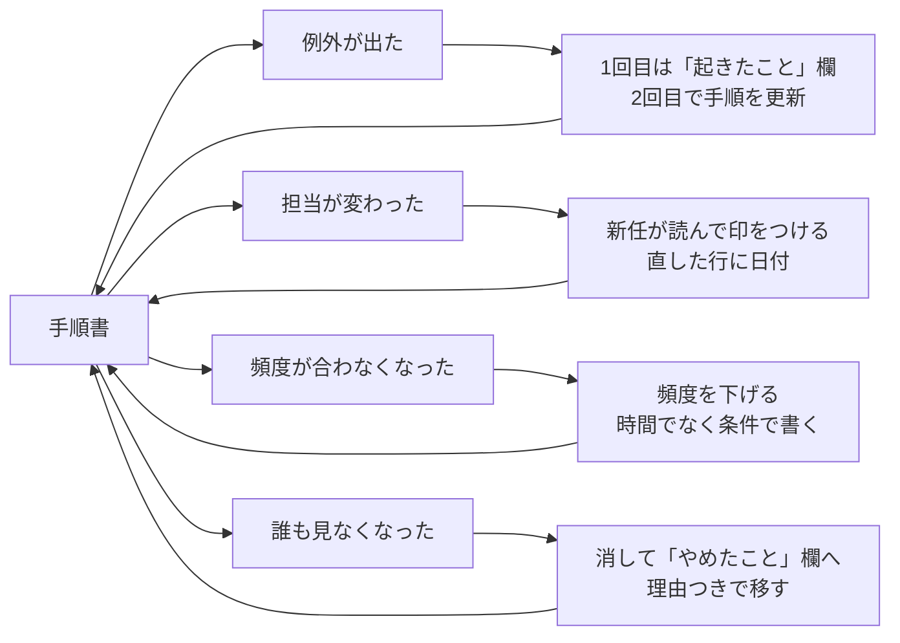

# 手順書と仕組みの違い — 「直した結果が戻る場所」を設計する

> **TL;DR**: 仕組み化とは手順を固定することではなく「直した結果が戻る場所」を決めることで、無印良品の店舗マニュアルMUJIGRAMが2,000ページあっても腐らないのは毎月直される場所があるからだ、と@smark_xが述べる。

「仕組み化して」と言われて手順書を書いた人は手順を書いただけで仕組みを作っていない、というのが@smark_xの出発点である。同氏が描く典型的な経路は、Notionに手順を10行書く、最初はみんな見る、1か月後に実態と3か所ズレて誰も開かない、「あのページ古いよね」と言われて直す気力が無くなる、結局口頭で聞かれるようになる、という流れだ。手順書が使われなくなるのは書き方のせいではなく、直した結果の戻り先（ブラッシュアップ機能）まで設計されていないからだ、と同氏は診断する。

その対比として同氏が挙げるのが無印良品の店舗マニュアルMUJIGRAMである。@smark_xの紹介によれば、2,000ページを毎月20ページずつ直し、1年で全体の12%が入れ替わる。修正の材料は現場の改善提案で年に約2万件あり、作った当時の社長は「マニュアルは社員全員で作り、常に仕事の最高到達点であるべき」と言っているようだ、と同氏は伝聞の形で紹介する。同氏の読みは「2,000ページだから強いのではなく、毎月直される場所があるから腐らない」である。

## 仕組みが腐る4つの場面と対策

同氏は仕組みが腐る場面ごとに、放置した場合の結末と対策を並べる（ソースからの転記）。

| 場面 | 放置すると | 対策 |
|---|---|---|
| 例外が出た（「月末が土日だったら？」に手順書が答えていない） | 答えが口頭で溜まる。放置される月が出て仕組みが止まる | 1回目は手順書を更新せず「起きたこと」欄に書くだけ。2回目に来たら初めて手順を更新する。「◯◯のときは△△」と「なぜ△△か」のイレギュラールールを加え、理由があれば3つ目の例外は担当が自分で決められるようにする |
| 担当が変わった（前任者の「いつも通り」が手順書のどこにも無い） | 新しい人が自分のやり方で埋め、手順書が2つになる | 引き継ぎ初日に新しい人に手順書を読ませ「分からなかった行」に印をつけてもらう。前任者には聞き取らない（書いた本人には抜けている行が見えない）。印がついた行を直したら行末に日付を入れ、手順が2つ残ったときは内容でなく日付で正本を決める。1行目に「口頭で聞いたことは、ここに書くまで手順ではない」と書く |
| 頻度が合わなくなった（「毎朝更新」が忙しい週に3日飛ぶ） | 罪悪感でページごと見なくなる | 飛んだ日は直さず、頻度の行を「週1」に書き換える。下げても飛ぶなら時間で書くのをやめ、「数字が動いたら」「依頼が3件たまったら」のように「何が起きたら動くか」だけを書く |
| 誰も見なくなった（3週間、誰も開いていない） | 口頭で伝えることが正本になり、手順書は「昔のやり方」になる | 見なくなった手順は消し、「やめたこと」欄に理由と一緒に移す。理由が無いと半年後に誰かが善意で復活させる。見られない手順は内容でなく置き場所が悪いことが多いので、探しに行く物でなく作業の入口に出てくる物にする |

各対策の理由として同氏が添えるのは、例外を1回で手順に足すと二度と起きない例外で手順書が膨らむ、守れない頻度は願望なので即見直す、時間で書いた手順は忙しい日に必ず飛ぶ、の3点である。

## 置き場所は「探しに行く物」でなく「作業の入口に出てくる物」

同氏が挙げる入口の例は、Notionなら新規ページのテンプレート、チャットなら固定メッセージ、AIなら指示書の先頭、の3つである。作った物が手順書なのか仕組みなのかは2本の軸で分かり、「仕組み化する」とは右上ではなく左上だ、と同氏は述べるが、軸の定義は添付画像内にあり本ソースには捕捉されていない。

## AIへの指示書も同じ

Claude Codeに渡す指示書も同じで、直したことが残る欄の無い指示書は翌日同じ間違いをする、と同氏は述べる。「属人化させない組織に」「エースの仕事観をマニュアルに」と意気込む少数精鋭の組織ほど、手順のマニュアル化をして1か月後に誰にも使われないことが起きている、というのが同氏の観察で、「直したことが残る場所」を意識して設計せよと締める。

このwikiの運用に引き付けると、「起きたこと」欄は[[concepts/self-refining-skills]]のLESSONS.md（実行のたびに2行追記し次回読む）に、「やめたこと」欄と「見なくなった手順は消す」は[[concepts/instruction-patch-lifecycle]]の「モデル世代が変わったら全部外してまだ失敗するものだけ戻す」に、戻り先を場面ごとに決める発想は[[concepts/correction-routing]]の6分類にあたると考えられる。@smark_xの記事が足しているのは「1回目は手順を更新しない」「時間でなく条件で書く」「消した理由を残す」という、戻り先を肥大させないための閾値の設計である。

## 観察ログ（未検証）

- 2026-09-05: MUJIGRAMの「2,000ページ・毎月20ページ・年12%入れ替え・改善提案年約2万件」は@smark_x経由の二次情報で、無印良品側の一次資料は未参照

## 問い

- このvaultのwiki-ingest LESSONS.mdは「起きたこと」欄に相当するが、「2回目に来たら初めて手順を更新する」という昇格の閾値は決めていない。LESSONSからSKILL.md本文へ昇格させる条件を明文化するか
- CLAUDE.mdやスキルから消した指示を理由つきで残す「やめたこと」欄は存在するか。無ければどこに置くか
- 「毎朝更新」のような時間ベースの手順が自分の運用にどれだけあるか。launchdの定時ingestを「ブックマークが溜まったら」という条件ベースに書き換えると何が変わるか

## 関連

- [[concepts/self-refining-skills]] — 「起きたこと」欄の実装形。実行のたびにLESSONS.mdへ2行追記し次回読む
- [[concepts/instruction-patch-lifecycle]] — 「やめたこと」欄と「見なくなった手順は消す」に対応する、指示を育てて捨てるサイクル
- [[concepts/correction-routing]] — 訂正の戻り先を6分類で決める。本ページの「直した結果が戻る場所」をチーム規模で設計した形
- [[concepts/skills-over-memory]] — 指示ファイルは短く保ち決定を変える行だけ残す。「二度と起きない例外で手順書が膨らむ」への同じ警戒
