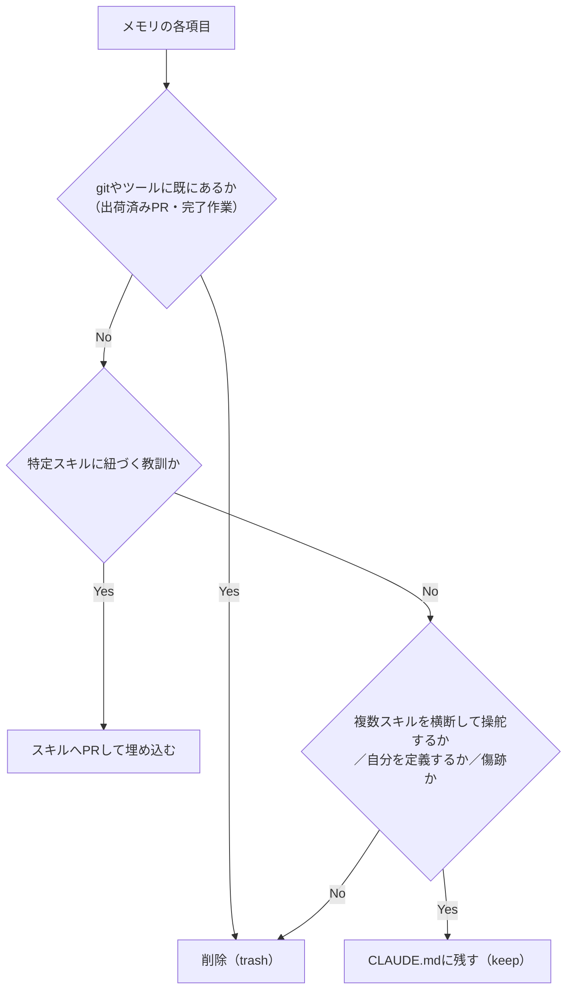

# Skills over Memory（メモリを太らせず、教訓はスキルへPRする）

> **TL;DR**: エージェントの永続メモリと常時ロードされる指示ファイル（CLAUDE.md / AGENTS.md）は同じ問題——どちらも毎セッション注入され、肥大すると知識でなく遵守を削る。規律は「短く保つ・決定を変える行だけ残す・スキル固有の教訓はメモリに溜めずスキルへPRする」。

出発点は「メモリを増やせ」という主流の助言への反論にある。ステートレスなエージェントが毎朝ゼロから始まる問題自体は本物だが、それを「毎セッションにより多く積む」で解こうとするのが誤りであり、正しくは「必要なときだけストアに問い合わせる」だ。常時ロードされる層では、テキストが増えるほど遵守は上がらず下がる——コンテキストウィンドウが埋まるほど出力品質が落ちる機構的な現象で、予算を持たないメモリは脳でなくゴミ捨て場になる。

中核となる再利用可能な発想:

- **push memory と pull memory を分ける**: push は毎セッション勝手に注入される層（CLAUDE.md・ネイティブの auto-memory）で、肥大が失敗モード。pull はストアに置いて必要なスライスだけをエージェントが都度クエリで引く層（gbrain・supermemory・mem0・Letta・Zep・Cognee など）。「メモリを消せ」と「本物のメモリを与えよ」は、push と pull を切り分けた瞬間に対立でなくなる。recall を残したいなら pull 側へ移す。
- **教訓はメモリでなくスキルへ（skills over memory）**: あるスキルに紐づく教訓は、そのスキルの中に PR として埋め込むべきもので、メモリに私的に書き溜めると静かに陳腐化する。スキルに入れればバージョン管理され、自分だけでなく同じスキルを使う全員に効く。要は「教訓を日記に書くのをやめ、スキルへ出荷する」。
- **削除でなく仕分けが本質**: メモリの各項目を「trash（gitが既に持つ完了記録）／skill-tied（スキルへPR）／genuinely cross-cutting（残す）」に分類する。問いは「何%消すか」でなく「各教訓はどこに住むべきか」。多くの「メモリ」は置き場所を間違えたスキルPRである。
- **予算＝強制された希少性**: ハードな行数上限が「本当に効くものだけを蒸留する」強制力になる。ファイルは各200行未満が目安（Anthropic のメモリ文書は「長いファイルはコンテキストを食い遵守を下げる」と明記）。
- **怖がらず消すために、まず可逆にする**: メモリストア全体を、ロードされないアーカイブ場所（自動ロード対象外のディレクトリやtarball）へ退避してから骨まで削る。残す基準は「複数スキルを横断して操舵する／自分を定義する／実害から学んだ傷跡」のいずれか。
- **auto-memory の罠**: auto-memory はメモリフォルダの読み込みと書き込みを兼ねた単一スイッチなので、オフにすると厳選した残存ファイルもロードされなくなる。回避策は、残存ファイルを常時ロードされ自動prune もされない CLAUDE.md へ移し、その上で auto-memory を切ること（環境変数 `CLAUDE_CODE_DISABLE_AUTO_MEMORY=1`、またはターミナルで `/memory` を開いてトグル）。
- **指示ファイルは一本化する**: プロジェクトの CLAUDE.md は `@AGENTS.md` の1行（またはシンボリックリンク）にして、規約を AGENTS.md に一度だけ書けば Claude Code・Codex・Cursor など全エージェントが同じものを読む。二重管理でドリフトさせない。
- **生き残る行はすべて gold-standard**: リポから推測できる内容（技術スタック・自明な規約・一般論）は消し、「エージェントが繰り返し間違える決定」だけを書き残す。判定基準は「この行は次に起きることを変えるか」。変えないなら捨てる。

通底するのは「メモリと CLAUDE.md は同じ戦い」という見立てだ。どちらも毎セッション課金され、かつて意味があったが今は誤誘導する内容で静かに埋まる。pull ストアに移しても腐敗は止まらず、希少性の規律はストレージが大きくなっても効力を失わない。

## 観察ログ（未検証）

- 2026-06-27: @mvanhorn が自身のエージェントのメモリを218ファイル・46KBのインデックスから6ファイル・約1.4KBへ削ったと報告。インデックスが上限超過でハーネスに後半を毎セッション黙って捨てられ、ファイルが「操舵しないただのトークンコスト＝作業日誌」になっていたという（単一ソースの数字）。
- 2026-06-27: 3人の読み手に218ファイルを行単位で仕分けさせた結果、約14%が真のゴミ（出荷済みPRや完了動画の記録＝gitが保持）、約39%が「有用だが特定スキル1つに紐づく教訓」、残りが横断的な操舵＋出荷で腐る進行中トラッカーだった、と著者が主張。
- 2026-06-27: 残した6ファイルの基準として、作業中の環境を絶対に終了しない安全則（Chromeを終了して12,552件のcookieを失いログアウトした実害＝scar tissue）、出力の整形規則と秘匿境界、毎日触るリポの正準パス、を挙げる（著者個人の運用）。
- 2026-06-27: 引用された各クリエイターの主張——aidecipher（TikTok）「強制された希少性こそが集中した長期メモリを作る」、Simon Scrapes（YouTube）「Claude Code は開始時に CLAUDE.md を全注入するので理想は200行未満」、@s1rozha_（X）「CLAUDE.md をゴミ箱のように使うな」、@Vishaldej（X）「指示を増やすほど Claude は無視する。システムプロンプトに既に約50個の組込み指示がある」、@cxprakash（X）「AGENTS.md の全行は gold-standard であるべき」。いずれも単一ソースの引用。
- 2026-06-27: 著者は自分の68個のプロジェクトCLAUDE.mdのうち48個が `@AGENTS.md` の1行だけだと述べ、あるポストが「AGENTS.md を持つリポは6万件、Claude Code/Codex/Cursor/Aider/Devin/Copilot/Gemini CLI/Windsurf/Amazon Q が読む」と数えたと引用（未確認）。
- 2026-06-28: 同記事のTL;DR告知ポスト（@mvanhorn）。「主流の助言は『より大きなメモリシステムを作れ』だが、自分は逆を行った」という記事の主旨を要約するのみで新情報なし。

## 検証済み事実

- 2026-06-27: Anthropic のメモリ文書が「各 CLAUDE.md を200行未満に保て。長いファイルはより多くのコンテキストを消費し遵守を下げる」と推奨していること、Claude Code が `@` 行による import（`@AGENTS.md`）と `ln -s AGENTS.md CLAUDE.md` のシンボリックリンクの双方を認めることは、いずれも公式ドキュメントに基づく記述として article 内で引用されている。
- 2026-06-27: auto-memory のトグルは Claude Code のターミナルで `/memory` を実行して切り替える（アプリ内設定では切れない）と明記。

## 問い

- このwikiの運用にそのまま重なる主張。`memory/MEMORY.md` インデックスと各 `feedback_*` ファイルは「skill-tied（LESSONS.md やスキルへPRすべき）」と「genuinely cross-cutting（残す）」のどちらに仕分けられるか。LESSONS.md 方式（[[concepts/self-refining-skills]]）は既に「教訓をスキルへ出荷」を部分的に実装していないか。
- 「push を削り pull へ移す」は [[concepts/agent-memory-layer]] の共有メモリ層や [[concepts/llm-wiki]]（クエリで引く知識ベース）と同じ設計。自分のメモリは push に偏っていないか、pull で足りるものを毎回ロードしていないか。
- メモリ劣化の機構（[[papers/2026-peng-llm-memory-faulty]]）は「継続的な再要約」が原因だったが、本記事は「常時ロードの肥大」が原因。両者は別経路で同じ結論（メモリは増やすほど良くならない）に至る——自分の運用ではどちらの劣化が効いているか。

## 関連

- [[papers/2026-peng-llm-memory-faulty]] — 「メモリは増やすほど劣化する」を実験で示した論文。本ページが常時ロードの肥大、論文が継続的再要約と、別経路で同じ結論に至る
- [[concepts/agent-memory-layer]] — pull memory 側の設計（共有メモリ層・gbrain/CASS）。本記事の「recall は削除でなく pull へ移す」の受け皿
- [[concepts/claude-code-instruction-methods]] — 指示の格納先決定フレーム（200行未満・索引に徹す・hook/permissionで決定論的強制）。「各教訓はどこに住むべきか」の機構的な地図
- [[concepts/agentic-engineering-workflow]] — 同著者 @mvanhorn の総合スタック。「2回以上やる作業はスキル化」という skills over memory の能動側
- [[concepts/agents-md-canonical]] — AGENTS.md を正本に `@import` で一本化する設計。本ページの「指示ファイルは一本化」の具体
- [[concepts/managed-agents-dreams]] — メモリストアの重複削除・矛盾解消・陳腐化処理。pull ストアも腐るという注意への自動pruning側の答え
- [[concepts/self-refining-skills]] — LESSONS.md 方式の自己改善ループ。教訓をスキルへ畳み込む実装パターン
- [[tools/compound-engineering]] — 著者が「既存の良いスキルを見せて同じ形でコピーさせる」起点に挙げるスキル群
- [[concepts/context-engineering]] — Anthropic Claude Codeチーム公式の「CLAUDE.mdに記憶させる→auto-memoryに任せる」逆転。本ページのpush/pull区分と同じ問題意識を公式側から裏付ける
