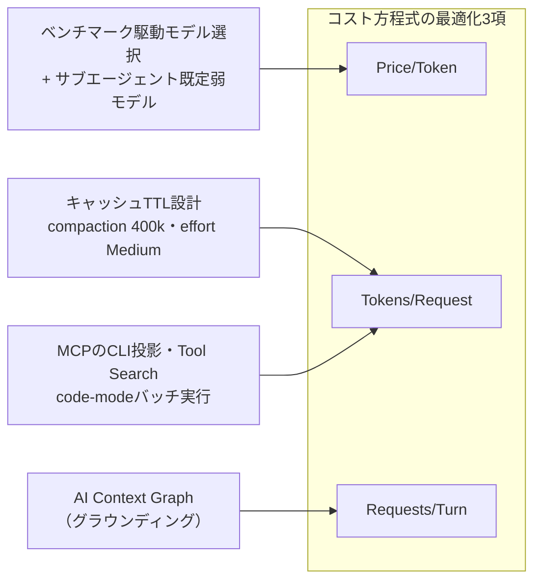

# ソフトウェアファクトリーのコスト方程式（Uber）

> **TL;DR**: Uberはエージェントセッションのコストを方程式に分解し、Price/Token（モデル選択）・Tokens/Request（キャッシュ・CLI化・code-mode）・Requests/Turn（グラウンディング）の各項を独立に最適化。利用を7倍に伸ばしながらモデル固定比較でセッション単価を52%下げ、コスト制御の本丸を対話型セッションからmanaged agentsへ移した。

Uberではプルリクエストの70%超がローカル/クラウドエージェント由来で、社内エージェントスキルは3,600個超・実行は1日3万回超に達する。この規模で2026年2月→8月に週次アクティブユーザーが7倍・週次エージェントリクエストが9.4倍に伸びる一方、AI総支出は4月以降ほぼ横ばい。モデルを1つに固定した比較では、1,000リクエストあたりコストがピーク比34%減・セッション単価が6月ピーク比52%減とUber Engineeringが公表している（Uber公式エンジニアリングブログ、著者はudaykiran）。方法論の核は「単価の安いモデルへ下げたり機能を削るのでなく、価値ゼロのトークン消費を消す」こと。エージェント利用を専用→汎用の4層に整理し（上の層ほどコスト・品質・モデル選択の制御が効く）、セッションコストを複数の項に分解して、採用・エンゲージメントを表す最初の2項は伸ばし、「エンジニアの依頼の上にエージェントが自分のために行う作業」にあたる中間の項を削る。

## Price/Token: ベンチマーク駆動のモデル選択

トークン単価はベンダーが決めるが、どのワークロードにどのモデルを走らせるかは選べる。Uberはmanaged agentごとに「実作業からベンチマークを作る→任意のモデルを同一インターフェースで差し替えられるハーネスで走らせる→Pareto最適へ移り続ける（フロンティアは数週間ごとに動く）」という手順を踏む。全PRのAIコードレビューを担うuReviewでは、既知バグ入りの実PRを難易度3段階で採点するベンチマークを組み、モデル切替でF1を上げつつレビュー単価を大幅に下げたという。数千件の実PRから作った社内Uber SWE BenchmarkがSDLC全域のモデル選択を支える。

対話型ハーネスでは既定値が消費配分を左右する。中でも**サブエージェントの既定モデルを弱く安いモデルに固定する**のが最も効くレバーだとUber Engineeringは述べる。サブエージェントは入力が明確な限定タスクを担いフロンティア級の推論を要さないため、主モデルがタスク分解と評価を担い、実作業は安いモデルに流す構図になる。

## Tokens/Request: キャッシュ・CLI化・code-mode

毎ターン全履歴が再送されるため、リクエストあたりのペイロード削減はセッション全体に複利で効く。Uberの標準設定は、1Mコンテキストモデルでも400kトークンで自動compaction・reasoning effortの既定をMediumの2つ。

プロンプトキャッシュはTTL経済（読み出し0.1倍・5分書き込み1.25倍・1時間書き込み2倍）に基づき、アイドル5分超が頻発する対話セッションは1時間TTLへ移行し、短命タスクのサブエージェントは5分TTLに据え置くという使い分けをする。仕組みの詳細は[[concepts/prompt-caching]]にある。

MCPは1,000超のサーバーを単一ゲートウェイに集約した上で、スキーマの事前ロード（100超のツールで初期プロンプトに約50〜70Kトークン）を避けるため、全MCPツールをCLIコマンドとして投影する方式とTool Search（必要なツールだけオンデマンドでロード）を併用する。さらにcode-modeでは複数アクションを1スクリプトに束ね、SQLポーリングのような多ターン往復をサブプロセス内のループに封じて要約だけを文脈に返す。同一セッションで同じSQLクエリ5本を両経路で流した実測で、最小の結果セットでもトークン50%超削減・バルク処理では90%超の削減になったとし、最頻アクセスのMCPサーバー向けに25本超のcode-modeスキルを事前配備している。効き目が「ターン数の削減」にあるという構造は[[concepts/agent-command-wrappers]]と同一で、こちらはそれを全社規模で実装した側にあたる。

## Requests/Turn: AI Context Graphによるグラウンディング

グラウンディングされないエージェントは安く失敗せず、膨らみ続けるコンテキストを再送しながら「もう1箇所」を探し続ける。Uberは30超の社内システム（サービス・チーム・インシデント・PR・設計文書・デプロイ・データセット・テーブル利用履歴）を統合したAI Context Graph（ノード2,400万・エッジ8,000万・86ノード種別・117エッジ種別）を敷き、任意のエージェントが自然言語で照会できるようにした。記事の比較例では、グラウンディングされたエージェントが利用履歴から38秒で正しいテーブルに到達したのに対し、されていないエージェントは20分かけサブエージェント2体を起動しエラー3回の末に誤った結論を出した。

## 可視化と行動変容

強制上限でなく可視化とナッジで運用する。ハーネスのステータスラインに実費カウンターを常駐させ、想定支出の50/80/100%でSlack通知を送り、ティア昇格はマネージャー承認で素早く通す。さらにセッション分析ダッシュボードがセッショントレースを直接検査し、16種のアンチパターン（単純タスクへの上位モデル使用・大きなMCP応答の文脈残留・キャッシュ失効後の全額再構築・10万トークン級の初期化オーバーヘッドなど）を金額影響と改善策つきで提示する。

結論としてUber Engineeringは、数千人の端末セッションを個別に最適化するより、評価ベンチマークとPareto最適モデルを対にしたmanaged agentsの艦隊を最適化する方が構造的に安くスケールすると総括する。

## 問い

- 「サブエージェントの既定モデルを弱くする」レバーは自分のClaude Code運用でも最有効か。ワークフロー/サブエージェント委譲の損益分岐（[[concepts/cost-effective-harness]]）と突き合わせて検証したい
- 「対話型の個別最適化よりmanaged agentsの艦隊最適化」という結論は[[tools/stripe-minions]]（週1,300本のマシン生成PR）と同じ収斂か。個人規模での相似形はlaunchdのheadless ingestか
- AI Context Graphの「passageでなくpathを返す」方向は[[concepts/context-graph-retrieval]]の9ステップとどこまで一致するか

## 関連

- [[concepts/token-management]] — トークン消費を経営イシューとして可視化する問題提起側。本ページはUber自身による方程式分解×レバー実装の回答側
- [[concepts/prompt-caching]] — TTL経済（0.1倍/1.25倍/2倍）の仕組みの正本。本ページはそれを艦隊規模の既定値に落とした実例
- [[concepts/agent-command-wrappers]] — ターン削減がコストの実体という同一構造の個人規模側（gh実測24%減）。本ページのcode-mode/CLI投影は全社規模側
- [[concepts/llm-model-selection-strategy]] — 工程分解型モデル選択の個人版。Uberはベンチマークで同じ配分を自動化する
- [[concepts/context-graph-retrieval]] — コンテキストグラフ検索の設計手順側
- [[tools/stripe-minions]] — managed agentsパイプラインの他社実装（Stripe）
