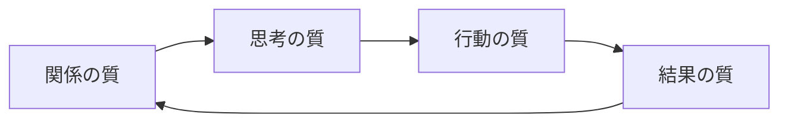

# 社内勉強会を形骸化させないファシリテーション

> **TL;DR**: 勉強会を形骸化させないコツは「組織の成功循環モデル」で関係の質から始めること。発表クオリティ（結果の質）を最初から求めるとバッドサイクルが回り、登壇者が身構えて離脱し開催が途絶える。

@sodawateeer（制作会社のデザイン組織で社内勉強会の運営を2年担当）は、参加者が増えない・盛り上がらない・タメになっているか分からない、という運営の悩みの根を「順番の間違い」に見る。信頼関係が築けていない状態で「全員のタメになる高尚な発表を」と結果を求めると、登壇者は「来週僕の番か、嫌だな」「発表できる内容がない」と身構え、姿勢が受け身になり、スキップが増え、開催数が減って形骸化する——これがダニエル・キム（MIT）の**組織の成功循環モデル**でいうバッドサイクルだ、というのが出発点。グッドサイクルは逆に、関係の質→思考の質→行動の質→結果の質の順で回す。@sodawateeer は3つのフレームワーク（成功循環モデル・SECIモデル・知の階層構造）を挙げるが、この記事で詳述するのは最重要の成功循環モデルのみで、残り2つは別稿としている。

グッドサイクルは関係の質（A）から入って一周させる。バッドサイクルは結果の質（D）を最初に求めて逆流させ、信頼が育つ前に登壇者を潰す。運営が関与できるのは主に前半（A・B）で、後半（C・D）は自然発生に委ねる度合いが増える、と @sodawateeer は整理する。

## 1. 関係の質の向上（まずここ「だけ」）

とにかく関係の質を上げることだけを目指す段階。KPIは実質「参加者数」で、雑談多めの「楽しい勉強会」を意図的に演出する。

- **発表テーマを指定しない** — 実務に関係なくてOK。デザイン/UI/UX/Web/マーケ/気になるサービス等、広くキーワードだけ提示して発表のハードルを下げる。
- **テーマの相談に乗る** — 「困ったら運営が相談に乗る」。実案件に絡めて「今の案件のこの学びをテーマにしたら？」と助言するとより良い。
- **まず運営が発表する** — 進行のイメージを持ってもらう。あえて「そんなカンタンでいいんだ」と思えるありふれたテーマにして登壇ハードルをさらに下げる。
- **ファシリは雑談ベース** — 高尚な絡め方は不要。雑談で「勉強会って楽しい」「イジってもらえるからまた発表したい」を作る。
- **運営が積極的に質問する** — 「質問ある人？」では出ない。運営が分からないフリをして質問し「バカになる」ことで、「そんなことも聞いていいんだ」と質疑が活発化する。

@sodawateeer は、結果の質を求めずこれらを実践した結果、3ヶ月ほどで毎回30名超（別部署からの参加者も）に達したと報告する。

## 2. 思考の質の向上

ここから徐々に結果へ繋げる。最終目的（KGI）を社内評価アップ（給与）・社外評価アップ（案件獲得）と定義し、その手前のKPIに「デザイナーとしてのスキルアップ」を置く。鍵は、発表を聞いた「へ〜すごいな」という抽象的感想を「これ今の案件のこの場面で使えるかも」という具体的な気づきに変えること。

- **感想シートを用意する** — 発表後に全員へ強制的にアウトプットさせる。聞くだけだと大半が「聞くだけの人」になり頭に入らない。運営が質問する隙に参加者にシートを書いてもらい、それを見ながら質疑に入る流れにすると、ファシリテーションも楽になり一石二鳥。

## 3. 行動の質の向上

勉強会で得た知見を実務で実践する段階。ここまで来ると運営がナッジできることは減り、参加者が自然に試し始める。KPIを「参加者数」から「実務での実践数」に切り替える。

- **勉強会の場以外での促進** — 週1時間だけでは限界があるので、チームMTGや1on1でも勉強会の内容に言及して実践を促す。
- **テーマと登壇者を運営が指定する** — 「来月のプロジェクトでペルソナ設計が要るから、前回作った○○さんお願いします」と指名する。発足当初にやるとバッドサイクルだが、関係の質で信頼を築いた後なら快く引き受けてもらえる。抽象→具体の手順で、具体的なプロジェクト名を出してファシリテーションする。

## 4. 結果の質の向上

運営としての関与はさらに難しくなる。勉強会の場に閉じず、1on1・チームMTGなど様々な場面で発表内容を意識させる発信を続けるとよい、というのが @sodawateeer の締め。

## 観察ログ（未検証）

- 2026-07-05: @sodawateeer は「結果の質を求めず関係の質だけを実践した結果、3ヶ月ほどで毎回30名超の参加」を得たと報告（単一ソースの効果測定・組織固有条件あり）。

## 問い

- 成功循環モデルの「関係の質から始める」は、勉強会だけでなくAIエージェント導入（まず小さく信頼を作ってから成果を求める）にも転用できるか
- 「感想シートで強制アウトプット」は [[concepts/output-first-learning]] の出力前提学習と同型か（受け身の消費を能動的な結び付けに変える点で）
- SECIモデル・知の階層構造（本記事では別稿扱い）を足すと、この4段階はどう精緻化されるか

## 関連

- [[design/claude-design-workflow]] — 同じ @sodawateeer によるClaude活用のデザイン制作術（別トピックだが同著者の実践）
- [[concepts/team-leader-transition]] — 心理的安全性（エドモンドソン）・委譲＝投資など、関係の質を土台に置く点で通底するリーダー論
- [[concepts/coachability]] — 正直さ・謙虚さ・素直さが学びを機能させる。関係の質が結果に先行するという発想と同根
- [[concepts/output-first-learning]] — 出力前提で学びを血肉化する方法論（感想シートによる強制アウトプットと接続）
