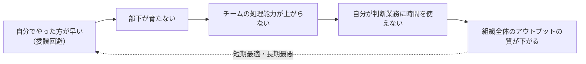

# 新任リーダーの最初の3ヶ月

> **TL;DR**: 新任リーダーが最初の3ヶ月で犯すミスはほぼ全て「プレイヤーの延長線上でリーダーを定義したこと」に起因する、という @KensukeTaki の転換論。

@KensukeTaki は、リーダー昇格の瞬間に評価軸が「自分が直接生んだ成果」から「チームが生んだ成果の総量」へ変わると説く。自分が 100 のアウトプットを出してもチームが 30 しか動いていなければリーダーとして失格であり、リーダーの仕事は「自分が動くこと」ではなく「チームが動ける環境を設計すること」だと位置づける。この転換ができたかどうかで 3 年後のポジションに決定的な差が開く、というのが記事全体を貫く主張。

具体的な行動指針として @KensukeTaki は次を挙げる。

- **影響力で動かす**: 率先して背中で見せることは有効だが、それだけでは「上司が全部やってくれる」空気が醸成される。チームが自走しなければ永遠にプレイヤーを兼務する。
- **任せる怖さに飛び込む**: 委譲をためらう理由（自分でやった方が早い／クオリティが担保できない／失敗の責任が怖い）は全て正しい感覚だが、回避し続けるコストの方が何倍も大きい。委譲は部下への投資で、初期の非効率が半年〜1年後に複利で返る（上図の負の連鎖を断つ手段）。
- **目的を語る**: 「何を・いつまでに」だけの依頼は作業の割り振りにすぎない。@KensukeTaki は「なぜこれが必要か」を言語化できない仕事は、そもそも部下に頼む必要があるか疑うべきだ、と逆向きの使い方も示す。目的が分かれば部下は想定外の場面でも自分で判断できる。
- **心理的安全性を正しく使う**: @KensukeTaki はエイミー・エドモンドソン教授の定義（チームのために耳の痛い真実を率直に言える状態）に立ち返り、「何でも許容するぬるま湯」ではなく健全な摩擦が生まれる環境が正解だとする。感情的に「何でも言っていい」と言うのでなく、「分からなければ 10 分調べ、それでも分からなければ必ず聞く。聞かないことはルール違反」のように行動規範へ落とし込む。
- **フィードバックする覚悟**: 与えないことは優しさでなく成長機会の剥奪であり、放置はチーム全体の基準を下げる。型は「状況を具体的に示す→その行動が何をもたらしたかを伝える→次にどう変えてほしいかを明示する」。感情で責めず構造で伝えれば、フィードバックは信頼を勝ち取る行為に変わる。

@KensukeTaki は結論として、リーダーシップの本質は自分が目立つことでなく「自分がいなくても回る組織を作ること」であり、プレイヤーとしての優秀さはリーダーとしての適性を何一つ保証しない、と述べる。

## 問い

- 「任せる＝投資、初期の非効率が複利で返る」という論理は、人間の部下だけでなく AI エージェントへの委譲（[[concepts/loop-engineering]] 的な手放し）にもそのまま当てはまるか。
- フィードバックの型（状況→行動→結果→次）は、自分が AI に成果物をレビューさせる仕組み（[[concepts/self-evaluation-gap]]）の設計にも流用できるか。

## 関連

- [[concepts/manager-director-gap]] — 一つ上の階層（マネージャー→部長）の役割断絶。求められる力がさらに「文脈を作る側」へ変わる
- [[concepts/coachability]]
- [[concepts/self-evaluation-gap]]
- [[business/org-design-intelligence]]
