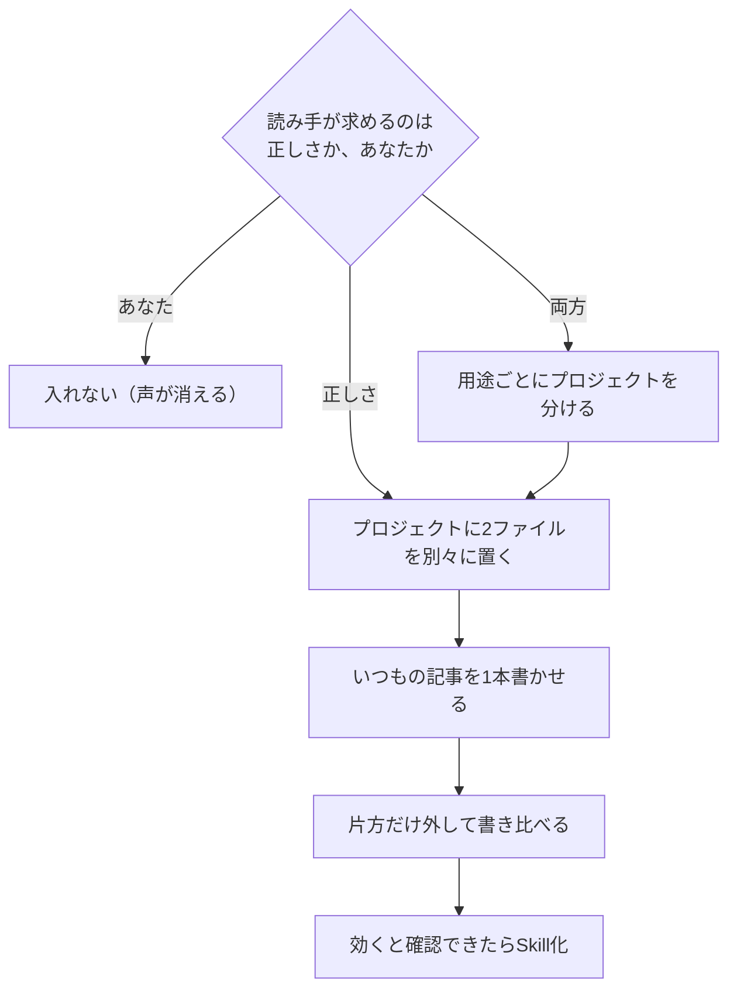

# 日本語ライティング規範を入れるかどうかの判定

> **TL;DR**: 日本語ライティング規範（japanese-tech-writing と cognitive-rhythm-writing）は全員に効く道具ではなく、読み手が「正しさ」を求める文章にだけ入れる。@tetumemo が自社の執筆ルール130項目と突き合わせ、6項目が正面衝突した実践記録。

解いている問題は「AIに書かせた文章が、間違っていないのに最後まで読めない」という状態である。@tetumemo はこれを指示の出し方が下手だからではなく、AIが持っている「AIっぽい型」に名前が付いていなかっただけだと診断する。名前が付けば消せる、というのがこの2つの規範の効き方にあたる。ただし同氏の結論は「入れれば良くなる」ではなく、入れる前に自分の文章がどちらを求められているかを先に決めろ、という条件つきの採用判断になっている。

## AIっぽさの6つの型

規範が名指ししたのは次の6つ。@tetumemo は自分がAIに書かせた直近の文章を1本開いて探すよう勧めている。

1. **予告と総括** — 「重要なのは〜である」「本章では〜を扱う」「まとめると」「要するに」（言い換えているだけのとき）「〜に他ならない」
2. **姿勢の宣言** — 「正面から扱う」「回収する」「しっかり見ていく」。姿勢を宣言しているだけで、扱っていない
3. **中身のない形容** — 「不可欠」「核心的」「鍵となる」「根本的な」「多角的」「包括的」「総合的」
4. **中身のない動詞** — 「掘り下げる」「深掘りする」「言語化する」「触れる」「言及する」。何をするのかを言っていない
5. **接続でごまかす型** — 「〜において」「〜という側面から」「〜の観点から」／「さらに」「また」「加えて」の連打
6. **弱い緩和と、中身のない強調** — 「〜と言えるだろう」（根拠なく弱める）／「非常に」「極めて」「大いに」（強めているつもりで何も足していない）

判定は単純で、1つでも当てはまればそこが読み疲れの発生源、3つ以上ならAIの出力をそのまま貼っている状態だと @tetumemo は言う。同氏自身は5番目で赤面したと書き、その理由を「順番に意味がないのに接続詞だけ置くと、読者は次に何か来ると身構えて、何も来なくて疲れる」と説明している。

## 2つの規範は対で動く

規範を書いたのは k16shikano（鹿野桂一郎）で、Gistに無料公開されている（[[tools/japanese-tech-writing]] が基礎の規範側の本体ページ）。@tetumemo は前者を「基礎の規範」、後者を「リズムの規範」と呼び分ける。

基礎の規範は、書き手が読者にツッコまれないためのもの。やることは引き算で、演出・冗長・中身の空っぽな文を削る。直すのは正しさと節度で、想定しているのは技術書の章や解説記事。上の6分類はこちらに入っている。

リズムの規範は、読者が読むのをやめないためのもの。引き算だけでなく設計もし、文の拍と続きを読みたくなる緊張を作りながら駄文を削る。直すのは緩急で、想定しているのは「密度はあるのに、平坦でつまらない」文章。

この2つは対になっていて、リズムの規範の冒頭には基礎の規範を先に読むよう書いてある。つまり単独では動かない設計で、片方だけ入れると半分しか効かない、と @tetumemo は指摘する。

リズムの規範の芯として同氏が紹介するのは、緩急は文の長さで作るものではない、という点。作るのは読者の頭のモードの切り替え（観察する、迷う、言い切る、また確かめる）で、文の長さはその結果でしかない。だから「短文と長文を交互に」とAIに指示してもリズムは出ず、長さがバラバラなだけの文章が出る。@tetumemo はこれを半年続けていたと書いている。

## 効く文章と、声が消える文章

効くのは、技術記事・解説記事、マニュアルや手順書、報告書や議事録、提案書や企画書。共通点は読み手が「正しさ」を求めている文章である。やめたほうがいいのは、エッセイや体験談、ファンとの距離が武器の発信、「その人が言うから読む」タイプの文章。

線引きの根拠として @tetumemo は、自社の執筆ルールと2つの規範を130項目突き合わせて6項目が正面衝突した経験を挙げる。最も大きかったのは、規範の「後で参照しない固有名を出すな」と、自社ルールの「感情語より固有名詞と数字」が真逆だった点。体験談で「あるツールを使ったら、けっこう時間が減りました」と書いても伝わらず、「Codexで画像を作ったら、3時間が20分になりました」と書くから伝わる。固有名と数字が体験した証拠になっているからで、技術書ならノイズになる同じ1行が、体験談では信用そのものになる。

もう1つは整形の規則で、規範の「一文ごとに改行する」は一文の長い技術書原稿では正しくても、スマホで読むニュースレターでは縦に落ちていくだけの塊になる。@tetumemo は「1段落2〜3文」で運用しているためここも衝突した。同氏はこれを「全部の料理に同じ調味料を入れるのと同じ」と表現している。

## 入れる手順と、2ファイルを結合してはいけない理由

ChatGPT と Claude のプロジェクト機能に2ファイルをアップロードし、指示欄には規範本体を貼らず「情報源を読め」に相当する数行だけを書く。2つ合わせると長いので、指示欄に直接貼ると途中で切れる、というのが @tetumemo の実地の注意である。

2ファイルを1つに結合しない理由は3つ挙げられている。長さの制限にぶつからないこと、規範だけ後から差し替えられること、そして片方だけ外して比べられること。3つ目が一番大きく、2つ入れて良くなったときにどちらが効いたのか分からないままだと、次に何を足すかも決まらない。推奨される順番は、2つとも入れて1本書く → 片方だけ外して同じものを書く → 読み比べる。

プロジェクトの限界はその部屋の中でしか効かないこと。どの会話からでも呼べるようにするには Claude の [[concepts/claude-skills]] にする（置き場所は `~/.claude/skills/writing-norms/SKILL.md` で、同じフォルダの `references` に2ファイルを入れる）。@tetumemo は1つのSkillを Claude・Codex・Antigravity・Gemini の4つに配って動かしている。順番を逆にすると「効かないものを4つのAIに配る」ことになるため、プロジェクトで効くと分かってからSkill化する。

うまくいかないときの切り分けも症状別に用意されている。効いている気がしないなら片方だけ外して読み比べ、差が出なければそのAIには重すぎるので基礎の規範だけにする。文章が固くなったなら効きすぎで、読み手が「あなた」を求めるタイプなのでエッセイ用のプロジェクトを分ける。自分の書き方が消えたなら指示欄の最後の1行が抜けている。長すぎて入らないなら指示欄に貼っているのでファイルにする。

すでに自分の文体が仕上がっている場合に備えて、導入前に文体フォルダのパスを渡し、取り入れるべき観点を洗い出させてから対話で可否を決めるプロンプトも示されている。@tetumemo 自身はこの突き合わせの結果、130項目のうち6項目だけを採用した。

## 観察ログ（未検証）

- 2026-07-19 @tetumemo: 自社の執筆ルールと2つの規範を130項目突き合わせ、衝突したのが6項目、最終的に採用したのも6項目だったと報告（単一ソース・自己申告の数字。衝突と採用がどちらも6項目という対応関係は記事中で説明されていない）

## 問い

- このvaultの CLAUDE.md「文章スタイル」節は「正しさ」側に寄っているが、weekly insights や note 下書きは「あなた」側ではないか。用途ごとに規範を分けるべきか
- 「片方だけ外して書き比べる」手順を、このvaultのページ生成（ingest の本文）でも実行できるか。比較の判定は誰がやるか
- cognitive-rhythm-writing の Gist 本体は本vault未取得。「読者の頭のモードの切り替えで拍を作る」を、具体的な規範文としてどう書いているのか

## 関連

- [[tools/japanese-tech-writing]] — 基礎の規範側の本体ページ。本ページはその規範を「入れるべきか」の判定と導入手順にあたる
- [[concepts/llm-japanese-style-hooks]] — 指示では消えない日本語の癖をHookで検査する運用。本ページが扱う「規範を指示側に置く」アプローチの限界に対する、検査側からの回答
- [[tools/suiko]] — 翻訳調・定型対比・リズムを決定論的CLIで診断するツール。「リズムの規範」が指示で狙う対象を検査側に置いた例
- [[tools/no-ai-slop]] — 英語圏の同種の規範スキル。6つの型に相当するAIスロップパターンを検出・除去する
- [[tools/first-reader]] — 架空の読者に逐次読ませて離脱位置を観測する校正支援スキル。@laiso が cognitive-rhythm-writing と並べて評価した、規範でなく読まれ方を測る側の道具
- [[concepts/kakeru-hito]] — 「AIで書いてもレビューできる人がいなければ伸びない」という主張と、規範の採否を自分で判定するという本ページの姿勢が接続する
