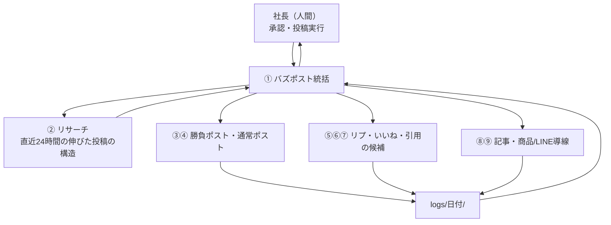

# Claude Codeのサブエージェントで作る「X運用会社」（統括1体＋8チーム）

> **TL;DR**: AIに投稿を「書かせる」のをやめ、直近24時間の伸びた投稿を先に調べる役・書く役・リプ/いいね/引用の候補を作る役などを Claude Code のサブエージェント9体に分け、統括1体を経由して人間は承認だけする X 運用の型。

@giver_itora26 は、最初に AI へ「Xでバズる投稿を書いて」と任せたところ、それらしく読みやすいが全く伸びない投稿を量産したと述べる。原因は AI に「今のX」を渡していなかったことだとし、先に書かせるのをやめて、伸びている投稿を先に調べさせる運用へ切り替えた。この記事は @giver_itora26 が LINE オープンチャットと自身の収益化講座へ誘導する宣伝つきの記事で、以下は宣伝部分を除いた設計の要点。

## リサーチを先に置く：「直近24時間」の構造だけを見る

リサーチチームの仕事は、昨日でも半年前でもなく**直近24時間**で実際に伸びた投稿を探すこと。@giver_itora26 は投稿をコピーするのでなく、何のネタに反応があったか・1行目の始め方・切り口・構成・続きを読みたくなる理由という**構造**を調べ、それを統括に渡すと述べる。X のアルゴリズムが短期で入れ替わる前提（[[concepts/x-algorithm-phoenix]]）に立つと、鮮度の窓を24時間に絞る判断は理にかなうと考えられる（wiki側の解釈）。

## 組織：人間が話す相手は統括1体だけ

9チームは、バズポスト統括・リサーチ・Xバズポスト作成（1日1本の勝負ポスト）・通常ポスト作成（朝昼夜）・リプ周り・いいね回り・引用・記事作成（X Articles）・商品作成/マネタイズ（商品企画とLINE導線）。@giver_itora26 が強調するのは人数でなく、9体を束ねる「上司」がいることで、人間が各チームへ個別に指示するなら結局忙しいままだとする。統括は仕事を振り分け、方針からずれた成果物を差し戻し、「今日の承認リスト」を1ファイルにまとめ、週1回は伸びた/伸びなかった投稿を分析して改善案を3つ出す。

実装は Claude Code の標準機能の組み合わせで、@giver_itora26 は次の構成を示す（有志公開のプラグイン cc-company は任意）。

- `CLAUDE.md` — 「会社の憲法」。ミッション・組織図・共通ルール（ターゲット・トーン・全角140字以内・成果物は `logs/YYYY-MM-DD/チーム名.md` へ提出）
- `.claude/agents/` — 1チーム1ファイルのサブエージェント定義（name・description・tools を frontmatter に持つ。[[tools/claude-code-subagents]] 参照）
- `inbox/` — AI はそのままでは X のタイムラインやフォロワー数を見られないため、人間が見つけた投稿・アカウントを貼る場所。慣れたらブラウザ操作ツールや X API で自動収集させてもよいとする
- `logs/` — 各チームの提出先。統括がここを読んで承認リストにまとめる

共通ルールに「inbox/ にないデータ（フォロワー数・URLなど）は推測で作らず『不明』と書く」を入れている点は、生成役に数値を捏造させないための地味だが効く制約と考えられる（wiki側の解釈）。起動は個別呼び出し・複数チーム並列・統括経由の「社長モード」の3通りで、毎朝7時に `claude -p "buzz-directorとして朝の業務を開始して"` を cron で回す例も載っている。

## 自動化してよい範囲と人間に残す判断

@giver_itora26 は、X では通常の自動投稿や一定条件下の引用ポストは認められているが、自動いいねは禁止、不特定多数への自動返信も認められず、AI 自動返信ボットには事前承認が要ると述べ、「AI社員に何でも自動実行させる」設計にしてはいけないとする。このためリプ・いいねのチームは実行でなく**候補リストを作るだけ**で、リプは各アカウント3パターンを出して人間が選ぶ。記事中のリプ・いいねチーム説明には「【要修正：規約まわりの説明をここに記載】」という編集途中の注記が残っており、規約部分は記事内でも未整理のまま公開されている。

人間が最後に見るのは、内容がおかしくないか・事実関係・自分が言っていないことを作っていないか・ブランドに合っているか、の4点。「人間に残したのは判断」という配置は、[[concepts/loops-and-graphs-approval]] の「人間は最後の1点だけを承認する」、[[concepts/ai-pre-judgment-automation]] の「AIに任せるのは判断の手前まで」と同じ形をしている。

## 観察ログ（未検証）

- 2026-09-26 @giver_itora26: 「1案件の報酬78,386,800円」「X未経験から9か月で利益1.3億円」は自己申告で、この仕組みとの因果も示されていない。運用時間は「外注3人＋1日4時間→自分1人＋約30分（87.5%削減）」で、現在の運用量は1日4投稿＋引用2本。X bookmark 655（2026-09-28時点）

## 問い

- 統括の差し戻しは「方針からずれていれば」という主観基準だけで、プログラムで判定できるチェックを持たない。[[concepts/loops-and-graphs-approval]] の言う「楽観主義者2人の同意」になっていないか
- 週次振り返りの改善案は次週の指示（エージェント定義）に書き戻されるのか、報告で終わるのか
- このリポの発信（note記事・公開サイト）に「直近24時間の構造だけ見るリサーチ役」を置くと何が変わるか

## 関連

- [[tools/claude-code-subagents]] — `.claude/agents/` のサブエージェント定義の仕様
- [[concepts/claude-code-orchestration]] — 役割を subagent 定義で固定する並列運用フレーム。本ページはその非エンジニア向けの業務適用例
- [[concepts/ai-employee-workflow]] — Claude を「AIスタッフ」に仕立てる7日間セットアップ（@eng_khairallah1）
- [[concepts/x-algorithm-phoenix]] — 2026年5月の X アルゴリズム大改変。直近の反応から逆算する必要の背景
- [[concepts/ai-news-source-automation]] — 深夜収集→朝に並列分析→人は選ぶだけ、という同じ発信ネタ収集の型（@beku_AI）
- [[concepts/ai-pre-judgment-automation]] — AIは判断の手前まで・人間が承認・AIが実行という同じ分担
- [[concepts/loops-and-graphs-approval]] — 人間を最も取り返しのつかない1点にだけ置く設計論（@hanakoxbt）
