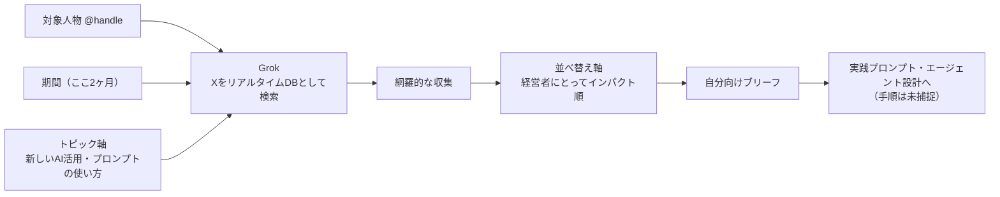

# Xタイムラインの人物単位蒸留（Grokに叡智だけ抜かせる）

> **TL;DR**: 対象の人物・期間・トピック・並べ替え軸の4つを指定して Grok に X の発言を集約させ、他人の連投を「自分の立場での優先順位つきブリーフ」に変えるプロンプト。@kazobara が深津貴之との対談の事前準備として実行した。

Xの投稿は時系列に流れるだけで構造を持たないため、フォローしていても「その人がこの2ヶ月で何を言ったか」は手元に残らない。@kazobara が使ったのは、その復元を人力の遡り読みでなく Grok に投げる形である。実際に入力したプロンプトは1文しかない。

> 深津さんのXの発言 @fladdict から　ここ２ヶ月で、あたらしいAI活用の試み、あたらしいプロンプトの使い方などを　できるだけ網羅的にあつめた上で　経営者にとってインパクトある順にならべなおしてください。

この1文は4つの指定でできている——**対象人物**（@handle で名指す）・**期間**（ここ2ヶ月）・**トピック軸**（新しいAI活用の試み、新しいプロンプトの使い方）・**並べ替え軸**（経営者にとってインパクトのある順）。前の3つが「網羅」を担い、最後のひとつが「自分にとって重要なものだけ」への絞り込みを担う。@kazobara は Grok を選ぶ理由を、X をリアルタイム情報源として使えるAIであること（気象・電車トラブル・最新技術のキーパーソンの意見収集に使っている）と、まとめ能力が異常に上がっていて「ツイ廃な方々の沢山の投稿の中から【自分にとって】重要なものだけをまとめてくれる」ことだと書く。

用途として実演されているのは対談前の事前準備である。相手の直近の思考を把握してから会う、という使い方は商談・面談・採用面接にもそのまま横展開できると考えられる。@kazobara はさらに、まとめて終わりにせず「それを実践プロンプト・エージェント設計にも昇華させることで、自分の【即つかえる】実践に直結できる」と書いているが、その具体的な手順は記事後半（noteメンバーシップ側）にあたり、本文からは未捕捉である。

この手法の弱点は出力の検証にある。生成されるのは原ポストの二次要約であり、記事本文にも個々の発言への引用リンクは付いていない。実際、この手法で作られた出力を wiki 化した [[business/ai-native-management]] では、深津の原ポストが確認できないという制約がそのまま残った。原ポストのURLを併記させる、あるいは重要な論点だけ [[tools/xurl]] で原文を引き当てる、といった検証工程を足さないと、蒸留の精度は測れない。

## 問い

- 並べ替え軸に入れる「自分の立場」を変えると出力はどれだけ変わるか（経営者向け／実装者向け／wiki運用者向けで同じ人物を蒸留して比較する）
- 出力に原ポストのURLを必ず併記させるプロンプト追記で、幻覚と実在の切り分けはどこまでできるか
- このvaultの ingest 対象選定に転用できるか。「フォロー中のN人×直近2週間×自分の関心軸」で候補を出させ、ブックマークの取りこぼしを埋める使い方が考えられる

## 関連

- [[tools/x-research-skills]] — 同じ「X検索だけGrokに外注」の構成をSkill＋xAI APIで固定した版。本ページは手入力1文の即席版で、クエリを固定しない代わりに軸を都度変えられる
- [[business/ai-native-management]] — この手法の出力例（深津貴之の2ヶ月分13論点）
- [[people/fladdict]] — 蒸留の対象となった発信者
- [[concepts/frontier-model-extraction]] — 相手をモデルに置き換えた同型の発想（去るモデルから判断を「抽出」して永続資産にする）
- [[tools/xurl]] — 原ポストを公式API経由で引き当てる検証側の道具
