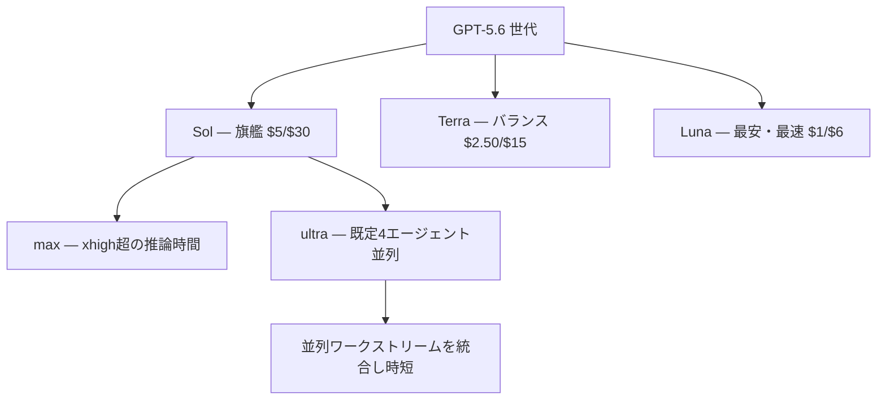

# GPT-5.6

> **TL;DR**: OpenAIが2026-07-10にGA公開した新世代モデルファミリー。Sol（旗艦）/ Terra（バランス）/ Luna（最安）の3ティア構成で「トークンあたりの有用な仕事」＝効率を主戦場に据え、並列4エージェントの `ultra` 設定とProgrammatic Tool Callingを導入した。

命名体系が変わった点が構造上の要点で、数字（5.6）が世代を表し、Sol・Terra・Lunaは各自のケイデンスで進化しうる永続的な能力ティアだとOpenAIは説明する。発表全体を貫くのは「同じ知能をより少ないトークン・コスト・時間で」という効率のポジショニングで、比較対象としてほぼ一貫して [[models/claude-fable-5]] を名指ししている。前世代 [[models/gpt-5-5]] が推奨したアウトカム重視プロンプトの延長線上に、ツール協調をモデル自身のプログラム実行に委ねる方向へ踏み込んだ世代と言える。

発表に際し Sam Altman（OpenAI CEO）は自身のXポストで「明らかに我々がこれまで作った最高のモデルだが、同時に我々が書いた最高のブログ記事の一つでもある」と述べ、モデルと並べて発表記事そのものを売り込んだ（2026-07-09）。

## 効率戦略とベンチマークの読み方

OpenAIの自社測定によると、SolはAgents' Last Exam（55分野の長時間プロフェッショナルワークフロー評価）で53.6を記録しFable 5（adaptive reasoning）を13.1点上回り、medium reasoningでも約1/4の推定コストで11.4点上回る。TerraとLunaは約1/16のコストでFable 5超えと主張する。Artificial Analysis Intelligence IndexではSol（max）がFable 5の1点差以内に迫り、61%短い時間・約半分の推定コストで完了。Artificial Analysis Coding Agent IndexではSolが80でSOTA（Fable 5比+2.8点、出力トークン半分以下）とする。

一方、同記事末尾のOpenAI自身の比較表では別の顔も見える。GDPval-AA v2はFable 5が1,759.6 EloでSol（1,747.8）を上回り、Artificial Analysis Intelligence Index v4.1もFable 5 59.9 > Sol 58.9。SWE-Bench ProはFable 5 80%に対しSol 64.6%、FrontierMath Tier 4はFable 5 87.8%に対しSol 83%。「ピーク知能では拮抗ないし一部劣位、トークン効率・コスト・速度で圧倒」というポジショニングだと読める（wiki側の解釈）。なお本文が主張するAgents' Last Exam 53.6と表中のSol 52.7%は一致せず、条件差の説明は記事内にない。数値はすべてOpenAI自社測定・自社推定コストである点に注意。

## 新機能: ultra・max・Programmatic Tool Calling

- **`ultra`**: 既定で4エージェントを並列に協調させ、複雑タスクの時間短縮とスコア向上をトレードする最上位設定。BrowseComp・SEC-Bench Pro・Terminal-Bench 2.1でスコア-レイテンシのフロンティアを押し上げるとし、16エージェント構成の結果も示す。API側ではResponses APIのmulti-agent beta（並行サブエージェント実行＋単一リクエスト内統合）として提供される。
- **`max`**: `xhigh` よりさらに推論・検証・方針修正に時間を割く設定。
- **Programmatic Tool Calling**: モデルが軽量プログラムを書いて実行し、ツール協調・中間結果の処理・進捗監視を担う。ツール応答を毎回モデルに戻さず大量の中間データをプログラム側でフィルタできるため、トークンとラウンドトリップが減り、Zero Data Retention互換になるとOpenAIは説明する（Responses API）。

## 設計判断・ナレッジワーク・サイバー

デザイン面では、生成したコードだけでなくレンダリング結果をcomputer useで検査して仕上げる挙動を「design judgment の一段の進歩」として押し出す。OSWorld 2.0で62.6%（Opus 4.8超え・出力トークン85%減と主張）、BrowseComp 92.2%（ultra）のSOTAを報告。ナレッジワークではSlack・Notion・Microsoft 365・Google Driveの雑多な文脈から成果物を作る性能と、参照デッキのデザインシステム（Slide Masterに埋め込まれたルールまで）を推論して踏襲する能力の向上を挙げる。

サイバーは今回最も伸び幅が大きい領域で、ExploitBench 73.5%（GPT-5.5は47.9%）、SEC-Bench Pro 71.2%（同45.8%）。防御用途の能力はOpenAI Daybreakの「Trusted Access for Cyber」プログラムで検証済みユーザーに開放し、個人は2026-09-01までにハードウェアパスキー必須化という条件を付けた。安全システムは学習時保護・リアルタイムチェック・reasoning monitor・アカウント単位執行の多層構成で、従来比約10倍の潜在有害活動をブロックする保守側の初期設定とし、約70万A100e GPU時間の自動レッドチーミングを実施したと述べる。GeneBench Proの比較でFable 5を「高度な生物学の質問の大半を拒否するため含めない」と注記しており、Anthropicのセーフガード方針との違いが第三者比較の空白として表面化している。

## 自己改善（RSI）の測定

OpenAIは社内のAI研究加速を直接測る評価スイート（研究システムのデバッグ・カーネル/訓練レシピ最適化・別モデルの改善など）を作り、SolがGPT-5.5比+16.2点と報告する。内部テスト期間中、研究者1人あたりの日次出力トークンがGPT-5.5の最高値の2倍超になり、過去6ヶ月で研究計算に占める内部コーディング推論のシェアが100倍、内部agenticトークン使用が約22倍になったとも公表した。[[concepts/recursive-self-improvement]]（Anthropic Institute側の論考）と対をなす、OpenAI側のRSI一次データと位置づけられる。

## 価格・提供

ChatGPT・ChatGPT Work・Codex・APIで即日ロールアウト（24時間かけて全面提供）。価格は1Mトークンあたり Sol $5/$30、Terra $2.50/$15、Luna $1/$6 で、Fable 5（$10/$50）と比べるとSolは入出力とも半額の設定と読める（wiki側の比較）。プロンプトキャッシングは明示的キャッシュブレークポイント対応と30分の最低キャッシュ寿命が入り、キャッシュ書き込みは非キャッシュ入力単価の1.25倍・読み取りは90%割引となった（Claude側の仕組みは [[concepts/prompt-caching]] を参照）。

## 観察ログ（未検証）

- 2026-07-10: OpenAI本文はAgents' Last Exam 53.6（Fable 5比+13.1点）と主張するが同記事の表ではSol 52.7%。効率優位の主張が第三者（Artificial Analysis等）の再測定で再現されるか追跡
- 2026-07-10: RSI関連の伸び率（内部コーディング推論シェア6ヶ月で100倍・agenticトークン22倍・RSI評価+16.2点）— 次世代発表時に答え合わせ

## 問い

- 「ピーク知能は拮抗以下・効率で圧倒」という読みは第三者ベンチで裏づけられるか。自分の用途（長時間の複雑タスク）ではどちらの軸が効くか
- `ultra`（effort設定の一段としての並列度）はClaude Code側のマルチエージェント設計（[[concepts/multi-agent-patterns]]）と何が違うか。並列度をAPIの1パラメータに抽象化する発想は自分のハーネスに持ち込めるか
- キャッシュ書き込み1.25倍・30分最低寿命は、Claudeのキャッシュ課金（[[concepts/prompt-caching]]）と長時間エージェント運用でどちらが有利か

## 関連

- [[models/gpt-5-5]] — 直接の前世代。全ベンチの比較基準
- [[models/claude-fable-5]] — 発表全体を通じた最大の比較対象
- [[companies/openai]] — 開発元
- [[models/claude-opus-4-8]] — 比較表の対象モデル（Coding・Computer use等）
- [[concepts/recursive-self-improvement]] — RSI測定のAnthropic側論考。本ページのRSI節と対
- [[concepts/multi-agent-patterns]] — ultraの並列4エージェントが実装するマルチエージェント協調
- [[concepts/prompt-caching]] — キャッシュ課金・寿命設計の対比先
- [[models/gpt-6-astra]] — 次の世代番号。Codex チームは Sol／Luna 向けの指針が Astra を過剰に縛りうると述べる（発表内容は未収集）
