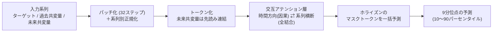

# TimesFM-3

> **TL;DR**: Google Researchの時系列基盤モデル第3世代。複数ターゲット・過去共変量・既知の未来共変量を含む多変量予測をゼロショットで扱い、予測ホライズン全体を1回の順伝播で出す。Gift-Eval・FEV-Bench・Timeの3ベンチマークで事前学習済み基盤モデル中1位だとGoogle Researchが公表した（2026-08-31）。

> 📌 X bookmark: 10,927（2026-09-02 時点）

TimesFM-2.5（2025年9月公開）までのTimesFMは単一系列の履歴だけから予測する単変量モデルだった。Google Researchはブログで、実世界の予測問題はほとんどが多変量だと述べる。小売チェーンのアイスクリーム売上を予測するなら、過去の売上だけでなく関連商品（コーン・シロップ）の売上、客足の履歴、天気予報・プロモーション・休日といった既知の未来イベントが揃って初めて良い予測になる、という例をGoogle Researchは挙げる。TimesFM-3はこの多変量シナリオをタスク別のファインチューニングなしで扱うことを狙って、多変量で事前学習された。

## 何が新しいか（Google Research公表）

- **330Mパラメータ**、実データと合成データを合わせた**1兆時点超**の時系列コーパスで事前学習
- ネイティブ対応する入力は3種類。**複数ターゲット**（関連する複数系列を同時に予測、点予測と分位点予測の両方）・**過去共変量**（過去の客足など履歴しか分からない特徴）・**過去-未来（動的）共変量**（プロモ計画や天気予報など未来が既知のイベント）
- **非自己回帰デコード**: 従来のTimesFMは1パッチずつ生成していたため遅延・誤差累積・計算コストがあった。TimesFM-3はContiguous Patch Masking（arXiv 2505.23719）の戦略で、未来ホライズン分のマスク済みプレースホルダートークンを観測コンテキストに並べ、交互アテンション層で全マスクを同時に埋める。反復ループは不要
- 各ターゲット系列の各ホライズンステップで**9分位点**（10〜90パーセンタイル）を出し、予測の不確かさを分布として返す

## アーキテクチャ

Google Researchの説明では、前世代と同じdecoder-only Transformerを土台に、連続する32時点を1パッチにまとめ、スケールが大きく異なる系列を揃えるためTimesFM-2.5と同様の系列別正規化をかける。多変量化のために加わったのは次の2点。

- **多変量トークン構築**: ターゲット系列と過去共変量は1パッチから1トークンを作る。過去-未来共変量は現在のパッチに未来のパッチを連結した「先読み」トークンにし、モデルが既知の未来シグナルを覗けるようにする
- **交互アテンション**: トークンは2次元グリッドとして処理される。**因果的な時間方向アテンション**はトークンが自分の系列内の過去だけを見る（データ漏洩防止のため厳密に因果的）。**系列横断の全結合アテンション**は同じ時刻の全系列を見て、ある系列のプロモが別系列の売上に効くような相関を学ぶ。この2種を数層にわたって交互に積む

## ベンチマーク（Google Research公表）

Gift-Eval・FEV-Bench・Timeの3つの公開ベンチマークで、点予測と確率予測の両指標とも、事前学習済み基盤モデルの中で平均ランク1位だとGoogle Researchは述べる。比較対象には多変量対応のChronos-2やToto 2.0ファミリー、前世代のTimesFM-2.5が含まれる。共変量も系列間情報も使わず各ターゲットを独立に扱う「単変量モード」でも競合と同等以上で、多変量モードに切り替えるとさらに伸びる、という2段構えの提示になっている。具体的なランク値はブログ内の図にのみあり本文には転記されていない。

## 提供形態

- GitHub（google-research/timesfm）とHugging Face（google/timesfm-3.0-pytorch）で公開
- **BigQuery統合が数週間以内**に着地するとGoogle Researchは予告。それまではTimesFM-2.5をBigQueryのAI.FORECAST関数で単変量タスクに試せる
- ブログ末尾の謝辞で、Yichen Zhou・Petros Mol・Abhimanyu Das・Samet Oymakとの共同研究と記されている
- 公開翌日に@sametkarakastrがGoogle Researchの発表を引用し、売上・需要・トラフィック・エネルギー・金融・センサーといった時間依存データがあれば過去データ・関連系列・キャンペーンや祝日や天気など未来が既知の変数を渡せる、とトルコ語で用途を要約して拡散した（bookmark 4,147・2026-09-02時点）

## 観察ログ（未検証）

- 2026-09-03: プロモ計画を過去-未来共変量として渡した説明例で「プロモ日ごとに約20%の売上増を予測した」とGoogle Researchは述べる。ベンチマーク値ではなくブログ図解1件の説明値
- 2026-09-03: BigQuery統合「数週間以内」の予告（2026-08-31時点）。着地時期とAI.FORECASTでの多変量対応の有無を確認する

## 問い

- 自分の運用データ（トークン消費・ingest件数など）に休日や予定という既知の未来共変量を添えた予測は、TimesFM-3のゼロショットで意味のある精度になるか。BigQuery統合後にAI.FORECASTで試すのが最短か
- 系列横断の全結合アテンションは系列数が増えると系列軸にも2乗コストが乗る。数百系列規模の多変量で実用速度を保てるか（[[concepts/attention]]のO(n²)問題の系列版）
- Chronos-2・Toto 2.0との差は画像のみで数値未転記。Gift-Eval等の公開リーダーボードで実際の順位差を確認する

## 関連

- [[concepts/attention]] — 土台となるdecoder-only Transformerのアテンション機構。TimesFM-3は因果的な時間方向と全結合の系列方向を交互に積む変種
- [[companies/google]] — 開発元（Google Research）
- [[tools/google-knowledge-catalog]] — 同じBigQuery生態系のAI向け製品。TimesFM-3はAI.FORECAST関数としてBigQueryへ統合予定
- [[papers/2025-kim-mhealth-stress-cosegmentation]] — 多変量時系列を扱うwiki内の先行ページ。あちらは変化点でセグメント化し区間ごとに関連を検定する統計手法、こちらは基盤モデルによるゼロショット予測
