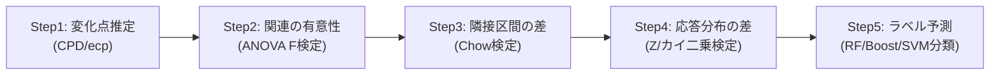

# Co-Segmentation によるmHealthデータからの感情的ストレス期検出（Kim et al. 2025）

> 孤立理由: 本wikiはLLM/AIエンジニアリングと事業領域が中心で、変化点検出・生物統計・mHealth（モバイルヘルス）を扱う既存ページが存在しないため、現時点で意味のある相互リンク先がない。

> **TL;DR**: パッシブセンシングデータの変化点で時系列をセグメント化し、各区間ごとに自己申告ストレスとの関連を検定して、関連が成立する「共セグメント（co-segment）」だけを使い感情的ストレス期を検出する手法。

メンタル不調（気分障害）や慢性疼痛をもつ中高年・高齢患者では、スマホが受動的に集める活動・睡眠・社交・移動のデータと自己申告ストレスとの関連が、時系列全体では見えにくく短い時間窓でのみ立ち現れる（非定常）。全データへ一括で機械学習を当てる従来法は、この局所的・時変的なパターンを取りこぼす。本手法は分析単位を「個々の時点」から「データ駆動で切り出した区間」へ移し、区間ごとに異なる関連を許すことでこれを捉える。

具体的には **5ステップ**で進む。(1) パッシブ変数だけに変化点検出（CPD）をかけて初期セグメントを作る（Rパッケージ `ecp`、ノンパラメトリックでモデルフリー）。(2) 各区間で「パッシブ変数→調整済みストレス」の区分線形回帰が有意かをANOVAのF検定で確かめ、有意でない区間は隣へ統合する。(3) 隣接区間どうしで回帰係数が異なるかをChow検定で調べ、区別できない区間は統合する。(4) 応答（ストレス水準）の分布が隣接区間で異なるかをZ検定／カイ二乗検定で確認する。(5) 残った区間に順序ラベルを振り、パッシブ変数からそのラベルを当てる分類問題として将来のストレス状態を予測する（多項ロジ・LDA・SVM・ランダムフォレスト・勾配ブースティング）。応答変数を変化点検出に含めないのは、関心が「応答と予測子の関連の変化」であって応答単体の変化ではないため。自己申告ストレスは5段階Likertで変動が小さいので、arousal（覚醒度）とvalence（感情価）をRussellの感情空間に写すPAMスコアで連続値に調整し、変動を増やす前処理を入れている。

## 観察ログ（未検証）

- 2026-06-23: 「パッシブ変数と自己申告ストレスの関連は非定常で、短い時間窓に限って意味を持つ」という前提が手法全体の動機。図1の手描き変化点を境に両系列の分布が同時に動く例で示している（著者の問題設定・単一データセットでの観察）。
- 2026-06-23: arousal/valence→PAMスコアでストレスを連続化する前処理は「本研究の例に特有」と著者自身が注記。応答の変動が元々大きい他研究では不要かもしれないとしている。
- 2026-06-23: 著者が挙げる限界 — ①50日以上のパッシブ＋アクティブデータを持つ患者に限定、②パッシブ/アクティブを同一頻度（日次）で測る前提、③ストレスの変動を増やすためarousal/valenceが必要だが他研究では入手困難な場合がある、④多重比較を未制御（global type-I error の制御は今後の課題）、⑤自己相関など高次モーメントの変化は未考慮。

## 検証済み事実

- 2026-06-23: データはWeill Cornell ALACRITY Center（NIMH P50MH113838）の3研究から収集。気分抑うつで心理療法中の中高年・高齢者が対象、subject IDに `relief` を含む患者は慢性疼痛も併発。パッシブ11変数（移動・睡眠・社交・位置の4群）＋アクティブ4変数（ストレス水準・arousal・valence・調整済みストレス）を日次集計。
- 2026-06-23: 評価実験（6患者・各50日以上、ローリングウィンドウで50成功まで保留サンプルを構築）の結果、ランダムフォレストと勾配ブースティングが全患者・大半の指標で他手法を一貫して上回った。
- 2026-06-23: セグメンテーションを組み込むと、組み込まない非セグメント版ベンチマークより精度が高い。パッシブ変数のみの予測（Pred）は応答のみ（Resp）を全体として上回らず、「パッシブ変数はセグメンテーションを考慮したときに初めて有用」という結果が出た。
- 2026-06-23: 著者は Younghoon Kim（Cornell University / Weill Cornell Medicine）、Sumanta Basu（Cornell University）、Samprit Banerjee（Weill Cornell Medicine）。arXiv 2502.10558v2。

## 問い

- データ駆動セグメント単位で関連を検定する発想は、LLM時系列ログ（トークン消費・エラー率の変化点）など自分のwiki運用データの「いつ挙動が変わったか」検出にも転用できるか。
- 共セグメントの「区間ごとに関連が変わる」前提は、エージェントの振る舞いが文脈によって非定常に変わる現象（[[concepts/loop-engineering]] のループ品質の時変）と構造的に似ているか。
- arousal/valence で応答の変動を人工的に増やす前処理は、評価ラベルの分散が小さい他タスク（例: 5段階自己評価）の前処理として一般化できるか。

## 関連

- 現時点で本wiki内に直接の関連ページなし（孤立理由は冒頭参照）。
