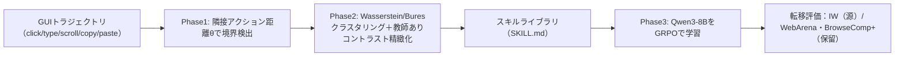

# GUIトラジェクトリからのSKILL.md自動マイニング（診断的研究・ネガティブ結果）

> **TL;DR**: GUI操作ログ（クリック・入力・コピペ等の軌跡）から手書きでない「SKILL.mdスキルライブラリ」を自動採掘できるか、を検証した診断的研究。採掘したクラスタは元データ上では読める（8中5クラスタが純度0.95以上）が、それは下流ポリシーの改善には繋がらず、学習した方策は自明な頻度ベースラインにすら負ける——「読めること」と「転移して効くこと」は別だ、という負の結果を正面から報告する。

手書きスキルは命名・スコープ・文書化・UI変化への追従というボトルネックを抱える。ならば多数のユーザーが繰り返す操作部分列にこそ自然なスキル単位が眠っているのでは、という発想で軌跡からのスキル蒸留を試みる。だが本研究の核心は「クラスタリングできた」ではなく**「採掘したスキルが新タスクで方策を助けるか」を厳しく問うた**点にある。クラスタは一貫していても有用とは限らず、方策が伸びても「転移可能なスキル語彙を学んだ」のか「単にアクションデータが増えた」のか区別が要る。著者（Yuexing Hao／MIT、Xiaomin Li／Harvard）はこれを成功主張ではなく診断研究として提示し、現状のパイプラインのどこが使え、どこが未解決かを切り分ける。

パイプラインは3段。**Phase1**は隣接アクションのL2距離が閾値θを超えた点を変化点（スキル境界）とみなす（各アクションは10種one-hot＋座標＋時刻＋テキスト長＋スクロール量の15次元）。**Phase2**は各セグメントを平均・分散で要約し（長さ不変の bag-of-actions、ただし順序は捨てる）、対角ガウス間の2-Wasserstein/Bures距離で凝集型クラスタリング、さらにクラスタ割当を擬似ラベルにした教師ありコントラスト学習で埋め込みを精緻化。**Phase3**は採掘したスキル名で組んだプロンプトから Qwen3-8B を GRPO で学習し、次スキル系列の予測を評価する。

## 検証済み事実

- 2026-XX: 採掘クラスタは**源データ（IW=InteraSkill Workflows、2,000本の合成エンタープライズ軌跡）上では可読**。k=8で8クラスタ中5つが正解スキルに対し純度0.95以上（document_edit=click/format/save、data_transfer=click/copy/paste、organize_files=click/right-click 等、明瞭なアクション特徴を持つ）。コントラスト精緻化後はKMeansでNMI=0.862・純度0.837まで上がる。
- **しかし転移しない**。GRPO学習後の Qwen3-8B は IW skill-step精度を 18.5%→20.5% とわずかに上げるだけで、BrowseComp+ は 43.5%→43.3%（ほぼ不変）、WebArena は 55.8%→44.2%（**悪化**）。exact sequence match は0%。
- **学習方策は自明な頻度事前分布に負ける**。IW skill-step精度で Frequency ベースライン34.9% > Transformer 34.6% > MLP 23.3% > GRPO 20.5%。Auto-SKILL.md も全データサイズで Frequency に edit distance で負ける（N=2,000 で Frequency 0.485 vs Auto 0.528）。手書きの遷移表には一部サイズで勝つが、最強の自明ベースラインには勝てない。
- 境界検出は高再現・低精度で**スキルを過分割**する（IWで precision 0.419 / recall 0.803 / F1 0.538）。閾値はドメイン非安定：IW由来のθ=1.545をWebArenaに当てるとF1 0.119まで崩れる（target側でオラクル調整すればF1 0.851だが、これは正当なゼロショット転移ではない）。
- 根因は**bag-of-actions表現が順序を捨てること**。GUIスキルの有用部分はしばしば順序づき（選択→コピー→ペースト、メニューを開く→項目選択）なのに、平均・分散要約はそれを記録しない。読めるクラスタが下流合成に不十分になる。
- ゼロショット比較対象（format-constrained）：GPT-5・Claude Sonnet 4.5・Claude Haiku 4.5・Llama-3.1-70B・OLMo-3-7B 等。WebArenaはGPT-5/Claude Sonnet 4.5が最強、BrowseComp+はOLMo-3-7Bが最強で、閉じたモデルも全ベンチを支配はしない。
- GRPO構成：Qwen3-8B、候補8/プロンプト、temp 0.7、lr 5e-6、報酬は学習済みtrajectory reward model、1エポック・4×H200で6,072秒。再現コードは匿名GitHubで公開。

## 観察ログ（未検証）

- 2026-06-20: 著者の処方箋——GUIスキル発見の研究は LLM と比べる前に必ず3つのコントロールを報告すべき：(1)頻度事前分布、(2)遷移メモリ事前分布、(3)モダリティを揃えた教師あり方策。これを欠くと「データの偏り／出力形式適応」由来の伸びを「スキルの効果」と誤認する、という方法論的警告。
- 著者の次の一手の提案：IWに標的ドメインのプロンプトを混ぜる・bag-of-actionsを順序考慮エンコーダに置換・タスク成功に近い密な報酬・3段のうち2段を固定して1段だけ差し替える要因分析。
- CUAは有用な反復作業を自動化できるが悪用もされうるため、生成された SKILL.md は配備前に人間レビュー可能なまま保つべき、という著者の但し書き。

## 問い

- 「読めること ≠ 効くこと」は、このwikiが自動生成するページにも刺さる。可読な要約が後のQuery精度を実際に上げているか、頻度ベースの素朴な索引と比べて検証する余地。
- このwikiのソースは順序を持つ作業ログ（ingest手順・handover）。順序を捨てる要約と保つ要約で、後段の有用性がどれだけ変わるか。
- [[papers/2026-li-skillsbench]] は「curatedスキルは効く」、本論は「自動採掘スキルは転移しない」。差は「人手キュレーションの有無」に集約されるのか、それともGUI/ターミナルというドメイン差か。
- 自分のスキル評価に「自明ベースライン（頻度・遷移事前分布）に勝てているか」というゲートを足せるか。

## 関連

- [[papers/2026-li-skillsbench]] — 「Skillは効くか」を対試験で測る姉妹研究。本論の「自動生成スキルは転移せず頻度に負ける」は、SkillsBenchの「自己生成Skillはcuratedの代替にならない」と同じ向きの負の結果
- [[papers/2026-zhou-colleague-skill]] — 痕跡からのスキル自動生成。本論はGUI軌跡が素材で、生成物が下流で効くかを検証する点が対照的（あちらはartifact-levelの主張に留め効果は未測定と明言）
- [[concepts/claude-skills]] — 採掘対象である SKILL.md／Agent Skills の概念
- [[tools/claude-computer-use]] — Claude のリアルUI操作エージェント。本論が扱うCUA（computer-using agent）の実装側
- [[tools/browser-use]] — WebをAIが操作するエージェント基盤。WebArena等GUIベンチの実務的隣接
