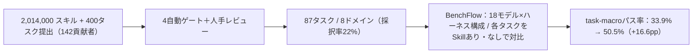

# SkillsBench: Agent Skillsの効果を対試験で測るベンチマーク

> **TL;DR**: 「Skillを足すとエージェントは本当に強くなるのか、どれだけ」を、同一タスクをSkillあり・なしで走らせる対試験（paired evaluation）で定量化したベンチマーク。87タスク×18モデル–ハーネス構成で、厳選Skillはパス率を平均+16.6pp押し上げるが、効きは構成・ドメイン・Skillの作り方で大きくばらつく。

Skillは数百万個に増えたのに「実際どれだけ効くか」を測る標準がなかった、という空白を埋める研究。鍵は**対試験の設計**にある。既存のエージェントベンチマークはモデル・ハーネス・augmentationの効果を1つのパス率に畳み込んでしまい「このSkillを足すと自分のエージェントはこのタスクで何pp伸びるか」という配備時の問いに答えられない。SkillsBenchは同一コンテナ・同一タスクをSkillアクセスの有無だけ変えて走らせ、差分を（構成, タスク）単位のペア差として取り出す。Skillを「測定対象の一級アーティファクト」として扱う点が新しい（[[papers/2026-zhou-colleague-skill]] がSkillの生成側を扱うのに対し、本論は評価側）。

汚染を避ける設計が中核を支える。Skillは「特定問題の答え」ではなく「ある問題クラスの専門知」でなければならず、(1)貢献者がベンチマークと独立にSkillを著述し、(2)タスク指示はどのSkillを使うか名指ししない（progressive disclosureで自力発見させる）という2制約でこれを担保する。タスク自体も「実在する専門作業・決定論的pass/failで検証（LLM-as-judge不使用）・問題そのものが難しい・オラクルでend-to-end解ける」を満たすものだけを、400提出から87件に絞り込んでいる（採択率22%）。各タスクはコンテナ＋人手記述の指示＋curated Skill束＋秘匿オラクル/verifierで構成される。

## 検証済み事実

- 2026-XX: 最新集計（87タスク・18モデル–ハーネス構成、各セル87×3トライアル）で、curated Skillは**task-macroパス率を33.9%→50.5%（+16.6pp、正規化ゲイン25.5%）**に引き上げた。18構成すべてで改善したが、構成別ゲインは+4.1〜+25.7ppと広い。
- 最高の「Skillあり」パス率は OpenHands+GPT-5.5（67.3%）/ Codex+GPT-5.5（66.5%）/ Claude Code+Opus 4.7（61.2%）。最大の伸びは OpenHands+GLM 5.1（+25.7pp）/ Gemini CLI+Gemini 3.1 Pro（+24.8pp）。ベースが強い構成（OpenHands+Gemini 3.5 Flash、ベース41.1%）の伸びは+7.1ppにとどまり、**素の能力の高さと Skill のレバレッジは相関しない**。
- 同一モデルでもハーネスで効きが変わる（Gemini 3.1 Pro：Gemini CLIで60.8% / OpenHandsで52.8%、Opus 4.7：Claude Codeで61.2% / OpenHandsで53.1%）。「Skillあり」を単一条件として扱えない。
- **自己生成Skillはcuratedの代替にならない**。agentがskill-creatorで自作Skillを書いてから解く条件は、no-Skillsベースラインを3構成すべてで下回った（Claude Code+Opus 4.7で−8.1pp、Codex+GPT-5.5で−11.3pp、Gemini CLI+Gemini 3.1 Proで−11.5pp）。同条件のcuratedは+18.2〜+24.8pp。
- **少数精鋭が勝つ**。Skill数は1個で+18.0pp / 2–3個で+19.0pp / 4個以上で+10.1ppに低下。記述量はcompact・標準（+19.0/+21.5pp）がdetailed（+14.5pp）・網羅的（+0.7pp）を上回る。網羅的な散文はほぼ無効。
- ドメイン差が大きい：Natural Science +28.8pp / Media & Content +24.1pp / Cybersecurity +18.9pp が最大、Software Engineering +11.6pp / Mathematics & OR +9.7pp が最小。事前学習で薄い専門手続きほど効く。
- 小モデル+Skillが大モデル単体に並ぶ（MiniMax M2.7+Skill 34.9% > OpenHands+GLM 5.1 素 32.7%）。Skillはモデル容量を部分的に代替できる。
- エコシステム規模（構築スナップショット）：source-partitioned Skillは**2,014,000個**（2026年1月の37k個から1桁以上増）。到達可能な767,430バンドルの統計では SKILL.md 中央値≈1.2kトークン、59.9%が単一ファイル、拡張子は.mdが51.7%。エコシステム平均品質は6.2/12でベンチマーク採用Skill（上位四分位、≥9/12）と乖離。
- 公開物：ベンチマーク・BenchFlowハーネス・公開トラジェクトリ/結果。タスクは `task.md` 標準（YAMLフロントマター＋本文＋verifier/・oracle/）で梱包され、AgentBeatsプラットフォームでも動作。著者筆頭は Xiangyi Li ら多数、Dawn Song を含む（arXiv 2602.12670）。

## 観察ログ（未検証）

- 2026-06-20: 著者は失敗パターン（13/87タスクで負のデルタ）の根因を「適用境界も軽量フォールバックも持たない単一の"正しい"重量級パイプライン」と診断し、対策として **SKILL.md フロントマターに complexity contract（想定ツール/トークンコスト・適用境界・必須の軽量フォールバック経路）を足す**ことを提案。これは提案であり実証ではない。
- 著者の主張する Skill 著述指針：完全性ではなく「エージェントが推論できないverifier向けの細部」に最適化せよ（実行可能スクリプトの較正済みデフォルト・正規データソースとパースの癖・ファイル形式制約・アルゴリズム不変条件・description/frontmatterでの一致用メタ）。
- 限界として著者自身が、Skill注入はコンテキスト長も増やすため「手続き構造でなく単に文脈が増えた」効果と切り分けきれていない点、長さ揃えのベースライン（無関係テキスト等）が要る点を明記。

## 問い

- このwikiの wiki-ingest スキルを SkillsBench 流の対試験にかけられるか。「ingestあり・なし」でカテゴリ判定や粒度判定の質をdeterministicに採点する verifier を組めるか。
- 「2–3 Skillが最適、4個以上で劣化」は自分の `.claude/skills/` の積み増し方針にそのまま効く警告。今のスキル群は冗長化していないか（[[tools/skill-cleaner]] での監査余地）。
- complexity contract（コスト・適用境界・軽量フォールバック）を自作SKILL.mdのフロントマターに先回りで足すと、headless実行のコスト暴走を抑えられるか。
- 自己生成Skillがベースを下回った原因（solverが発見できない・creatorがsolverの作業を食う・自信満々に誤る）は、このwikiの自動生成ページにも当てはまる失敗モードか。

## 関連

- [[papers/2026-zhou-colleague-skill]] — Skillの「生成側」を扱う対の研究。本論は「評価側」で、両者でSkillライフサイクルの入口と出口が揃う
- [[concepts/claude-skills]] — 本論が前提とする Agent Skills 標準（SKILL.md＋progressive disclosure）の概念
- [[concepts/skill-building-best-practices]] — Skillの作り方。本論の「compact・focusedが網羅的散文に勝つ」は同方針の定量的裏付け
- [[concepts/agent-skill-management-system]] — Skillが増えた後の管理問題。エコシステム200万個・平均品質6.2/12という本論の規模感が背景を補強
- [[concepts/harness-engineering]] — 「同じモデルでもハーネスでSkillの効きが変わる」は、エージェント=モデル+ハーネスという見立ての実測的証拠
- [[business/skill-library-strategy]] — Skillライブラリを私有資産とする戦略論。本論は「どんなSkillが実際に効くか」の経験則を与える
